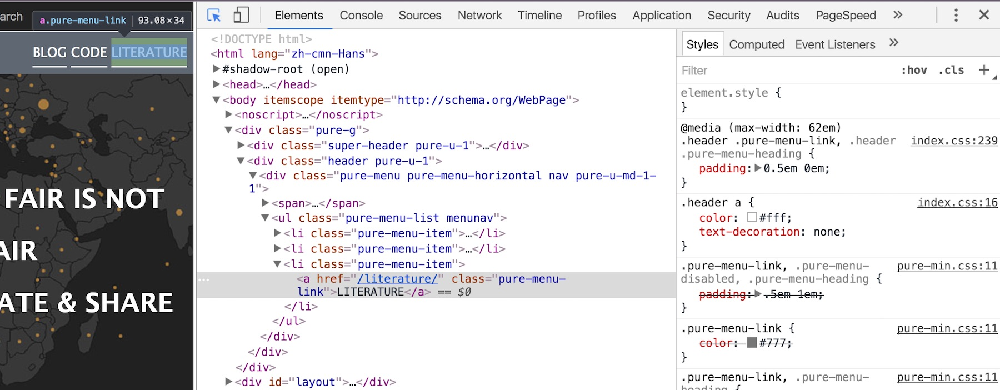
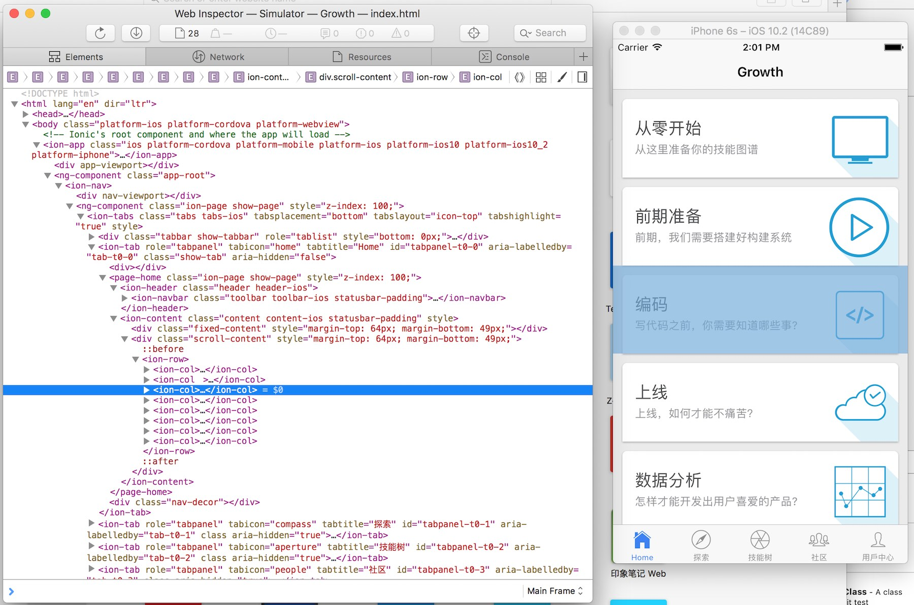
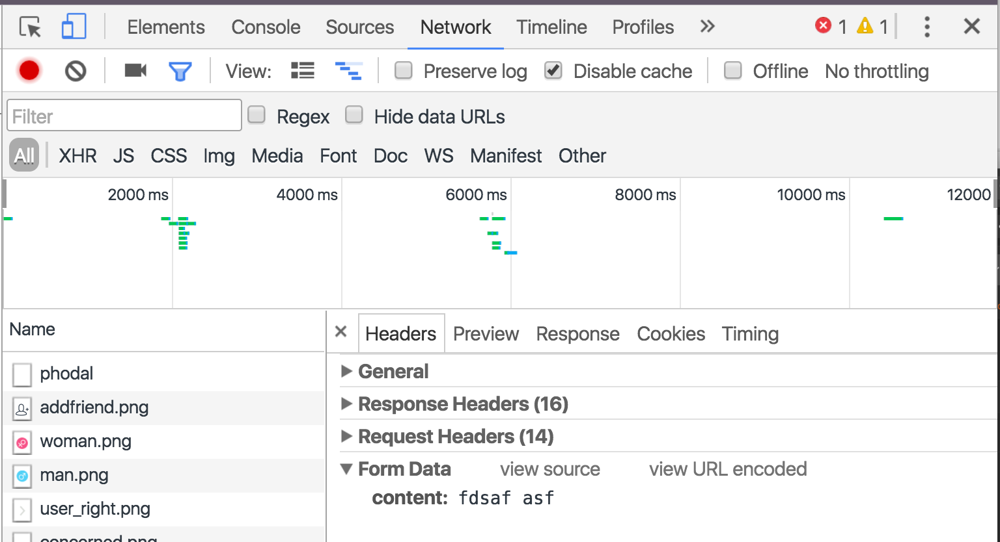

必会的六个调试技能
===

> 我还是一个野生程序员的时候，不会 Debug，只会傻傻地写一句句 std::count。即使是在今天，有些时候我也会这样做：打一个 console.log，然后看看结果是不是和预期的一样。如果不是和预期一样，就修改一下代码，刷新一下浏览器。这得亏是 JavaScript 是一门动态语言，可以很快的看到运行的结果。

**前言**： 本章里，主要介绍如何调试前端应用——基本的调试： HTML、CSS 和 JavaScript；使用网络工具对 API 进行测试；对移动设备进行调试：使用浏览器的模拟器、真机、iOS 模拟；对网站的性能进行调试等内容。

调试（Debug）在[维基百科](https://zh.wikipedia.org/wiki/%E8%B0%83%E8%AF%95)上的定义是：是发现和减少计算机程序或电子仪器设备中程序错误的一个过程。

多数时候，调试是为了找到代码中的错误，并具体定位到错误的地方。幸运的是，现在的前端框架都比较人性化了，可以和大部分的后台框架一样，提示代码中出错的地方。这时，我们只需要借助于浏览器的调试，找到错误的行数，并查看错误的原因。

有些时候，我们调试是为下一步编程，提供一些理论依据。如在应用运行的时候，我们可以使用浏览器打个断点，并在 Console 中输入代码调试下一步要做的事。最后，再将这些代码复制到 IDE 或者编辑器上即可。

我的调试入门
---

与我的编程经验相比，我学会 Debug 的时间比较晚。我是在大学里学会 Debug 的，当时在为一个支持在线调试的芯片写程序。对于嵌入式开发而言，不同的芯片都会有不同的 IDE。有的 IDE 可以支持调试，有的则不行；有的 IDE 则连基本的语法高亮都没有。

对于支持在线调试的开发环境来说，我们只需要打一两个断点，看程序是否运行到这个逻辑，又或者是按下“下一步”按钮，看程序运行到哪些地方，并实时的预览变量的值。

对于不支持在线调试的芯片来说，没有屏幕也就不能使用 printf 来输出结果。只能通过 SD 卡里的文件系统来写入日记，再计算机上读取日记来分析。这只的是一件麻烦的事，对于没有 SD 卡的开发板来说，还需要腾出几个脚本接上 SD 卡。也有些芯片是不能使用 SD 卡的，这时我们就只能依靠于想象力来调试。

在今天开发 Web 应用时，上述的内容都只是基本的调试。有一些能支持更高级的调试——如评估表达式，即利用当前的变量值，来实时计算，并慢慢完成下一步的代码。最初，我是在用 Intellij Idea 写程序的时候，学会在后台编程时使用 ``evaluate expression``。它可以在调度代码的时候，我们可以边实现功能。

后来，我才醒悟到在前端领域，这是基本的调试功能，在 Chrome、Safari 这些现代的浏览器上都能这样做。

与一般的单机应用相比，让 Web 应用不能如期运行有更多的原因。并且相当多的原因与代码无关，如：

 - 服务在运行中崩溃，没有向前端返回数据，前端只能使用超时来处理。这时，我们可以通过浏览器中的 Network 来知道这件事。
 - 本地开发的时候，URL 的编码都是没有问题的，而在线上则出了问题。经过一系列复现和排察后，才发现问题出在 Nginx 上的转义上。
 - 等等

这时，我们就需要使用更好的工具来帮助开发。

基本调试技巧：实时调试
---

开始之前，我们需要打开 Chrome 浏览器的调试窗口。除了点鼠标右键，然后选择“审查元素”之外，还可以：

 - Windows / Linux 操作系统，使用 Ctrl + Shift + I 快捷键打开开发人员工具
 - Mac OS 操作系统，使用 Comand + Option + I  快捷键打开开发人员工具

这个调试窗口看上去，有点高大上：

图中左上角的两个图标，分别是：

 - **审查元素**。可以让我们检查页面上的 DOM 元素，了解 DOM 结构
 - **设备工具栏开关**。在设备工具栏里，可以模拟不同的移动设备屏幕、网络状态等等的内容。

随后就是各类工具了，让我们在随后的内容里慢慢欣赏。而在平时的工作中，前端工程师用得最多的就是调试样式和代码了，这些也是作为一个前端程序员必须要掌握的。

### 实时调试样式

作为一个有经验的前端程序员，当我们开发前端界面时，都会：

 1. 在浏览器上编写 CSS 和 HTML
 2. 将编写好的 CSS 和 HTML 复制到代码中
 3. 重新加载页面，看修改完的页面是否正确
 4. 如果不正确，重复 1~3

而当我们想查看页面上某个元素的 DOM 结构或者 CSS 时，我们可以点击开发者工具中的 Inspect 图标，并在页面上选择相应的元素。我们还可以使用快捷键来选择元素，Windows / Linux上使用 Shift + Ctrl + C，Mac OS 上使用 Command + Shift + C。如下图所示：

我们还会发现工具栏中的 Elements 菜单自动被选上了，这是因为我们要选择的元素是属于 Elements 下的。也因此，还可以在 Elements 中选择 HTML代码，查看它在页面上的位置。它们两者是互相对应的，当我们选择一个元素时，会自动为我们选择相应的元素。

编码时，可以在左侧的“元素区”编辑 HTML，右侧的区域的“Styles”可以查看元素的样式，“Computed”可以查看元素的拿模型，“Event Listeners”则可以查看元素的监听事件，等等的内容。由于 CSS 样式存在一定的优化级，如：

 - 元素选择器选择越精确，优化级越高
 - 相同类型选择器制定的样式，越靠后的优先级越高

因而在复杂的前端项目里，我们看到右侧的样式区域特别复杂，一层嵌套一层，如上图中的右侧区域。有些时候，是因为我们想共用一些样式；有些时候，是因为在修改时，我们担心影响其他区域，而使用更精确的选择器。不幸的是，在一些早期的代码里，我们还会看到在很多的地方里写了``!important``这样的代码。

### 实时调试代码

与静态语言相比，JavaScript的调试就相对比较简单一些，我们可以在运行的时候调试代码。只需要在浏览器的相就部分打个断点，再执行相应的操作，就可以等代码掉到这个坑里。如下是 Chrome 浏览器进行代码调试时的截图：

从工具栏中的 Sources 就可以进行到这个界面。左侧的部分会显示当前页面的代码及资源，如 HTML、CSS、JavaScript，还有图片等。这些内容都是由当前页面的 html 加载来决定的，如果是单页面应用，则会是所有的资源。

如上图所示，调试时，我们只需要：

 - 选择相应的源码文件
 - 在中间区域在相应的行数上打上断点
 - 再刷新页面就可以进入调试

这时，我们只需要将光标，移动到正在调试的变量上，就可以实时预览这个值。我们还能在 Console 里对这些值进行实时的处理，当业务逻辑比较复杂时，这个功能就特别有帮助——实时的编写代码。

移动设备调试
---

从几年前开始，越来越多的公司将 Mobile First 作为第一优先级的技术转型。这时对于前端而言，我们需要响应式设计，我们需要处理不同的分辨率，我们需要处理不同的操作系统，我们需要编写更多的代码，以及见证更多的 Bug 诞生。

越来越多的移动端功能需要开发时，能提供好的开发体验的工具就会越受欢迎，于是各个浏览器产商就提供了更好的移动开发功能：

 - 可以在浏览器上模拟真机的分辨率、User Agent 等等基本的信息
 - 提供接口来连接真机，并允许开发者在上面进行调试。

在浏览器上模拟的特点是，我们可以一次开发匹配多种分辨率的设备，但是并不能发现一些真机才存在的 Bug——如 Android 设备的后退键。而真机的缺点则是，需要一个个设备的进行调试。因此，理想的开发模式是：**先在浏览器进行响应式设计，随后在真机上进行测试**。

### 模拟真机：设备模拟器

为了适配不同分配率的移动设备时，我们会使用 media query 进行响应式设计。并制定出一些屏幕的分辨率，并以此来区分三种类型的设备：计算机、平板、手机，如针对于计算机的像素应该是大于 1024 的。

屏幕大小只是用来判断的一部分依据，还有一部分是通过 User Agent。它包含客户端浏览器的相关信息，如所使用的操作系统及版本、CPU 类型、浏览器及版本、浏览器渲染引擎等等。如下是我使用浏览器时，浏览器发出的 User Agent：

``Mozilla/5.0 (Linux; Android 6.0; Nexus 5 Build/MRA58N) AppleWebKit/537.36 (KHTML, like Gecko) Chrome/56.0.2924.87 Mobile Safari/537.36``

那么，我们就可以根据这些信息，最终确定设备是桌面设备，还是移动设备，是 Android 手机，还是 iOS 手机。

我们所需要的就是，打开开发者工具，然后选择图标中的设备工具栏，就有如下的图：

在使用它进行调试时，我们可以自定义屏幕大小，也可以选择一些主流的设备进行响应式设计，如iPhone。除此，我们还能测试不同的网络环境，如 4G、2G 的下载速度，又或者是离线情况下使用。

如果我们只是适配不同的设备屏幕，那么我们使用这个工具就够了。而当我们需要做一些设备相关的逻辑时，我们还需要使用真机来进行调试。

### 真机调试：Device Inspect 

过去的很长一段时间里，我一直都不需要真机调试这种功能——因为只是进行响应式设计。当我们在项目上遇到一系列关于 Android 返回键的 Bug 时，我们就不得不使用设备进行调试。

对于移动单页面应用来说，我们需要创建一系列的 UI、事件和行为。理论上，我们需要保证用户可以在全屏的情况下，像一个移动应用一样运行。除了一般应用的功能，我们还需要在页面上创建返回键来返回到上一个页面。这时，难免的我们就需要处理 Android 设备上的这种 Bug。于是，我们需要：

 - 判断设备是不是 Android 设备
 - 判断按下的是设备上的返回键，而不是浏览器上的返回
 - 如果是设备上的返回键，则进行特殊处理，避免用户退出应用

这时我们就需要连接上真机，并在浏览器上打开 ``chrome://inspect/``，进入移动设备的调试界面，并在手机 Chrome 浏览器上敲入要调试的网址：

[https://phodal.github.io/motree/](https://phodal.github.io/motree/)

随后，我们就可以像在桌面浏览器的调试一样，对代码进行调试。

同理，对于 Safari 浏览器来说也是类似的。除此，Safari 浏览器可以支持更有意思的调试，如果正在开发的应用是混合应用，Safari 也可以对此进行调试。开发混合应用时，我们往往会遇到一些奇怪的 Bug，这时我们就需要它了。

网络调试
---

在前后端 Web 应用开发的初期，前后端进行交互是一种痛苦的事，会遇到各种意味之外的错误。我们需要查看参数传递过程中是否漏传了，是否传入了一些错误的值，是否是跨域问题等等。

### 网络调试

Chrome 里的开发者工具中的 Network 不仅可以查看页面的加速速度，还可以看我们发出的请求的详细信息、返回结果的详细信息，以及我们发送给服务端的数据。如下图所示：

在图里，我们可以清晰地看到请求的 URL、返回的状态码，它可以让我们知道发出的请求是对的、返回的状态也是对的。如果我们发出的请求是对的，而返回的内容是错的，那么我们可以相信这是服务端的错误。如果返回的状态码是错的，我们也可以看出到底是服务端的错误，还是客户端的错误。

设计表单时，我们可以看到它发出的参数是否是正确的。

这一来一往，我们就知道到底是哪个地方的问题。

### 使用插件

除了上面说到的工具，我们还可以在 Chrome 应用商店里找到更多、更合适的工具。我在我的 GitHub 上维护了，我常用的一些工具：[https://github.com/phodal/toolbox](https://github.com/phodal/toolbox)，我整理了平时使用的插件在上面。

让我推荐两个简单的工具，一个是 Postman，用于调试 API 用的：

还有一个是 Google 的 Page Speed，可以帮助我们优化网络：

小结
---

在这一章里介绍了使用 Chrome 浏览器来调试的工具，这些在前端工程师的日常开发中非常有用。

除此，在 Chrome 浏览器里还有一些额外的功能可以使用。如在 “Application”菜单栏中，我们可以看到与应用相关的一些缓存和存储信息。Chrome 浏览器里，我们可以看到 Local Storage、Cookies、Session Storage、IndexedDB、Web SQL 等等的用于数据存储的工具。编写单页面应用时，我们都需要在客户端存储一些数据，这时就需要用到这个工具。除此，还有 Google PWA 应用的一些相关属性，Manifest、Service Workers。
