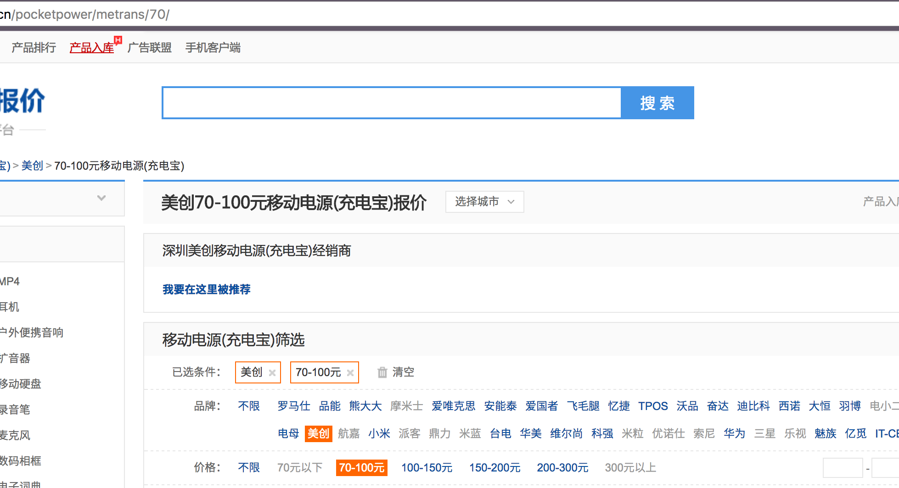

前端搜索引擎优化技巧：如何设计一个高质量的 URL 和标题
===

> 在过去的几年里，搜索引擎的影响力发生了一些变化——其影响力的趋势是逐渐变弱。应用程序已经变成了流量的一个大入口，当然搜索引擎也还是一个大的入口。搜索引擎优化看上去并没有那么重要，企业靠活动、运营来挖掘新的用户。可当所有的人不重视，而我们重视的时候，那么这个流量入口就是你的天下。

自打我开始写博客起（大概是在 2011 年左右），便开始研究搜索引擎优化（Search Engine Optimization），这项看似不重要的技术为我的博客带来 了大量的流量。

工作之后，我才发现是一门大生意——为了排在搜索引擎靠前的位置，每个网站每天都在不断的送钱给 Google、百度、Bing 等搜索引擎公司。当我们在 Google、百度上点击一下，首页上的某个推广链接，可能就会为它们带去几十美刀的收入。要是能竞争到此，那说明这个行业相当的赚钱。同时，处在这个行业的人呐也越来越不赚钱了——他们都把钱交给了科技公司了。

如我们在引言里所说的，搜索引擎的流量在逐渐地减弱，但是这**几乎**是一种一劳永逸的方式。我们只需要制定一个合理的 SEO 策略，再瞧瞧看竞争对手的规则、用户的习惯等等。我们就可以坐着看，用户从搜索引擎来到我们的网站。随后的日子里，我们只需要看看用户行为的一些变化，再做出一些改变即可。

前端工程师也需要的 SEO

网站有一部分的流量来源是搜索引擎，如以内容为主的网站，如各种博客、知识问题类网站，网站的主要功能也是搜索的网站，如各种手机、电脑、房产网站等等。

SEO 是前端的活，但是是由一些 SEO 专家来制定策略。

设计一个高质量的 URL
---

### 受 RESTful 影响 的 API

RESTful API 的设计原则，我们设计出来的 URL 可能会是这样的：

blog/:id，于是 URL 可能就是 blog/123，又或者是 blog/58c286d7ac502e0062d7c84e

要是稍微有一点规划，那么可能就是

### 自定义 URL

如我的博客的正常 URL 是这样的，https://www.phodal.com/blog/use-jenkinsfile-blue-ocean-visualization-pipeline/，对应的标题是：Jenkins 2.0 里使用 Jenkinsfile 设计更好的 Pipeline

如我的专栏：https://read.douban.com/column/5945187/ 《我的职业是前端工程师》 这真是一个不好记的东西

知乎上 https://zhuanlan.zhihu.com/beafe

这里的 use-jenkinsfile-blue-ocean-visualization-pipeline 就是优化的部分，而为了设计方便，大部分的单页面应用都会做成 /blog/123

这样做并没有啥问题，但是当用户搜索 jenkinsfile 和 pipline 时，劣势就出现了。

### 依据规则来生成 URL

而当搜索条件更加复杂时，想搜索一个 100~150 元左右的 移动电源时，不应该是 product/12345678 ，product/mobilebank-range-100-150-city-shenzhen

如果有后台渲染时，数据直接由后台处理：

在前端处理逻辑就会比较复杂，需要用正则去：(\S+)-range-(\d+)-(\d+)-city-(\S+)

高质量的标题：
---

示例 Title ： 文章标题 - 分类 | 网站名称 - 几个字简介

不算太差的标题

 - 我的职业是前端工程师 - 知乎专栏

移动电源 -【美创70-100元移动电源(充电宝)】美创70-100元移动电源(充电宝)报价及图片大全-ZOL中关村在线

【Phodal牌 100-150 元移动电源】Phodal 100- 150 元移动电源 - SITE INFO

