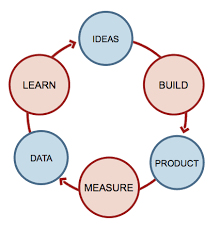

SEO 优化技巧 ：如何设计一个高质量的 URL 及页面标题
===

> 今天，很多网站的 URL 的设计都是有问题的——因为 RESTful。依据 RESTful API 原则，我们设计出来的 API 的 URL 都会有这样那样的缺陷。

-

> 在过去的几年里，搜索引擎的影响力发生了一些变化——其影响力的趋势是逐渐变弱。应用程序已经变成了流量的一个大入口，当然搜索引擎也还是一个大的入口。搜索引擎优化看上去并没有那么重要，企业靠活动、运营来挖掘新的用户。可当所有的人不重视，而我们重视的时候，那么这个流量入口就是我们的天下。

自打我开始写博客起（大概是在 2011 年左右），便开始研究搜索引擎优化（Search Engine Optimization）。这项看似不重要的技术，却为我的博客带来 了大量的流量。

工作之后，我才发现这是一门大生意——为了排在搜索引擎靠前的位置，每个网站每天都在不断的送钱给 Google、百度、Bing 等搜索引擎公司。当我们在 Google、百度上点击一下，首页上的某个推广链接，可能就会为它们带去几十美刀的收入。要是能竞争到此，那说明这个行业相当的赚钱。同时，处在这个行业的人呐也越来越不赚钱了——他们都把钱交给了科技公司了。

搜索引擎优化都是前端的活
---

如我们在引言里所说的，搜索引擎的流量在逐渐地减弱，但是这**几乎**是一种一劳永逸的方式。只需要制定一个合理的 SEO 策略，再瞧瞧看竞争对手的规则、用户的习惯等等。我们就可以坐等：用户从搜索引擎来到我们的网站。随后的日子里，只需要跟踪用户行为的变化，再做出一些适当的改变即可。

在决定玩搜索引擎优化之前，我们仍然得判断是不是需要搜索引擎优化。对于那些网站流量依赖于搜索引擎的网站来说，搜索引擎优化必要的，这样的网站有以内容为主的网站，如各种博客、知识问题类网站，网站的主要功能也是搜索的网站，如各种手机、电脑、房产网站等等。而对于大到一定体量的网站——用户已经有这个品牌意识的时候，他们对没有多大必要进行搜索引擎优化，而是更关注于如何提高用户体验。

当我们决定为网站进行搜索引擎优先的时候，需要执行一系列相关的调查、设计，并着手开始修改代码，上线，随后再分析线上的情况，不断的改进系统。系统以一种精益的模式在运行着：



而完成这部分的主要工作，都是在前端的页面模板上。而在那之前，我们得保证：我们的 Web 应用可以支持后台渲染。

> 如果当前的单页面应用不支持后台渲染，可以参考我之前写的文章《[单页面应用后台渲染的三次实践](https://github.com/phodal/articles/issues/20)》来完善后台渲染的机制。

作为一个前端工程师，我们需要做一系列的工作：

 - 设置好 HTML 中的 Title、URL、Keywords、Description
 - 页面中的内容是否可以正常显示。如果内容是动态生成的，那么整个系统对于搜索引擎的体验将会特别。尽管 Google 可以动态的渲染页面，但是仍然会有一些影响。
 - 页面的内容是否以推荐的 HTML 标签写的。如只有一个 H1 用于作内容的标题，多个 H1 标签可能会造成和 Title 不一致，导致显示在搜索引擎上的结果有误。
 - 页面中的内链是否分配得合理。页面中是不是会有指向重要页面的链接，如首页。或者每个分类的详情页都会有链接，并链接到列表页。这样一来，列表页的排名就会比较高。
 - 判断页面中的外链是否需要 nofollow 标签。
 - 如果有独立的移动站点，要检测一下，是不是需要 rel="canonical" 来表明他们的关系。
 - 是否需要采用 rel="next" 和 rel="preve" 来指明页面间的关系，以让第一页拥有较高的排名。同时还能为浏览器开启 Prefetch 功能。
 - 等等

我们需要做的活有一大堆。不过，考虑到这不是一本详细的 SEO 书籍，我们将关注于基础的部分：设置好  HTML 中的 Title、URL、Keywords、Description。

如何设计一个高质量的 URL
---

今天，很多网站的 URL 的设计都是有问题的。它们看起来一塌糊涂，仿佛是被人洗掉的脏数据一样，没有经过设计，没有经过思考。他们一点都不适合阅读，也不利于搜索引擎优化。

刚开始写博客的时候，我从来不会想着去自定义一个 URL。想好一个标题，没有敲好内容就直接提交了，可这个时候生成的 URL 总是很诡异。当我们去设计一个博客的时候，URL 是一个头疼的问题。设计之下，每个人选择的方案都有所不同：

 - 直接使用博客的 ID，如 /blog/123，即省事又方便
 - 自动生成 URL
   - 将标题转换为拼音或者英语单词，如 blog/ruhe-sheji-yige-gaozhilang-de-url
   - 根据日期和 ID 生成，诸如 blog/2017/02/123
   - 等等
 - 自定义 URL，诸如 blog/how-to-design-a-high-quality-url。如果要考虑到一些推荐的 URL 设计原因，如介词，这个 URL 应该变成 howto-design-hight-quality-url。

也因此，我们会发现大部分的架构设计里，都忽略了对 URL 的设计——只是为了更加方便的使用 RESTful。

### 受 RESTful API 影响 的 URL 设计

依据 RESTful API 原则，我们设计出来的 API 的 URL 都会有这样的缺陷。如下是 RESTful API 设计的一个简单的实例：
 
 动作   | URL                    | 行为
---------|--------------------|----------------
GET      | /blog               | 获取所有的文章（PS：实践的时候，通常会采用分页机制）
GET      | /blog/:id         | 获取某一个具体的文章
PUT       |  /blog/:id       |  更新某一个具体的文章
POST    |  /blog             | 创建一个新的文章
DELETE | /blog/:id        | 删除某一个具体的文章

最后，我们设计出来的文章地址，可能就是 blog/123，又或者是 blog/58c286d7ac502e0062d7c84e。因为，我们是依据这个 ID 到数据库去操作（CRUD）相应的值。ID 本身是自增的，并且是唯一的，所以这种设计因此就比较简单了。因此，我们到数据去查询的时候，我们只需要``where id="123"``即可。

可是对于一个博客来说，**每个博客的链接都是唯一**的。因此，我们仍然可以使用``where slug="how-to-design-a-high-quality-url"。

于是，自定义 URL 就是其中的一种形式。

### 手动自定义 URL

与 URL 相比，ID 本身是不如记的。如我的专栏《我的职业是前端工程师》 的豆瓣上的链接是：[https://read.douban.com/column/5945187/](https://read.douban.com/column/5945187/) ，而在知乎上则是 [https://zhuanlan.zhihu.com/beafe](https://zhuanlan.zhihu.com/beafe)。试问一下，如果要记下来的话，哪个更轻松？

以我的博客为例，正常的 URL 是这样的，[https://www.phodal.com/blog/use-jenkinsfile-blue-ocean-visualization-pipeline/](https://www.phodal.com/blog/use-jenkinsfile-blue-ocean-visualization-pipeline/)，对应的标题是：[Jenkins 2.0 里使用 Jenkinsfile 设计更好的 Pipeline](https://www.phodal.com/blog/use-jenkinsfile-blue-ocean-visualization-pipeline/)，这种设计本身可以将关键词融入  URL ，就更容易换得一个好的排名：


这里的 use-jenkinsfile-blue-ocean-visualization-pipeline 就是优化的部分。而为了设计方便，大部分的博客都会将 URL 设计成 /blog/123。结果便是，当用户搜索 jenkinsfile 和 pipline 时，就出现了一些劣势。

对应的，使用汉字搜索为主的中文网站来说，使用 wo-de-zhiye-shi-qianduan-gongchenshi 可能是一种更不错的选择。我们只需要使用一些分词库，就可以生成对应的中文拼音 URL。

当我们有大量的商品的时候，手动定义可能会让人有些厌烦。于是我们应该定义一些规则，然后生成相对应的 URL。

### 详情页 ：简单的 URL 生成规则

考虑到手动生成的难度，以及一些 RESTful 设计的风格问题，我们可以考虑结合他们的形式，诸如：

动作   | URL                                        | 行为
---------|------------------------------------|----------------
GET      | /blog/:id/:blog-slug         | 获取某一个具体的文章

是的，只需要改进一下 URL 生成的规则就可以了。StackOverflow 采用的就是这种设计，当我们从 Google 访问一个 URL 的时候，我们访问的地址便是：**questions/:question-id/:question-slug** 这种形式，其中的 id 和 slug 都是自动生成的，如：

```
questions/20381976/rest-api-design-getting-a-resource-through-rest-with-different-parameters-but
```

而当我们使用 question/:question-id 的形式访问时，诸如 questions/20381976，就会被永久重定向到上面的带 slug 的地址。

与手动相比，使用这种方式，即可以保证 URL 的质量，又可以减轻后台的负担——我们不根据 URL 来获取数据，我们仍然使用 ID 来获取数据，仍然可以对数据进行缓存。

而 RESTful 原则主要解决的问题是：对于资源的分类。，我们就需要一些更高级的 URL 设计。

### 自动化 URL：分类与多级目录

假使我们的网站上拥有大量的商品时，那么我们采用 RESTful 来描述资源时，这个时候路径可能就会变成这样：

```
/markets/3c/sj/meizu/meizu-mx5
```

如果不考虑搜索引擎优化，这个 URL 本身是没有什么毛病的，除了：**分类有点多**。

分类多对于 SEO 来说，主要问题就是，Page Rank 会被分配到不同的分类上，而导致当前页面的 Page Rank 比较低。因而，对于不同的网站来说可能有不同的策略需求。有的网站可能需要主目录的 Rank 比较高，有的网站则需要详情页的 Rank 值比较高，因此也没有一个好的定论：

 - 如果希望详情页的 Rank 比较高，那么应该减少分类
 - 如果需要分类的 Rank 比较高，那么这样设计就是合理的

### 搜索结果页：将参数融入 URL

在上面的例子中，因为博客都是唯一的，所以要配置一个唯一的参数都是比较简单的。当我们需要搜索结果时，情况就变得有些复杂——我们需要搜索和过滤。

对于一个使用 RESTful API 表示的搜索结果页，我们会这样去配置它的 URL：

```
http://www.xxx.com/search/?q={keyword}&page={page}&size={size}
```

然后，再我们的 Link Header 里指定下一页的结果就可以了。这样的 API 设计看上去，非常适合我们的场景。用户在筛选条件里选好想要的条件，再填入关键词就可以了。

现在让我们来假设一种用户场景，我们想搜索一个 100~150 元左右的 移动电源，并且它还是深圳产的。这个时候，网页返回的 URL 可能就是：

```
search/?minPrice=100&maxPrice=150&product=powerbank&location=shenzhen&page=1
```

这个时候索引的结果，可就失去了分类的意义了。于是，我们需要一个更好的 URL，诸如：

```
product/powerbank/?minPrice=100&maxPrice=150&location=shenzhen&location=shenzhen
```

那么，对于 URL 索引的 Rank 将会加给 powerbank，点击量 + 页面数量可以让它有一个好的排名：

当然诸如淘宝、京东这样的网站就不需要这么做了，他们对于 SEO 的需求没有这么强烈——因为要在百度上排个好名，可不止 SEO 的事了。

而如果我们愿意的话，还可以将参数融入到 URL 中，powerbank/range-100-150-city-shenzhen/page-1。这样，不止移动电源上有一个好的排名，100~150 元的移动电源也可以有一个好的排名。这时候，我们需要使用正则来匹配这些规则，一个简单的示例`` (\S+)-range-(\d+)-(\d+)-city-(\S+)``，匹配结果如下：


但是，不管怎样这些参数带来的影响，都是相当微弱的。正在要做好的是网站本身，以及相关的站点结构设计、网站内容。

自动生成高质量的站点标题
---

### 什么是站点标题？

就是我们在搜索结果页看到的那个标题。


如上图所示的结果，是我用 Google 搜索：“程序员如何提高影响力”得到的结果。对应的第一个链接的，``如何提高影响力- Phodal | Phodal - A Growth Engineer`` 就是我博客的站点标题。对应在 HTML 中就是 title 标题：


### 什么才算一个高质量的站点标题？

这是一个很趣的问题。我想应该是在标题里，带有我想要的信息吧。对于一篇博客来说，我可能想看到的内容有：文章的标题，站点的简单介绍，谁的网站等等的内容。

如上图中的我的博客的标题，就是一个不错的示例。标题里带有：文章的标题，作者名、站点名、站点简介，即：``文章标题 - 作者名 | 站点名 - 站点简介``。上图中的 SegmentFault 的标题也相当的不错，``文章标题 - 专栏标题 - 站点名``。而知乎的专栏，就没有那么有趣了：``程序员如何提高影响力2.0 - 知乎专栏``。

有了上面的例子之后，要完成一个相似的站点标题就更添加容易了：即将产品的相关信息带入到标题里。上面的例子中的 Title 看上去都有点生硬，如果我们愿意的话，我们也可以对其进行优化。

该说的我们都说了，最后再来说说为什么吧。如下是 Google 搜索结果中的用户热图：


尽管发生了一些变化，但是我们会发现：用户仍然集中注意力在左侧区域，即文章的标题部分。也就是说，我们应该将标题放在最左边，而与搜索无关的网站信息放在最右边。

所以，标题的形式应该是：文章标题 - 各种相关信息。由于 Title 标签拥有比较重要的作用，所以在不影响读者阅读的时候，应该尽可能地把相关的信息放进去。
