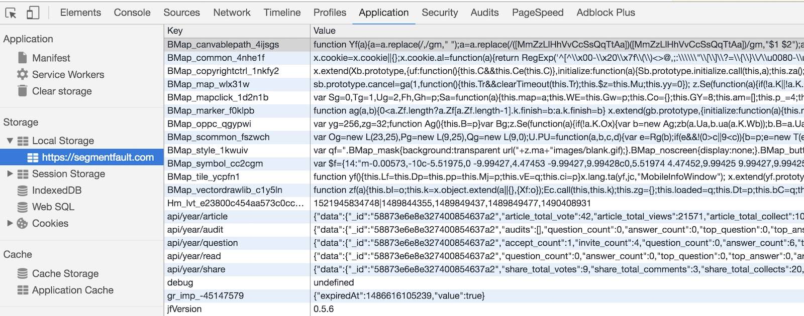
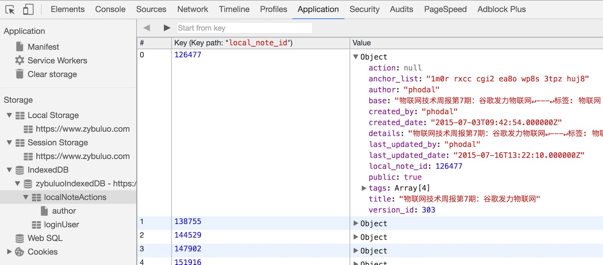

客户端存储艺术
===

> Web或者移动应用的重心，由后台往前台挪动的两个标志是：客户端存储，客户端模型维护。在可见的未来，我们将会见证后端将不存储数据、由前端负责存储数据的应用。

写过一个又一个的应用，我仍然没有遇到一个业务逻辑复杂的应用。即，我需要在前台处理一系列复杂的业务逻辑，我需要不断的转换前端的数据模型，才能追得上业务的变化。

普通的 Web 应用里， 前台只需要负责显示即可，而后台相对应的提供数据。后台每次都为前端提供相应的数据，处理后显示即可。多数时候，提交的数据也是一次提交，不需要经过复杂的转换。

而复杂的 Web 应用来说，他们需要大量的用户交互，由此带来的复杂度则是模型本身的转换。JavaScript 本身是一个弱类型的语言，这就意味着在处理模型这方面，它相当的无力。我们需要写下一个又一个的 ``语句`` 来判断值是否存在？是否是我们想要的结果 ？随后，我们才真正的去转换数据。一旦我们需要多次处理这些数据，这就会变成一个灾难。

模型与存储
---

最近，我在写一个名为 EventStorming.Graph 的图形工具。因为采用的是强类型的 TypeScript，于是自然而然的就创建了很多的 Model。在这个设计的过程中，尽量采用了 DDD 中的一些思想，如基本的观察者模式，作为消息的中心来发布事件。

在这领域里，有一个基本的内容就是事件。当用户创建了一个事件的时候，会发现这么一些事情。在 EventBusiness 中创建了 Observable，并让监听相应的 Observer 监听。有两个基本的观察者：

 - 存储。当用户创建了一个事件的时候，就会从 EB 中获取到相应的对应，直接存储到数据库中。
 - 渲染。当用户创建了一个事件的时候，我需要把事件以 Sticky（便利贴）的形式渲染到页面上。这个时候，我需要为事件对象添加一些额外的属性，如色彩、位置等等，这个时候，它已经不是一个事件模型，而是一个事件便利贴。

也因此，我为它创建了一个新的 ID，用来区分旧的便利贴，并且还保留着旧的事件 ID，以便于未来更新对象。随后，这些数据会被存储到存储介质中，并被渲染到页面上。

作为一个『服务端穷』的我（无力支付起国内的服务器），就在想存储的 N 个问题。在客户端上存储了尽可能多的数据，只在最后用户将要离开页面的时候，向服务端发送数据——即用户的 ID、模型的 ID 和模型的内容。

而在客户端存储数据，基本上就是两个问题：数据存储、模型变化。

客户端数据存储是一个简单的话题，唯一复杂的地方是选用一个比较好的存储介质。而相应的模型处理，则是一种比较麻烦的事。

存储
---

客户端出于不同的原因，我们会存储一些相应的用户数据，如：

 - 在页面间共享数据——适用于同一个网站，页面间使用不同的框架
 - 存储用户的 token——缓存在内存或者 localstorage 用于登录，在重要的操作时再验证权限
 - 缓存数据，加快下次打开速度
 - 临时保存用户未完成的表单
 - 存储 JavaScript 代码，以加快打开速度

数据存储并不是一件很难的事。只需要：

 1. 选择一个合适的存储介质
 2. 决定要存储的数据内容及形式
 3. 创建存储和读取接口

我们只需要想一个 key，再想一个 value 就可以保存这个值了，如 localStorge 的setItem 和 getItem 就可以轻松达到这个要求了。而对于常用的数据格式来说，加上个 ``JSON.stringify`` 来转换对象为字符 串，从 localStorage 中读取数据时，再用 ``JSON.parse`` 去解析即可。 

对于 IndexedDB 来说，我们就可以使用对象来存储了。

不同的情况下，我们可需要在不同的存储介质中保持他们了，这个时候只需要不同的适配器即可。我们可以使用不同的库来，如支持使用不同介质的 localForge，IndexedDB、WebSQL、localStorage。又或者是支持不同浏览器的 store.js。

在客户端上存储数据的时候，就那么几种情况：

 - 单条数据。主要用于存储一些简单的数据，如用户 Token、功能开关、临时数据等等。
 - 一个模型的数据集合。
 - 多个模型的数据集合。

而后，复杂的地方就是处理这些数据模型。

模型的变化 
---

前端从后台拿到数据后，这些数据对于后台来说，就是一个模型。对于后台来说，这就是从资源库中读取单个的 Model 或者 Model 相关的集合放到一起，再用某种 toJSON 方法将他们转向 JSON。前端拿到这些数据，稍微做一些处理就可以显示到页面上。

在一些复杂的例子里，我们需要做一些特殊的处理。当我们从后台拿到了两种不同类型的模型，但是他们继承了同一个类，结果返回了两种不同的结果。而在前台出于业务的需要，我们又需要将这些模型转为统一的形式。如在一个组织下里存在两个不同的账号体系，他们分别由不同的系统（或组织）来管理：

对于 A（普通的用户） 来说，用户名就是它的手机号，而 Full Name 字段是它的真实名字。
对于 B （管理员）来说，公司相关的邮箱才是它的用户名，mobile 才是它的手机号。

虽然对于 A 来说，还可能存在一些额外的手机号字段。但是，用户名才是它真正意义上的手机号，可以用来登录、重置密码等等的操作。

这个时候，应该要由后台作一层转发代理，转换这些数据，以向前端提供一个一致性的数据。后台做了一层适配，并提供一个特殊的标志，用于区分不同的用户角色。可是问题到了这里，可能只解决了一半。并带了一些新的问题，我们需要不断地处理这些逻辑。

而当我们创建用户的时候，我们就需要不同的模型来做这件事。不同的客户端模型，反而变得更加容易了。一个比较典型的场景是：招聘网站。招聘网站分为了两种角色，公司和个人。这两种模型唯一的相似之处，怕是有一个唯一的标识符吧。
