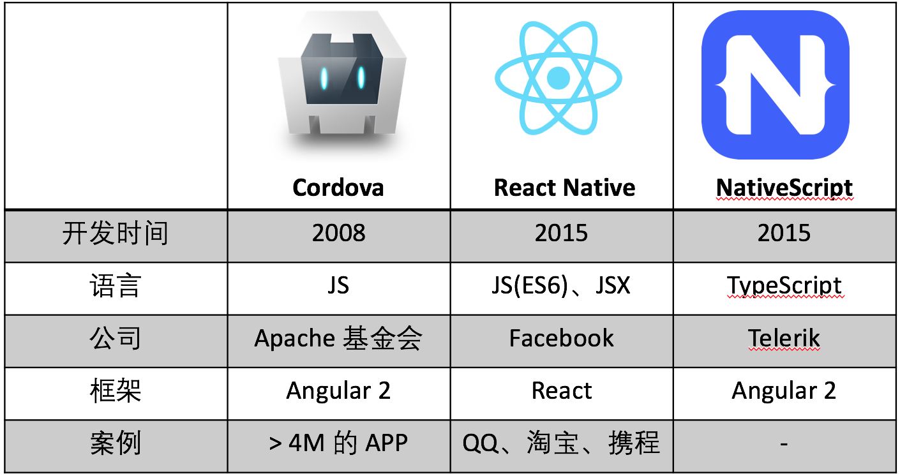

谈谈前端工程师开发移动应用
===

> 想来在这一个混合应用的项目上，我已经差不多做了一年了。加之，在上一个项目里，我做的是一个移动
Web 应用，从 Backbone 到设计基于 React 的原型，也积累了一定的移动开发经验。

与别人谈起移动应用的时候，作为一个前端开发人员，我总会有一些疑惑？你说的移动应用到底是指什么？

 - 针对移动设备的 Web 应用
 - 针对移动设备的 APP 应用

这两者都可以称作是移动应用。可这到底是我对于它们的分类，对于不同的人来说，又有不一样的分法。如，对于移动
APP 应用来说，如果是使用 HTML + JavaScript 实现的混合应用，算上是 Web
应用。要我说啊，这种分法是有些奇怪的。

它好像是在某种程度上说，只有你的应用是用原生的 Android 和 原生的 iOS
代码编写时，它才能算是一个移动应用——你用  JavaScript
写的应用，怎么能算得上是移动 APP 应用呢？

只是到了今天，许许多多的事情都发生了一些变化。

混合应用
---

与原生应用相比，Web 应用有着相当多的优势：

 - 更快的开发效率，更短的发布周期
 - 耗费更少的人力（至少少一倍）
 - Web 应用的生态更加丰富。可以使用各种成熟的 UI 组件

在移动应用开发的早期，市场上很难找到相对应的
Android/iOS人才，并且还有着高昂的成本。于是，人们就想：

> 让Web开发人员可以利用他们所有的HTML、CSS和JavaScript知识，而且仍旧可以同iPhone的重要本地应用程序(如摄像头和通讯录)交互呢？

就这样诞生了 PhoneGap/Cordova，它可以原生不动的运行 Web
应用。自那以后，有相当多的移动 APP 应用是使用 Web
来开发的——据混合应用开发框架 Ionic 官网显示，已经有超过 400 万个应用使用
Ionic 来构建。按我的猜测应该是：生成的项目，当我们使用 Ionic
来生成应用的时候，官方就会统计到相应的应用已创建。

这种使用 HTML + JavaScript 来作为移动应用的应用称为混合应用，它可以兼具
Web App 的跨平台及使用 Native 应用的接口。当我们手上已经有一套 UI
组件，如 Ionic，及单页面应用框架时，要开发起这样的应用更是手到擒来。诸如
Ionic 这样的框架，不仅封装了不同系统上的 UI，还提供了 ngCordova
的方案——封装第三方原生插件。

### 性能

混合应用性能受限有三个主要原因：

1. 设备自带的 WebView（PS：可以视作是浏览器） 影响。如旧的 Android
   设备（PS：Android 4.4
以下的版本）上的浏览器，其性能比较低，并且不兼容一些标准，如不支持 SVG。
2. 浏览器自带的 JavaScript 引擎效率低
3. DOM 操作效率低，导致页面卡顿。

今天的混合应用开发技术，已经成熟得不能再成熟了，人们开始在追求性能上的一些突破。这个时候，我们需要一个更快的
WebView，如 CrossWalk，又或者是使用诸如  React Native 或者 NativeScript
这样的方案。

### 选型指南

如果你仍然计划使用混合应用来作为开发移动应用，那么我相信你一定是出于下面的原因来考虑的：

 - Web 端使用的是与移动端相似的技术栈。当 Web 端使用的是 Angular 2 的时候，移动端使用基于 Angular 2，可以利用部分代码。同理于，React + Cordova，又或者是 Cordova + Weex。
 - 在 Web 方面的经验比较丰富，没有足够的能力来支撑起 React Native 的开发。
 - 你们在这方面已经有相当多的积累。在这个时候，开始一个应用都只是修改模板的工作。
 - 性能对于你们来说并不重要。对于很多资讯类、浏览类的应用来说，性能并非是重点。
 - 用户是高端人士，使用 iOS 和高级的 Android 手机。这个时候，你基本上不需要考虑 Android 低版本的问题。

如果上面的原因没有说服你，那么你应该选择使用 Ionic。作为一个 Ionic 框架的深度用户，**我已经开发了近十个基于 Ionic 的应用**，Ionic 可以为你提供丰富的 UI 组件，大量的原生插件可以使用。与此同时，我们可以发现 Ionic 应用的性能，正在努力地提升着~~。

并且依照我的开发习惯，它不仅仅可以作为一个移动 APP 应用，还可以是一个移动 Web 应用，又或者是 PWA 应用。丰富的 Web 组件，你只需要写一次，就可以在所有的平台上运行，React Native 可是做不到的哦。

React Native
---

越来越多的前端开发人员，加入了编写 React Native 的大军。主要便是因为可以使用 JavaScript 来实现功能，而编译运行之后， 又可以拥有接近原生应用的性能。即，我们仍然可以:

> write once, run anywhere

与 Cordova 不自 JavaScript 引擎与 WebView 相比，React Native 自带 JavaScriptCore 作为 JavaScript 引擎倒是一种明智的做法。它可以解决低版本 Android 设备上的 JS 引擎效率问题。

当然，如果基于 Cordova 的应用，还自带 WebView。那么，它可能做不到这么轻的量级。与此同时，与 React Native 相比，Cordova 是通过 WebView 来执行 JavaScript，这到底仍然是浪费了一些资源。

#### iOS

JavaScriptCore WebView

#### Android

内置了一个用于解析 JavaScript 脚本的框架

初始化阶段，Java端会把所有要暴漏的Java类的信息封装成Config传给JS，然后根据Config生成对应Java类的Javascript镜像对象，以及要暴漏的方法，在JS中调用这个镜像对象的方法就会被转发到对应的Java对象上

NativeScript、Weex及其他
---
