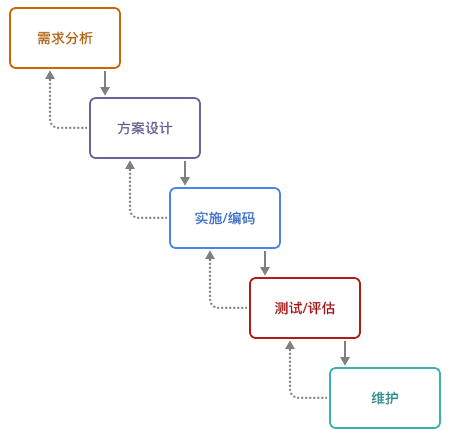
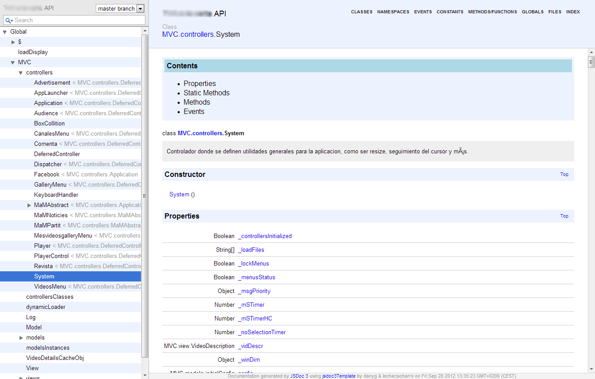
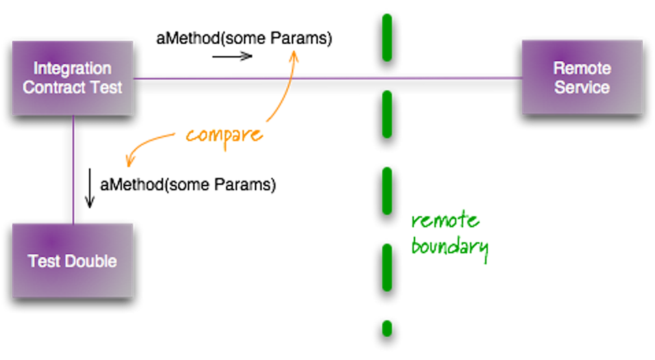

如何处理好前后端分离的 API 问题
===

> API 都搞不好，还怎么当程序员？如果 API 设计只是后台的活，为什么还需要前端工程师。

作为一个程序员，我讨厌那些没有文档的库。我们就好像在操纵一个黑盒一样，预期不了它的正常行为是什么。输入了一个 A，预期返回的是一个 B，结果它什么也没有。有的时候，还抛出了一堆异常，导致你的应用崩溃。

因为交付周期的原因，接入了一个第三方的库，遇到了这么一些问题：文档老旧，并且不够全面。这个问题相比于没有文档来说，愈加的可怕。我们需要的接口不在文档上，文档上的接口不存在库里，又或者是少了一行关键的代码。

对于一个库来说，文档是多种多样的：一份 demo、一个入门指南、一个 API 列表，还有一个测试。如果一个 API 有测试，那么它也相当于有一份简单的文档了——如果我们可以看到测试代码的话。而当一个库没有文档的时候，它也不会有测试。

在前后端分离的项目里，API 也是这样一个烦人的存在。我们就经常遇到各种各样的问题：

 - API 的字段更新了
 - API 的路由更新了
 - API 返回了未预期的值
 - API 返回由于某种原因被删除了
 - 。。。

**API 的维护是一件烦人的事，所以最好能一次设计好 API。**可是这是不可能的，API 在其的生命周期里，应该是要不断地演进的。它与精益创业的思想是相似的，当一个 API 不合适现有场景时，应该对这个 API 进行更新，以满足需求。也因此，API 本身是面向变化的，问题是这种变化是双向的、单向的、联动的？还是静默的？

API 设计是一个非常大的话题，这里我们只讨论：演进、设计及维护

前后端分享 API 的演进史
---

刚毕业的时候，工作的主要内容是用 Java 写网站后台，业余写写自己喜欢的前端代码。慢慢的，随着各个公司的 Mobile First 战略的实施，项目上的主要语言变成了 JavaScript。项目开始实施了前后端分离，团队也变成了全功能团队，前端、后台、DevOps 变成了每个人需要提高的技能。于是如我们所见，当我们完成一个任务卡的时候，我们需要自己完成后台 API，还要编写相应的前端代码。

尽管当时的手机浏览器性能，已经有相当大的改善，但是仍然会存在明显的卡顿。因此，我们在设计的时候，尽可能地便将逻辑移到了后台，以减少对于前端带来的压力。可性能问题在今天看来，差异已经没有那么明显了。

如同我在《[RePractise：前端演进史](https://github.com/phodal/repractise/blob/gh-pages/chapters/frontend.md)》中所说，前端领域及 Mobile First 的变化，引起了后台及 API 架构的一系列演进。

最初的时候，我们只有一个网站，没有 REST API。后台直接提供 Model 数据给前端模板，模板处理完后就展示了相关的数据。

当我们开始需要 API 的时候，我们就会采用最简单、直接的方式，直接在原有的系统里开一个 API 接口出来。


为了不破坏现有系统的架构，同时为了更快的上线，直接开出一个接口来得最为直接。我们一直在这样的模式下工作，直到有一天我们就会发现，我们遇到了一些问题：

 - API 消费者：一个接口无法同时满足不同场景的业务。如移动应用，可能与桌面、手机 Web 的需求不一样，导致接口存在差异。
 - API 生产者：对接多个不同的 API 需求，产生了各种各样的问题。

于是，这时候就需要 BFF（backend for frontend）这种架构。后台可以提供所有的 MODEL 给这一层接口，而 API 消耗端则可以按自己的需要去封闭。


API 消费者可以继续使用 JavaScript 去编写 API 适配器。后台则慢慢的因为需要，拆解成一系列的微服务。


系统由内部的类调用，拆解为基于 RESTful API 的调用。后台 API 生产者与前端 API 消费者，已经区分不出谁才是真正的开发者。

瀑布式开发的 API 设计
---

说实话，API 开发这种活就和传统的瀑布开发差不多：未知的前期设计，痛苦的后期集成。好在，每次这种设计的周期都比较短。



新的业务需求来临时，前端、后台是一起开始工作的。而不是后台在前，又或者前端先完成。他们开始与业务人员沟通，需要在页面上显示哪些内容，需要做哪一些转换及特殊处理。

然后便配合着去设计相应的 API：请求的 API 路径是哪一个、请求里要有哪些参数、是否需要鉴权处理等等。对于返回结果来说，仍然也需要一系列的定义：返回哪些相应的字段、额外的显示参数、特殊的 header 返回等等。除此，还需要讨论一些异常情况，如用户授权失败，服务端没有返回结果。

整理出一个相应的文档约定，前端与后台便去编写相应的实现代码。

最后，再经历痛苦的集成，便算是能完成了工作。

可是，API 在这个过程中是不断变化的，因此在这个过程中需要的是协作能力。它也能从侧面地反映中，团队的协作水平。

API 的协作设计
---

API 设计应该由前端开发者来驱动的。后台只提供前端想要的数据，而不是反过来的。后台提供数据，前端从中选择需要的内容。

我们常报怨后台 API 设计得不合理，主要便是因为后台不知道前端需要什么内容。这就好像我们接到了一个需求，而 UX 或者美工给老板见过设计图，但是并没有给我们看。我们能设计出符合需求的界面吗？答案，不用想也知道。

因此，当我们把 API 的设计交给后台的时候，也就意味着这个 API 将更符合后台的需求。那么它的设计就趋向于对后台更简单的结果，比如后台返回给前端一个 Unix 时间，而前端需要的是一个标准时间。又或者是反过来的，前端需要的是一个 Unix 时间，而后台返回给你的是当地的时间。

与此同时，按前端人员的假设，我们也会做类似的、『不正确』的 API 设计。

因此，API 设计这种活动便像是一个博弈。

### 使用文档规范 API

不论是异地，或者是坐一起协作开发，使用 API 文档来确保对接成功，是一个“低成本”、较为通用的选择。在这一点上，使用接口及函数调用，与使用 REST API 来进行通讯，并没有太大的区别。

先写一个 API 文档，双方一起来维护，文档放在一个公共的地方，方便修改，方便沟通。慢慢的再随着这个过程中的一些变化，如无法提供事先定好的接口、不需要某个值等等，再去修改接口及文档。

可这个时候因为没有一个可用的 API，因此前端开发人员便需要自己去 Mock 数据，或者搭建一个 Mock Server 来完成后续的工作。

因此，这个时候就出现了两个问题：

 - 维护 API 文档很痛苦
 - 需要一个同步的 Mock Server

而在早期，开发人员有同样的问题，于是他们有了 JavaDoc、JSDoc 这样的工具。它可以一个根据代码文件中中注释信息，生成应用程序或库、模块的API文档的工具。



同样的对于 API 来说，也可以采取类似的步骤，如 Swagger。它是基于 YAML语法定义 RESTful API，如：

```
swagger: "2.0"

info:
  version: 1.0.0
  title: Simple API
  description: A simple API to learn how to write OpenAPI Specification

schemes:
  - https
host: simple.api
basePath: /openapi101

paths: {}
```

它会自动生成一篇排版优美的API文档，与此同时还能生成一个供前端人员使用的 Mock Server。同时，它还能支持根据 Swagger API Spec 生成客户端和服务端的代码。

然而，它并不能解决没有人维护文档的问题，并且无法及时地通知另外一方。当前端开发人员修改契约时，后台开发人员无法及时地知道，反之亦然。但是持续集成与自动化测试则可以做到这一点。

### 契约测试：基于持续集成与自动化测试

当我们定好了这个 API 的规范时，这个 API 就可以称为是前后端之间的契约，这种设计方式也可以称为『契约式设计』。（定义来自[维基百科](https://zh.wikipedia.org/wiki/%E5%A5%91%E7%BA%A6%E5%BC%8F%E8%AE%BE%E8%AE%A1)）

> 这种方法要求软件设计者为软件组件定义正式的，精确的并且可验证的接口，这样，为传统的抽象数据类型又增加了先验条件、后验条件和不变式。这种方法的名字里用到的“契约”或者说“契约”是一种比喻，因为它和商业契约的情况有点类似。

按传统的『瀑布开发模型』来看，这个契约应该由前端人员来创建。因为当后台没有提供 API 的时候，前端人员需要自己去搭建 Mock Server 的。可是，这个 Mock API 的准确性则是由后台来保证的，因此它需要共同去维护。

与其用文档来规范，不如尝试用持续集成与测试来维护 API，保证协作方都可以及时知道。

在 2011 年，Martin Folwer 就写了一篇相关的文章：[集成契约测试](http://martinfowler.com/bliki/IntegrationContractTest.html)，介绍了相应的测试方式：



其步骤如下：

 - 编写契约（即 API）。即规定好 API 请求的 URL、请求内容、返回结果、鉴权方式等等。
 - 根据契约编写 Mock Server。可以彩 Moco
 - 编写集成测试将请求发给这个 Mock Server，并验证

如下是我们项目使用的 [Moco](https://github.com/dreamhead/moco) 生成的契约，再通过 [Moscow](https://github.com/macdao/moscow) 来进行 API 测试。

```
[
    {
        "description": "should_response_text_foo",
        "request": {
	      "method": "GET",
	      "uri": "/property"
	    },
        "response": {
		    "status": 401,
		    "json": {
		        "message": "Full authentication is required to access this resource"
		    }
		}
    }
]
```

只需要在相应的测试代码里请求资源，并验证返回结果即可。

而对于前端来说，则是依赖于 UI 自动化测试。在测试的时候，启动这个 Mock Server，并借助于 Selenium 来访问浏览器相应的地址，模拟用户的行为进行操作，并验证相应的数据是否正确。


当契约发生发动的时候，持续集成便失败了。因此相应的后台测试数据也需要做相应的修改，相应的前端集成测试也需要做相应的修改。因此，这一改动就可以即时地通知各方了。

### 前端测试与 API 适配器

使用代理，如 node-http-proxy，来写上不同环境的配置：


开始写 React 组件的时候，我发现了一个名为 PropTypes 的类型检测工具，它会对传入的数据进行验证。在那之前，我们总会写下一行又一行的：

```
if(response && response.data && response.data.length > 0){}
```

这部分工作本来应该是由后台去做的，不得已的情况下，也需要加一层适配层


TypeScript 这种强类型的语言也有其优点

如我之前尝试的：[DDM](https://github.com/phodal/ddm)。不过，设计倒是有待改进~~，Redux 可以管理状态，还应该有个相应的类型检测及 Adapter 工具~。

