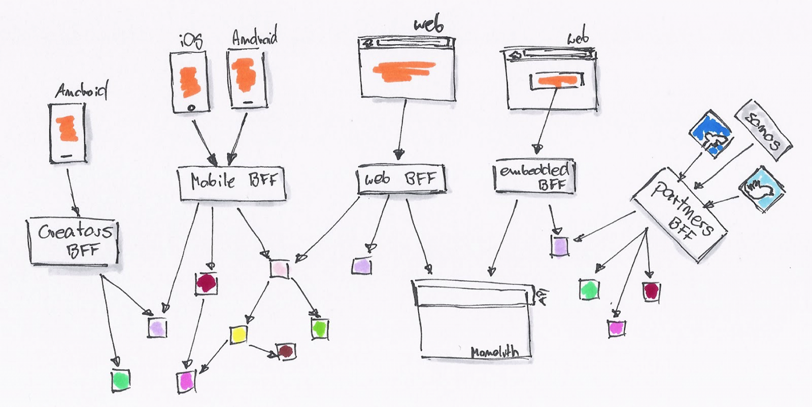

前后端分离的 API 的正确打开姿势
===

子标题：前端应该是 API 的主设计者

> 如果 API 设计只是后台的活，那么不需要前端工程师了。

作为一个程序员，我讨厌那些没有文档的库，当一个库没有文档的时候，它也不会有测试。

如果一个 API 有测试，那么它也相当于有一份简单的文档了——如果我们可以看到测试代码的话。

因为交付周期的原因，接入了一个第三方的库，遇到了这么一些问题：文档老旧，并且不够全面。

当我们在做一个前后端分离的项目时，我们就经常遇到这样的问题。**API 的维护是一件烦人的事，所以在设计之前，你已经设计好你需要什么内容。

API 设计是一个非常大的话题，这里我们只讨论：设计、使用及维护

API 演进史
---

刚毕业的时候，工作的主要内容是用 Java 写网站后台，业余写写自己喜欢的前端代码。慢慢的，随着各个公司的 Mobile First 战略的实施，项目上的主要语言变成了 JavaScript。项目开始实施了前后端分离，团队也变成了全功能团队，前端、后台、DevOps 变成了每个人需要提高的技能。于是如你所见，当我们完成一个任务卡的时候，我们需要自己完成后台 API，还要编写相应的前端代码。

尽管当时的手机浏览器性能，已经有相当大的改善，但是仍然会存在明显的卡顿。因此，我们在设计的时候，尽可能地便将逻辑移到了后台，以减少对于前端带来的压力。可性能问题在今天看来，差异已经没有那么明显了。

API 的协作设计
---

API 设计实际上应该是由前端人员来驱动的。后台只提高你想要的数据，而不是反过来的。后台提供数据，你从中选择你需要的内容。

我们常报怨后台 API 设计得不合理，主要便是因为后台不知道前端需要什么内容。

这就好像你接到了一个需求，而 UX 或者美工给老板见过设计图，但是并没有给你看。你能设计出符合需求的界面吗？

答案，不用想也知道。

因此，当你把 API 的设计交给后台的时候，也就意味着这个 API 将更符合后台的需求。那么它的设计就趋向于对后台更简单的结果，比如后台返回给你一个 Unix 时间，而你需要的是一个标准时间。又或者是反过来的，你需要的是一个 Unix 时间，而后台返回给你的是当地的时间。

与此同时，按前端人员的假设，我们也会做类似的、『不正确』的 API 设计。

因此，这种活动便像是一个博弈。

### 遵循 API 约定

Swagger

方式

 - 契约即测试代码（contract as code）
 - API 即文档（api as document）

API 编程指南
---

考虑到后台是『不相信』（不知道）前端的数据是否满足格式。

因此，API 第一原则：不要『相信』后台返回的数据。它可能返回给你一个 null 或者 ""，而不都是正确的结果。

### 编写自动化测试进行覆盖

### 对接口进行数据检验

### 处理异常
