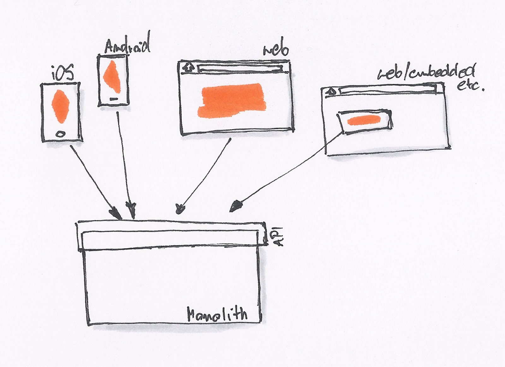

如何处理好前后端分离的 API 问题
===

> API 都搞不好，还怎么当程序员？如果 API 设计只是后台的活，为什么还需要前端工程师。

作为一个程序员，我讨厌那些没有文档的库。我们就好像在操纵一个黑盒一样，预期不了它的正常行为是什么。输入了一个 A，预期返回的是一个 B，结果它什么也没有。有的时候，还抛出了一堆异常，导致你的应用崩溃。

因为交付周期的原因，接入了一个第三方的库，遇到了这么一些问题：文档老旧，并且不够全面。这个问题相比于没有文档来说，愈加的可怕。我们需要的接口不在文档上，文档上的接口不存在库里，又或者是少了一行关键的代码。

对于一个库来说，文档是多种多样的：一份 demo、一个入门指南、一个 API 列表，还有一个测试。如果一个 API 有测试，那么它也相当于有一份简单的文档了——如果我们可以看到测试代码的话。而当一个库没有文档的时候，它也不会有测试。

在前后端分离的项目里，API 也是这样一个烦人的存在。我们就经常遇到各种各样的问题：

 - API 的字段更新了
 - API 的路由更新了
 - API 返回了未预期的值
 - API 返回由于某种原因被删除了
 - 。。。

**API 的维护是一件烦人的事，所以最好能一次设计好 API。**可是这是不可能的，API 在其的生命周期里，应该是要不断地演进的。它与精益创业的思想是相似的，当一个 API 不合适现有场景时，应该对这个 API 进行更新，以满足需求。也因此，API 本身是面向变化的，问题是这种变化是双向的、单向的、联动的？还是静默的？

API 设计是一个非常大的话题，这里我们只讨论：演进、设计及维护

前后端分享 API 的演进史
---

刚毕业的时候，工作的主要内容是用 Java 写网站后台，业余写写自己喜欢的前端代码。慢慢的，随着各个公司的 Mobile First 战略的实施，项目上的主要语言变成了 JavaScript。项目开始实施了前后端分离，团队也变成了全功能团队，前端、后台、DevOps 变成了每个人需要提高的技能。于是如你所见，当我们完成一个任务卡的时候，我们需要自己完成后台 API，还要编写相应的前端代码。

尽管当时的手机浏览器性能，已经有相当大的改善，但是仍然会存在明显的卡顿。因此，我们在设计的时候，尽可能地便将逻辑移到了后台，以减少对于前端带来的压力。可性能问题在今天看来，差异已经没有那么明显了。

如同我在《[RePractise：前端演进史](https://github.com/phodal/repractise/blob/gh-pages/chapters/frontend.md)》中所说，前端领域及 Mobile First 的变化，引起了后台及 API 架构的一系列演进。

最初的时候，我们只有一个网站，没有 REST API。后台直接提供 Model 数据给前端模板，模板处理完后就展示了相关的数据。

当我们开始需要 API 的时候，我们就会采用最简单、直接的方式，直接在原有的系统里开一个 API 接口出来。



为了不破坏现有系统的架构，同时为了更快的上线，直接开出一个接口来得最为直接。我们一直在这样的模式下工作，直到有一天我们就会发现，我们遇到了一些问题：

 - API 消费者：一个接口无法同时满足不同场景的业务。如移动应用，可能与桌面、手机 Web 的需求不一样，导致接口存在差异。
 - API 生产者：对接多个不同的 API 需求，产生了各种各样的问题。

于是，这时候就需要 BFF（backend for frontend）这种架构。后台可以提供所有的 MODEL 给这一层接口，而 API 消耗端则可以按自己的需要去封闭。


API 消费者可以继续使用 JavaScript 去编写 API 适配器。后台则慢慢的因为需要，拆解成一系列的微服务。


系统由内部的类调用，拆解为基于 RESTful API 的调用。后台 API 生产者与前端 API 消费者，已经区分不出谁才是真正的开发者。

API 的协作设计
---

API 设计实际上应该是由前端人员来驱动的。后台只提高你想要的数据，而不是反过来的。后台提供数据，你从中选择你需要的内容。

我们常报怨后台 API 设计得不合理，主要便是因为后台不知道前端需要什么内容。

这就好像你接到了一个需求，而 UX 或者美工给老板见过设计图，但是并没有给你看。你能设计出符合需求的界面吗？

答案，不用想也知道。

因此，当你把 API 的设计交给后台的时候，也就意味着这个 API 将更符合后台的需求。那么它的设计就趋向于对后台更简单的结果，比如后台返回给你一个 Unix 时间，而你需要的是一个标准时间。又或者是反过来的，你需要的是一个 Unix 时间，而后台返回给你的是当地的时间。

与此同时，按前端人员的假设，我们也会做类似的、『不正确』的 API 设计。

因此，API 设计这种活动便像是一个博弈。

### 使用文档规范 API

这是最常见的一种形式。

Swagger

基于 YAML语法定义 RESTful API，如：


它会自动生成一篇排版优美的API文档

然而，它并不能解决没有人维护文档的问题。但是持续集成与之中的自动化测试可以。

### 测试保证 API 

与其以文档来规范，不如尝试用代码与测试来维护 API 

早在 2011 年，Martin Folwer 就写了一篇相关的文章：[集成契约测试](http://martinfowler.com/bliki/IntegrationContractTest.html)


步骤：

 - 编写契约（即 API）。即规定好 API 请求的 URL、请求内容、返回结果、鉴权方式等等。
 - 根据契约编写 Mock Server。可以彩 Moco
 - 编写集成测试将请求发给这个 Mock Server，并验证

当契约发生发动的时候，相应的后台代码也相应的改动。


消费者驱动契约

使用 Moscow 和 Moco，如这是我们项目上采用的 Moscow：

```
[
    {
        "description": "should_response_text_foo",
        "request": {
	      "method": "GET",
	      "uri": "/property"
	    },
        "response": {
		    "status": 401,
		    "json": {
		        "message": "Full authentication is required to access this resource"
		    }
		}
    }
]
```

### 前端测试与 API 适配器

开始写 React 组件的时候，我发现了一个名为 PropTypes 的类型检测工具，它会对传入的数据进行验证。在那之前，我们总会写下一行又一行的：

```
if(response && response.data && response.data.length > 0){}
```

TypeScript 这种强类型的语言也有其优点

如我之前尝试的：[DDM](https://github.com/phodal/ddm)。不过，设计倒是有待改进~~，Redux 可以管理状态，还应该有个相应的类型检测及 Adapter 工具~。
