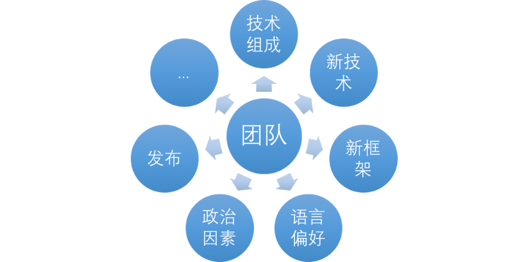
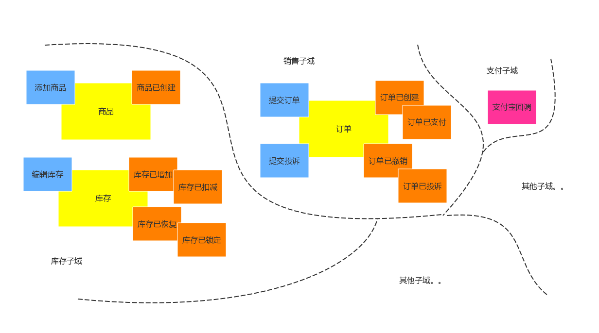
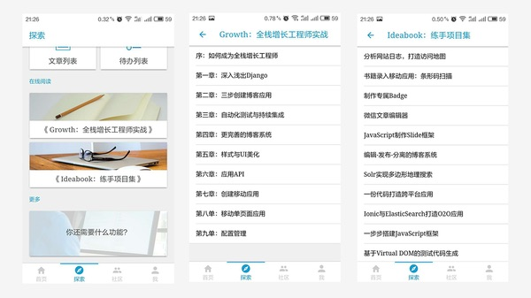

如何从头开发一个前端应用
===

> 创建项目，不就是运行起一个 hello, world 的事吗？

刚工作的时候，总想着能经历从零开始制作前端应用的过程。

工作一段时间后，总会经历要从零创建一个前端应用。

工作上的编程与日常编程，并没有太多的区别。只是有些时候，我们会省略一些步骤；有些时候，我们也会多一些步骤。

创建项目，不就是起一个 hello, world 的事吗？业余的时候，一个人创建项目：

 1. 在 GitHub 上创建一个项目。
 2. 使用官方的 Demo 创建一个 Demo，然后 Push

工作的时候，流程上也是相似的。只是多数时候，因为是多人协作，所以要考虑的因素就会多一些。选技术栈的时候，要考虑人员因素；部署的时候，要考虑运维能力，等等。考虑流程的时候，我们就需要：

 - 纠结于 Angular 4 或者 React。
 - 使用 Gulp 或者 Grunt，又或者 NPM
 - 适合于当前团队的工作流
 - 选择一个合适的测试策略
 - 与后台团队之间如何配合
 - 怎样去部署当前的应用
 - 发布策略：红绿发布，以及 Toggle

倘若，平时能像工作上走这些流程，那定能是提升自身的水平。工作上，需要更多的业务探索。而日常，则需要更多的技术发掘。

前端应用的生命周期
---

照例，我还是画下了这个过程的草图~。看上去，还不算太复杂：


刚开始，写前端应用的时候，为了创建 "hello, world"。总是自己亲手来完成，一点点的添加各种需要的元素。可做过的人都知道，这并不是一件容易的事，我们需要构建工具、测试工具、自动化测试组件等等。创建一个 package.json、index.html，再慢慢地往上加上各种配置，或者 karma.js 或者 webpack.js、tsconfig.json。对于新手程序员来说，这简单是一场灾难——像小学生一样，刚才会了拿笔、大字不识几个，却要让他们写篇文章。前端新手的痛苦期，莫过于此。

而那些前端框架的开发者们，应该是看到了这个痛苦的过程，便添加了一些基本的脚手架，可以让开发者使用 CLI 来生成项目。可是，生成的项目在多数时候并不能满足我们的需求，又得基于这个官方再修改一下。如 React 官方提供的 create-react-app 生成的项目，只是一个简单的 react 应用。

后来，懒了，便在 GitHub 寻找个模板，改吧，改吧，就用上了。GitHub 上可能是大量的开发者，他们也经历了相同的坑，便共享出了这些代码。

如大家所见，在这个过程里，编码只是其中的一小代码，还需要设计一系列的 workflow、流程、技术选型等等。

除此，对于软件工程做得好的前端团队来说，还需要考虑自动化测试、自动部署、持续集成等等的内容。

按这些步骤来看，前端应用的生命周期，与 Web 应用保持得相当的一致。上面的流程图，与我在 RePractise 中画的 "Web 应用生命周期" 差不多。


有兴趣的读者，阅读 GitHub 上的相关资料：[30分钟了解《全栈应用开发：精益实践》](https://github.com/phodal/growth-in-30-minutes)。或者等待，即将出版的纸质书籍。

现在，让我们进入这最后的一章，了解真实世界的应用构建。

项目准备
---

### 技术选型

在第四章中，我们提到了影响技术选型的几个因素。



这时，为了更好的考量不同的因素，你就需要列出重要的象限，如**开发效率**、团队喜好等等。并依此来决定，哪个框架更适合当前的团队和项目。


即使，不考虑前端框架以外的因素，那么技术选型也是相当痛苦的一件事。

选好了合适的技术栈，有了一个 hello, world 模板，剩下的就是考虑一下：构建系统与工作流。

### 构建系统

如《全栈应用开发：精益实践》一书中所说，构建系统是一个投入产出比非常高的组件部分。只需要在前期投入一定的时间，便能节省大量的时间用于开发 。

当我们选择了 Angular、Vue、React 这一类的现代前端框架，它们使用了 ES6、TypeScript 等 JavaScript 方言。要在浏览器运行应用，我们就需要 webpack、rollup、tsc 这类的工作来转换代码：


可我们还需要其他更多的步骤，如启动 MockServer 等等的过程。这时，我们就需要一个构建工具，诸如 Gulp、Grunt、Npm，它可以帮助我们完成自动化的过程。

可构建系统相当的复杂，需要执行一系列的步骤：


也因此需要不断地练习，并积累相关的经验。

### 前后端分离设计

虽然这是一个前端的创建指南，但是我还想稍微扯一点『无关』的内容。好的前端程序员，应该是要懂后端的，特别是后端的数据模型。其次，便是与后台交互时的 API 行为/动作设计，即事件。

我们需要考虑领域相关的模型，则模型相关的事件，而后整理出系统的领域事件图。


而诸如 [stepping](https://github.com/phodal/stepping) 这样的工具，则可以用 DSL 来生成。

```
domain: 库存子域
  aggregate: 库存
    event: 库存已增加
    event: 库存已恢复
    event: 库存已扣减
    event: 库存已锁定
    command: 编辑库存
```

再依据此去划分相关的子域，以及对应的微服务层次。



借此，开发人员与领域专家共同完成业务的抽象。

再由后台人员去设计后台数据结构，并结合 Swagger 设计并生成 Mock API 供前端使用，就可以完成前期的准备工作。

后端与前端开发人员，都能分别专注于自己的工作。

实现功能
---

好了，现在，我们已经可以开始编写相关的业务代码了。

### 分析设计图

对于前端开发来说，编写功能代码并不具有挑战性。其重点是：设计出符合用户喜好的界面，并且能让用户轻松上手使用。好的前端团队，应该要有好的 UX（用户体验）设计师，UX 能设计出符合用户习惯的设计。

于是，对于前端工程师来说，首先要做的就是分析设计稿——其实我的意思是：『切图』。即，分析页面的组成，拆分成不同的组件，使用不同的 Tag。

有的地方，可以使用相同的标签，使用相同的组件，我们只需要识别出设计图上的共有部分，将其抽象成组件、模板，并实现差异的部分即可。如页面的 header 和 footer，通常都是共用的。因此，多数时候，我们都在处理页面的 content （内容）部分。



而对于 content 来说，要做的一般都是：详情页和列表页，有些时候还会有个特别的首页。

列表页，无非就是一个数据的集合，有时候可能带有条件的进行过滤，遍历并显示他们即可。

详情页，就是某一个特定的数据，及其相关的子数据。如对于一个博客来说，评论与博客本身是对应的，但是不在同一个模型里。

而这个过程中，最麻烦的便是写 CSS，处理不同的浏览器、不同的屏幕大小、字体大小、元素颜色等等。CSS 被认为很简单，也因此大部分的人都不会去学，也导致了大部分人都是在实战中学习。

### 实现功能

接下来的另外一个难点，便是对数据的处理。产品上线的时候，我们需要从后台获取数据，才能显示上这些数据。

而对于数据处理来说，不同的时候，会有不同的方式，他们依据按优先级有所不同。如对于复杂的页面来说：

 - 初期结合 Mock Server，在 Mockup 中写入需要的数据，以完成页面的设计。
 - 再与业务、设计，确认需要的接口内容
 - 对接、更新接口到后台，并同步后台的接口

当我们打算获取数据的时候，发一个 GET/POST/PUT 等之类的请求，需要准备好相应的授权信息，以及要操作的资源信息。对于 RESTful 服务来说，服务器本身是不保存应用的状态，因此我们需要在一次的请求里，准备好这一系列的参数。如：

 - 当前的用户是谁。业界作法便是在 header 里带上相应的 token，它表明了用户的身份。
 - 当前用户要操作的资源则体现在 URL 上。如 https://www.phodal.com/blog/xx-slug
 - 操作的内容则体现在参数里。

这些参数，要么是保存在内存中的临时数据，如用户的 token；要么是写在代码中  URL；要么是用户提交的表单。它们都需要进行一系列复杂的处理，才能完成整个流程。

后台，再处理相应的操作，并返回相应的结果。当用户没有权限时，返回一个 401；当用户操作的资源不存在时，返回一个 404，等等诸如此类。

客户端，依据返回的状态与数据，及相应的业务逻辑，来决定其显示的内容。并对数据进行过滤，选择相应的字段，再匹配上相应的事件监听。

### 编写测试

可惜的是，国内测试环境不好，精彩内容可见《全栈应用开发：精益实践》。

集成与上线
---

### 与后台集成

### 上线

#### 设置 Toggle

### 修 bug

最后，祝大家修 bug 愉快。
