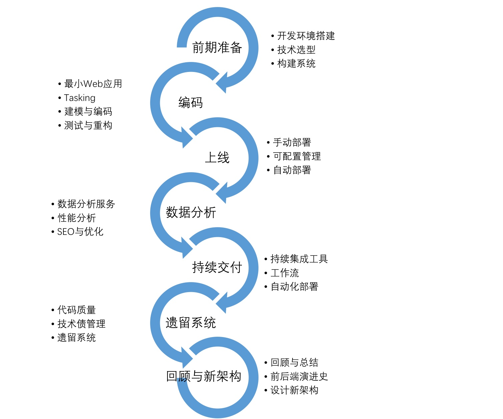

如何从头开发一个前端应用
===

> 创建项目，不就是运行起一个 hello, world 的事吗？

刚工作的时候，总想着能经历从零开始制作前端应用的过程。

工作一段时间后，总会经历要从零创建一个前端应用。

工作上的编程与日常编程，并没有太多的区别。只是有些时候，我们会省略一些步骤；有些时候，我们也会多一些步骤。

创建项目，不就是起一个 hello, world 的事吗？业余的时候，一个人创建项目：

 1. 在 GitHub 上创建一个项目。
 2. 使用官方的 Demo 创建一个 Demo，然后 Push

工作的时候，流程上也是相似的。只是多数时候，因为是多人协作，所以要考虑的因素就会多一些。选技术栈的时候，要考虑人员因素；部署的时候，要考虑运维能力，等等。考虑流程的时候，我们就需要：

 - 纠结于 Angular 4 或者 React。
 - 使用 Gulp 或者 Grunt，又或者 NPM
 - 适合于当前团队的工作流
 - 选择一个合适的测试策略
 - 与后台团队之间如何配合
 - 怎样去部署当前的应用
 - 发布策略：红绿发布，以及 Toggle

倘若，平时能像工作上走这些流程，那定能是提升自身的水平。工作上，需要更多的业务探索。而日常，则需要更多的技术发掘。

前端应用的生命周期
---

照例，我还是画下了这个过程的草图~。看上去，还不算太复杂：


刚开始，写前端应用的时候，为了创建 "hello, world"。总是自己亲手来完成，一点点的添加各种需要的元素。可做过的人都知道，这并不是一件容易的事，我们需要构建工具、测试工具、自动化测试组件等等。创建一个 package.json、index.html，再慢慢地往上加上各种配置，或者 karma.js 或者 webpack.js、tsconfig.json。对于新手程序员来说，这简单是一场灾难——像小学生一样，刚才会了拿笔、大字不识几个，却要让他们写篇文章。前端新手的痛苦期，莫过于此。

而那些前端框架的开发者们，应该是看到了这个痛苦的过程，便添加了一些基本的脚手架，可以让开发者使用 CLI 来生成项目。可是，生成的项目在多数时候并不能满足我们的需求，又得基于这个官方再修改一下。如 React 官方提供的 create-react-app 生成的项目，只是一个简单的 react 应用。

后来，懒了，便在 GitHub 寻找个模板，改吧，改吧，就用上了。GitHub 上可能是大量的开发者，他们也经历了相同的坑，便共享出了这些代码。

如大家所见，在这个过程里，编码只是其中的一小代码，还需要设计一系列的 workflow、流程、技术选型等等。

除此，对于软件工程做得好的前端团队来说，还需要考虑自动化测试、自动部署、持续集成等等的内容。

按这些步骤来看，前端应用的生命周期，与 Web 应用保持得相当的一致。上面的流程图，与我在 RePractise 中画的 "Web 应用生命周期" 差不多。



有兴趣的读者，阅读 GitHub 上的相关资料：[30分钟了解《全栈应用开发：精益实践》](https://github.com/phodal/growth-in-30-minutes)。或者等待，即将出版的纸质书籍。

现在，让我们进入这最后的一章，了解真实世界的应用构建。

项目准备
---

我们已经在第三章《如何选择合适的前端语言》、第四章《如何选择合适的前端框架》中谈到的技术选型简介绍的那些细节，这里就不展开讨论了。

选好了合适的技术栈，有了一个 hello, world 模板，剩下的就是考虑一下：构建系统与工作流。

### 构建系统

如《全栈应用开发：精益实践》一书中所说，构建系统是一个投入产出比非常高的组件部分。只需要在前期投入一定的时间，便能节省大量的时间用于开发 。

当我们选择了 Angular、Vue、React 这一类的现代前端框架，它们使用了 ES6、TypeScript 等 JavaScript 方言。要在浏览器运行应用，我们就需要 webpack、rollup、tsc 这类的工作来转换代码：


可我们还需要其他更多的步骤，如启动 MockServer 等等的过程。这时，我们就需要一个构建工具，诸如 Gulp、Grunt、Npm，它可以帮助我们完成自动化的过程。

可构建系统相当的复杂，需要执行一系列的步骤：


也因此需要不断地练习，并积累相关的经验。

### 架构设计

虽然这是一个前端的创建指南，但是我还想稍微扯一点无关的内容。

[stepping](https://github.com/phodal/stepping) 完成建模？

```
domain: 库存子域
  aggregate: 库存
    event: 库存已增加
    event: 库存已恢复
    event: 库存已扣减
    event: 库存已锁定
    command: 编辑库存
```


结合 Swagger 生成 Mock API

可这是后端的工作~~，2333。


实现功能
---

### 分析设计图

我的意思是：切图。

### 实现功能

对于数据处理来说，不同的时候，有不同的方式。

按优先级有所不同

 - 先需要从 Mockup 中写入需要的数据 —— 定死
 - 确认需要的接口内容
 - 更新接口到后台
 - 同步后台的接口

如一些 Related Fields 前端需要的可能是扁平的结果，但是未来可能需要更多的值 

### 编写测试

集成
---

### 与后台集成

### 设置 Toggle

上线
---

### 部署

### 上线

### 修 bug

最后，祝大家修 bug 愉快。
