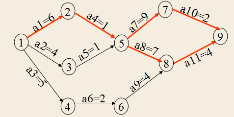

我的职业是前端工程师：入门不是应该很简单吗？
===

入门前端，是一件很难的事吗？在今天，我也没有想好一个答案，也不知道怎样给出一个答案。这个问题并不取决于前端，而是取决于不同人的需求。到底是想要快得一步登天呢，还是一点点的慢慢来，去享受前端带来的乐趣。

对于不同领域的学者来说，都会有一个相似的问题：如何从入门到精通？入门并不是一件很复杂的事，只是多数人想要的是**更快的入门**，这才是真正复杂的地方。虽说条条道路都是通过罗马的，但并不是每条道路都是能满足人们要求的。

前端之路
---

谈起路线规则这事，就会联想起算法里的路径问题。想了想，发觉“如何教人入门前端”与“选择合适的路径”颇为相似的，要实现这样的规划蛮难的。先上张图，加深一下印象：

接着，我们来思考这样的一个问题：

> 每个初学者都处于“1”，最后的目标都是到“9”，那么你会怎么帮助他们规划路线？

假设，每一个数字都对应了技术栈，并标注了每个技术栈学习所需要的时间。那么，这时要计算出**最快的学习路线**也就容易了。而这种开挂的感觉，就像是我们拥有了游戏中的技能树的一样。技能树上，包含了所有已知的技能，以及：学习某个技能所需要的时间，学习某个技能后可以触发某个技能等等。

不幸的事，这个路线不可能会怎么简单。倘若你是一个在校的学生，或者是相似的研究人员，那么这种路线也颇为适合。理想的情况下，我们可以自由地分配自己的时间，在对应的技术栈上花费相应的时间。这就好像是游戏世界的技能树一样，我们所拥有的点数是固定的，那么所能学习的技能也是固定的。

假使真实世界的前端技能树已经很清晰，那么这里的点数对应的就是时间。在时间固定的情况下，我们所能学习的技能也是固定的。而技能树中的时间花费是一个大的问题：当我们学习完某个技能后，我们可能就拥有其他技能的加成。

在已经学会了 ES6 的情况下，学习 TypeScript 就变得更轻松，这时学习 TypeScript 的时间就会更短。也因此，相似的技术栈可以归类到一起。遗憾的是，学习相似的技术栈仍然是需要时间的。

对于 A 说的路线并不一定适合于 A ，有可能会适合于 B；适合于 B 的路线，也有可能只适合于 B。当人们不肯谈及他们的需求时，我们所做的努力都是在打水漂。

我的前端入门
---

### Copy/Paste from Cookbook

在我刚学前端工程师的时候，要做前端的活相当的简单。与现在稍有不同的是，现在是 Copy/Paste from StackOverflow，那时是 Copy/Paste from Cookbook。因此，我们只需要三本书就足够了：

 - CSS Cookbook
 - JavaScript Cookbook
 - jQuery Cookbook

它们包含了我所需要的一切，书上对应于不同的功能，都有对应的代码。我们所需要做的就是**在合适的地方放上合适的代码**。

大学不像现在这么“宽裕”，不能轻松地去买自己想看的书，一本书抵得上好几天的饭钱，不会毫不犹豫地“一键下单”。现在，仍然会稍微犹豫一下，这主要是房价太贵，租的房子太小。尽管我们的学校是一所二本院校，但是图书馆还算是不小的——虽然没有啥各种外语书，但是大部分领域的书总算是有一两本的，每个月还会进一些新书——反正屈指可数。四年下来，我算是能知道每一本计算机书的大概位置。

平时，为了尝试各种新特性，我就将各种奇怪的 CSS3 加到了我的第一个网站里：

大一时，年轻气盛就去办了个社团，当了个社长。那会儿还能使用各种 Google 的服务，Google 刚刚开始推广它的云服务 Google App Engine。用户只需要点击一个按钮，就可以上传代码，应用就会自动地部署到相应的网站上了。也因此，上图中的那个网站。

后来，世道变了，免费的东西还能使用，但是网站已经访问不了。我们尝试很 SAE 上迁移，虽然 SAE 很不错，但是你是要去备案的。

### 开发工具

最初，我最喜欢的工具就是 Adobe DreamWeaver，还有 Chrome 浏览器，这两个工具基本上能完成大部分的 UI 工作。在今天看来 DreamWeaver 是个一个奇怪的工具，他可以让你拖拽来生成代码，但是这些生成的代码都是臭不可闻的。但是我爱及了他的及时预览地功能了，特别是当我在编写 CSS 的时候，不再需要在浏览器、开发工具不断切换。

Chrome 浏览器虽然很不错，但是当时市场占有率太低，只能拿来玩 CSS3、HTML 5 等等各种特效。多数时候你还是要用 IE 的，写下一行行的 CSS Hack。

慢慢地，当我开始越来越多的使用 JavaScript 时，DreamWeaver 提供的功能就变得越来越有限了，我开始觉得它越来越难用了。曾经有一段时间里，我使用 Aptana——它可以将 minify 后的代码格式化。

现在，我使用 Intellij IDEA 和 WebStorm作为主要开发工具，它们的重构功能让我难以自拔。当我需要修改一些简单的文本里，我会使用 Vim 或者 Sublime text。也仍然在使用 Chrome 作为我的日常和开发用浏览器。

前端基础知识
---

### FE 和 BE 的共同的语言

技术圈是一个相爱相杀的娱乐圈。

在我学习编程的时候，遇到了一对也学习 Web 开发的情侣，男的做后台名叫 BE，女的做前端名叫 FE。他们喜欢着编程创造，喜欢一起做运动，还有送狗粮。我和我们家花仲马，就是受他们影响的：送狗粮。他们还经常在一起玩各种接口。

第一天里，我们学了一门叫做 HTML 的语言。初学的时候，HTML 让我联想到了 XML，它们的结尾都是 ML。MLMarkup Language 的意思是『标记语言』，HTMLHyperText Markup Language 的意思是『超文本』。直到今天我才想明白，为什么那对情侣在学习的时候很害羞。

HTML 是一个特别简单的语言，我再也找不到更简单的语言了。但是为了运行起 HTML，我们仍然也花费了不少的功夫。

### 准备一些工具

为了编写代码，我们需要一些额外的工作。

一个可以帮助你调试的  Chrome 浏览器，这个浏览器我从他的版本号，还是个位数时就开始用了。

一个可以让你编写代码的工具，Sublime 是一个很不错的选择，如果。

未来，你还需学会一些基础的 Node.js 知识，并把它作为来作为构建工具使用。

初学的时候，准备这些东西，已经让我有了放弃的想法。我花了几天的时间，去了解开发者需要怎样的工具，同样的也花了几天去了解这些工具。在我还没写代码的时候，就已经浪费了很多天的时间，这真是罪过啊。俗话说得好：万事开头难，过了这个坑接下来的日子就“轻松”了。

### 编写一个简单的 HTML

如果你需要更多的工具，可以看看我的百宝箱：[https://github.com/phodal/toolbox](https://github.com/phodal/toolbox)，里面可是收藏了不少的好东西。

后来，BE 学了 PHP 语言，FE 学的是 JavaScript，他们喜欢天天一起撕逼：哪个语言才是最 x 的语言。好在他们又有了一个共同的特点，天天制造 $，才没有分手。

### 漂亮的 CSS

### JavaScript 居然是小三

最多的比喻是雷锋与雷锋塔的故事，但是这个比喻是反着过来的，这样一来是先有 JavaScript，才有 Java 的。实际上，是先有阿里巴巴与四十个大盗的故事，才有借着他们名气的阿里巴巴。

jQuery 是最好用的
---

到了后来，我觉得前端甚是无聊——这主要是限制于我们接的一些业务，都是企事业单位的单子，每天都是无尽的 IE 的兼容问题。也因此，我觉得同时使用很多个 IE 版本的 IETester，是一个伟大的软件。好在过了那段时间后，出现了 Node.js、Backbone 打开了另外一个世界。

世界原来是这么的大
---

