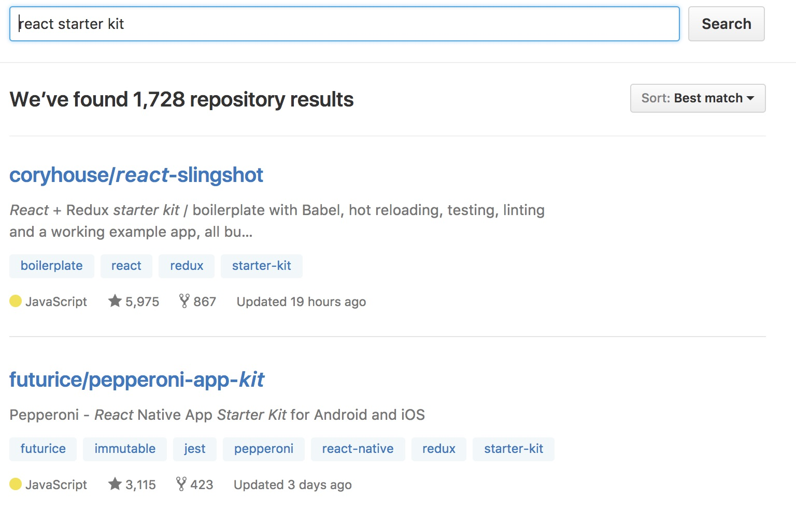

如何以正确的姿势练习，深化前端知识
===

> 要成为一个优秀的前端工程师，需要什么技能和学习？答案：练习

在逛知乎、SegmentFault 又或者是相似的技术社区，我们总会看到类似的问题。新手总会关注于，需要怎样的技能，怎么才能入门？有一点经验的程序员则是，需要练习什么？如若一个程序员已经懂得问题的关键是，编程需要大量的练习。那么，我想这个程序员已经入了这个行道了。

在我成为所谓的『前端工程师』之前，我没有想到会变成这样的结果。

前端项目的练习过程
---

年少的时候，想要做的是 Kernel Hacker。大学时，我做点前端相关的兼职，顺便赚钱点钱。再用这点钱，买点硬件做一些底层、低级的编程，带着去实验室，拿着电洛铁，高喊着：让我们来做一个毁灭世界的机器人。好在，后来我离这个行当有点远，要不这个世界可能就岌岌可危了。反而因此倒是，学会了相当多的前端知识，以及在今天看来是屠龙之术的 IE 兼容。

随后，在研究数据可视化时，我看着用 JavaScript、HTML、CSS 可以做出这么炫的效果。我就继续回到图形编程这个行当，前端的图形编程倒也简单，只需要找一个库，多加练习就可以了。练习多了，便发现，需要更多的**面向对象编程**经验，要不写出来的代码就跟屎一样。要是在今天，那可能就是**函数式编程**经验了。

玩了那么多的东西后，我便就对这些东西驾轻就熟了。而在今天看来，仍然走了相当多的弯路。当有人再问我『怎样练习才能成为一个优秀的前端工程师』时，我便想着：我应该好好的回答一下这个问题。

### Output is Input

我一直很喜欢那句，Output is Input 的话，即：

即，我们输出知识的时候，便是在输入更完整的知识。因此当我练习的时候，我便会刻意地去结合使用他们，往往能达到事半功倍的效果。想尝试玩一个新的框架时，我便会用这样的逻辑去玩它：**使用新框架编写一个应用，再阅读、整理相应的资料**。

你若问我，为什么我会这么练习？我想那大概是，我可以**更早的得到反馈**。我可以更早的知道，A 框架对于使用过 B 框架的人来说有些难度，我也能轻松地指出他们的差异。甚至，如果这是一个新的项目，那么我还能用一种『不很完美的姿势』完成之。而如果只是完成这个项目，那对于我而言也没有多少
实质性的提高。

遗憾的是对于多数人来说，可能就只是完成项目这一程度，后面仍然还有好长的路要走。做一个好的前端工程师，即要做很多的项目，又要读一些书。即要会使用这个框架，又要知道他的一些基本的思想。

习惯了先输出、后输入的过程后，练习起来就很轻松了。

### 练习框架、技术的时机

练习，那可是相当烧时间的大事；时间，又是一种相宝贵的资源。暂不说，相当于好几年的十万小时理论。对于我们这些每天要早出晚归的工作族来说，八小时以外的时间就更小了。对于一个在校的计算机专业学生来说，也不一定能在四年里搞定。

而这时候如果又选择了一个错误的技术栈，哪怕是相当的浪费时间了。好在我们已经在那篇《[学习前端只需要三个月【框架篇】](https://read.douban.com/reader/column/5945187/chapter/30511309)》中讨论了如何选择一个合适的技术栈。此时还有一个问题是，如何在一个合适的时机练习它。

过去，习惯了将一些 Idea 放在 [GitHub](https://github.com/phodal/ideas/issues) 上变成一个清单。也因此习惯了，将一些想要玩的框架放到了 TODO Lists 中，再慢慢地享受将他们完结的愉悦感。

当有一个新的框架出现时，看看知乎、微博、微信群里的讨论还不错，我就会将这个框架加到 Todo Lists。在一个周末，或者中午，搭建一下项目，玩一下 DEMO。

随后，这个框架就会进入评估期。评估一个框架可不是一件容易的事，要从不同的角度去了解它：社区欢迎程度、API 变化程度、Roadmap 计划、Release 情况等等。再确认一下框架是否可以适合当前的项目，可以的话，就会创建一个新的分支来玩玩，又或者直接引入项目。

如果这是一个有前景的框架，那么我就会选择一个合适的时机（有时间），创建一个开源来应用它。每个人都会有一些偏爱，这也决定了他们可能不会去玩某些框架，这倒是有些可惜了。

当我们决定去练习的时候，我们更需要一些练习的技巧。

练习的过程
---

练习框架、技术的技巧
---

练习嘛，我想就这么几步：

 - 找到一个模板
 - 边修改模板，边查阅资料，以此来完成一个应用
 - 阅读官方文档或者代码来补漏
 - 编写博客、文章、书籍来加强印象

我喜欢的就是这种输入和输出相结合的形式。一开始的时候，就应该先做一个应用。这种用意特别明显，借此可以快速地了解一个框架，就会觉得相当有成就感。随后就是去补缺补漏，以便于我们可以更好地完成应用。最后，当我们写文章去总结的时候，便会对这个框架有更基础的认识——像拥有一张清晰的思维导图，熟悉他的方方面面。

### 使用模板 

对于多数的人而言，也包括我，决定去使用一个框架的时候，表明它已经是一个几近成熟的框架——我们可以很容易找到一些资料。依据现在框架的发展趋势，大部分的框架都会提供一个脚手架，即应用程序模拟。只需要运行这个模板，我们就可以有一个 hello,world。

如 Angular 官方提供了一个 [angular-seed](https://github.com/angular/angular-seed) 的项目，它提供了一套基本的模板，可以用来快速的创建应用。而 React 也提供了一个名为 [create-react-app](https://github.com/facebookincubator/create-react-app) 的工具来快速搭建环境。

遗憾的是，大部分的官方 hello,world 都不是很详细，这时候我们可以在 GitHub 上搜索 xxx starter kit 来做同样的事，如 React Starter Kit，就可以轻松地在 GitHub 上找到相就的项目，如[react-slingshot](https://github.com/coryhouse/react-slingshot)

它提供了一些丰富的组合，如 React、Reactd Router、Redux、Babel、Jest、WebPack 等等的工具。现在，我们在这一步要做的事情就是运行起 hello,world。然后，我们再考虑下一步要做一些什么？

### 做点什么应用

拿到框架的下一个问题时，我们要去做什么，这个就相当有趣了。挑一个有难度的吧，做不了；挑一个简单的吧，觉得不能练手；还是挑一个实用的吧，比如博客。

我写过最多的应用就是与博客相关的应用了。当出现一个新的练手框架时，我总会用这个框架来把博客写一遍。于是，我的博客的后台 API 用 Node.js、Flask、Django 实现过一遍，而前台则用 Backbone、Angular 1、React 实现过一遍，而 APP 方面也使用 Ionic 1 和 React Native 实现过一遍。

对于博客而言，我们都很轻松它的功能：列表页、详情页、登录、创建博客等等。我通常只会实现上面的四个基本元素，这和大部分应用的主要模式差不多。对于前端来说，我们会练习到基本的内容：

 - GET 和 POST 数据
 - 列表页到详情页的跳转和返回
 - 对于用户登录凭据的获取和保存

基本上涉及到了一个框架的大部分内容，路由、模板、API 请求、数据存储、用户授权等等。这样一来，我们就要清楚地业务逻辑了，那么剩下的是都是技术的事。

### 编写一个博客应用

接下来，唯一的问题是：因为对这一系列的技术栈，我们会遇到一系列的困难。当一个新手选择 React 的时候，就会遇到 JSX ES6 Babel Webpack Redux React-Router 等一系列的 React 全家桶。这时，难以下手的主要原因是，不知道这些东西都是干嘛的，也对前端单应用应用没有一个清楚的认识。

在没有基础的情况下，直接下手这些会有一定的困难：**在学习新的技术栈的同时，也在学习前端应用的组成**。因此：

首先，要对前端单页面应用有一个大致的了解。如对于一个前端框架来说， 它要有模板引擎、依赖管理、路由处理、控制器（模板）和状态等等，除此它还需要有构建工具、编译工具、测试框架等等。

然后，就需要了解所使用的工具对应的有什么功能。如上面说到的例子里，JSX 相当于是模板引擎、WebPack 是打包工具 / 构建工具、Babel 是 ES6 语言的编译器、Redux 用来做状态管理、React-Router 用来处理路由。

最后，需要一个应用的例子来将这些内容串在一起。如当我们打开一个 Web 应用的时候，应该要有一个路由处理的工具，来将用户导向相应的页面。而这个页面会有对应的控制器和模板，路由就是来分发用户的请求。当页面数据数据或者用户操作时，页面上的数据状态就会发生变化，这时就需要状态管理工具来管理。

幸运的是，我们已经有了一个 starter kit，在这个 starter kit 中会为我们做好相应的配置。因此，我们可以直接阅读代码来了解它们的关系，逐一的了解他们的功能。过程有点痛苦，结局便是大丰收。

这一个过程里，还有一个难点是，我们缺少数据。这时候，我们可以用 moco、MockServer 等工具来做一个假的服务器，以向我们的应用提供数据。

### 输入和总结

编写应用的时候，我们将一个又一个的内容放到了脑子里，然后发现自己混乱了。需要重新理清他们的关系，这时候可以选择写博客、画思维导图、做分享的形式来整理。

当我们向别人讲述一个东西的时候，就不得不压迫自己对此有更深入的了解，要不只能丢脸。这时候，我们又在重新学习这些内容，并且比以往的任何时间更加深入。这也就是为什么我喜欢写作的原因，它能让我的思路更加清晰。**原本只是散落在房间里的书籍，现在整整齐齐的排列在了书架上**。在需要的时候，我就可以找到想要的内容。而由于博客的存在，我可以在未来轻松地了解这个框架，别人需要的时候，也可以直接分享相应的经验。

等闲了，逛逛官方的文档，还会发现：原来这个地方可以这么用；原来某个地方还可以做得更好。

其它
---

假如，我们将前端和后台所要求的能力做一些对比，我们会发现前端在高级领域比后台简单一些。我的意思是，前端要在编程方面遇到瓶颈更快，并且需要从其他方面来补充，如后台，又或者是用户体验设计。

### 关于练手项目

在那一篇《[关于编程，你的练习是不是有效的](https://github.com/phodal/articles/issues/19)》中，我提到，提升技能的项目会有四种：

 - 纯兴趣驱动的项目。即我的Idea列表上的一个个酷炫的项目，先满足自己再说。
 - 理论驱动的项目。这一类的项目会比较少，因为我们需要牵强地驱动出这样的项目，然后以理论的方式驱动它。
 - 兴趣结合理论型。有一个长长的Idea列表，难免有些时间会和将要学习的理论有很大的交集。这种的练习效果是最好的。
 - 整合成文章、电子书。这一步主要是为了分享、巩固知识点、讨论。
