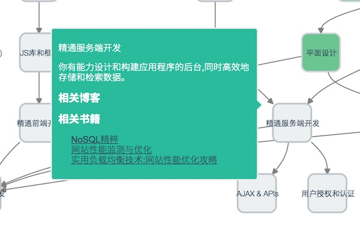
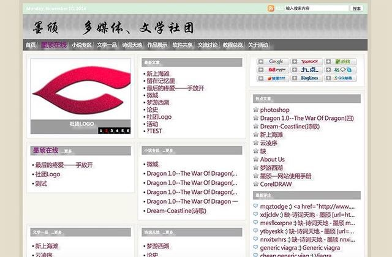
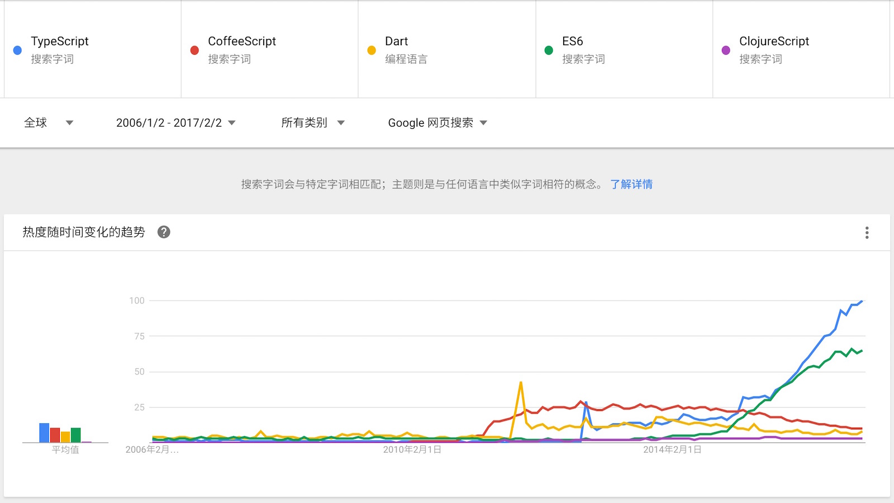
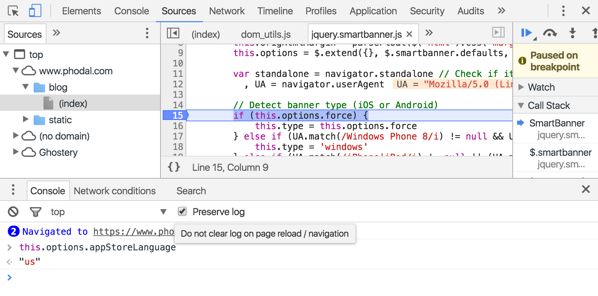
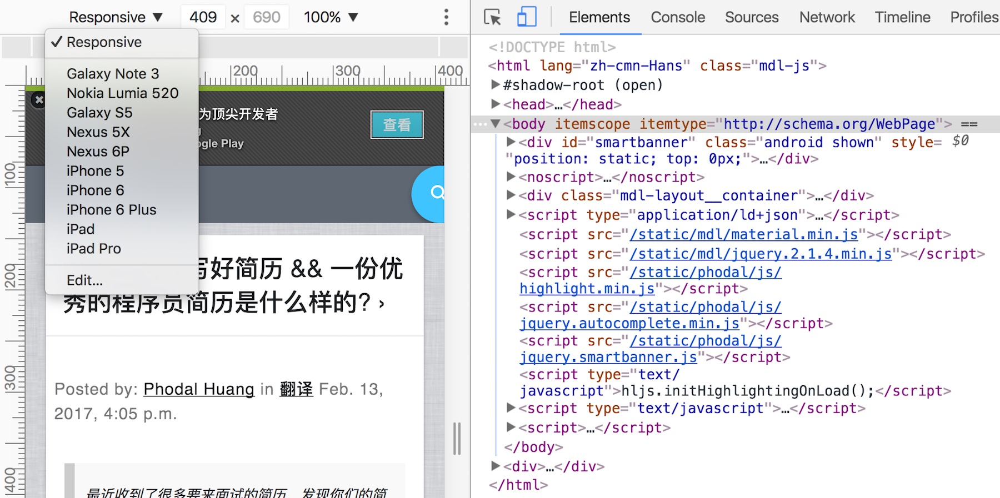
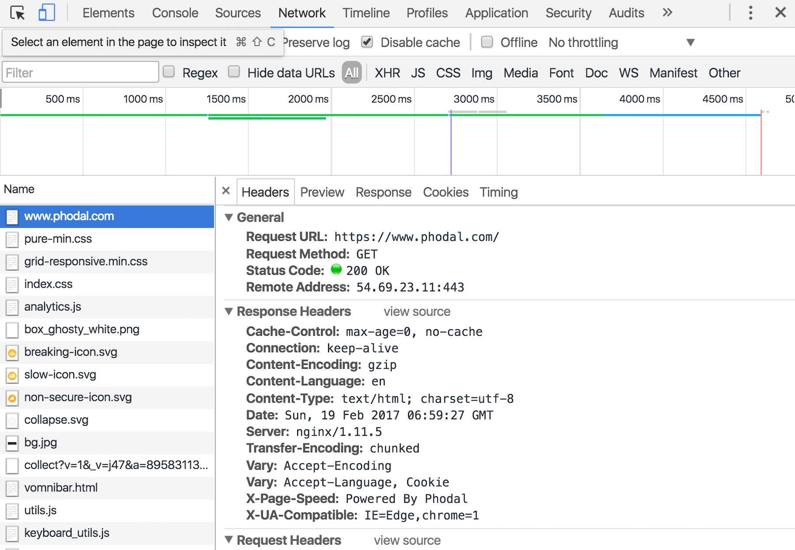
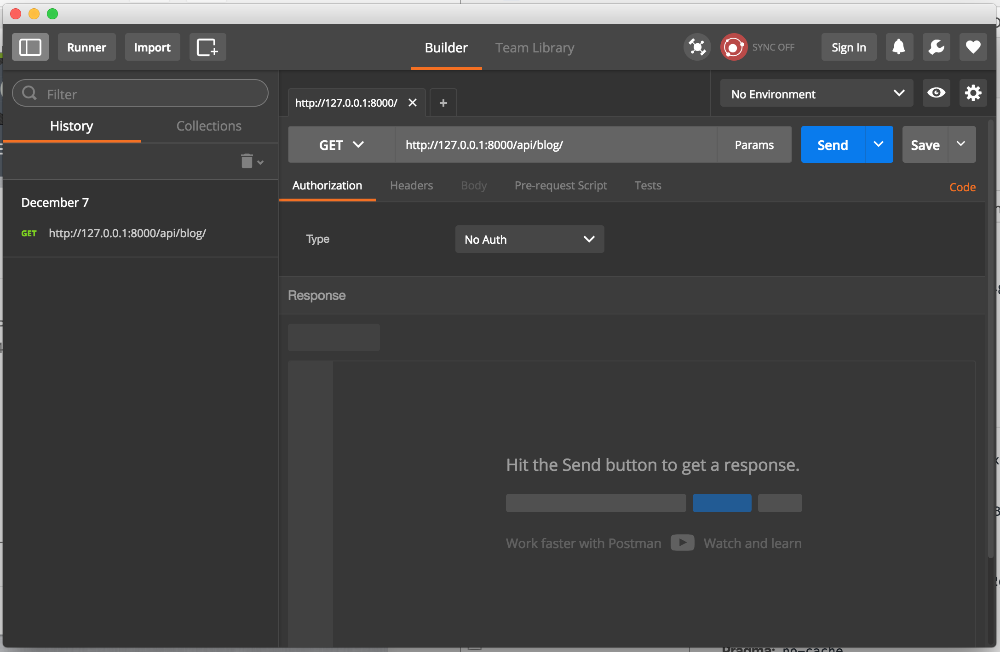
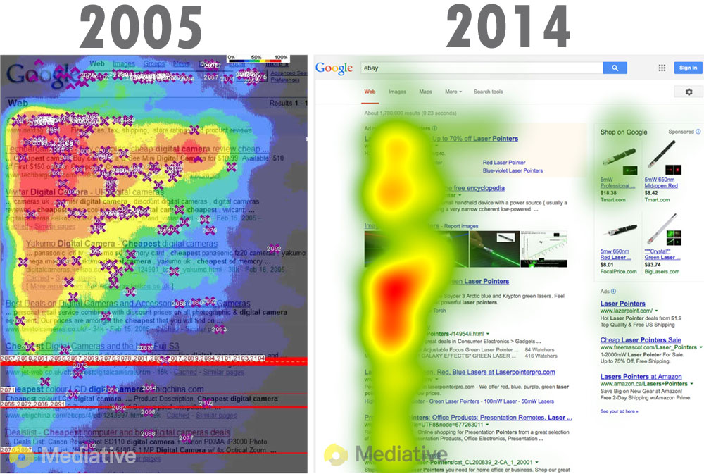
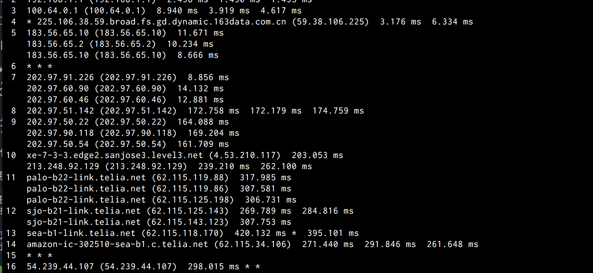
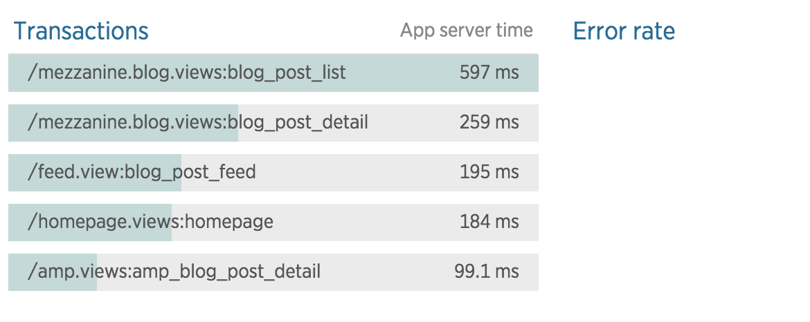

序:为什么前端没有前途？
===

与客户做交互的那部分就是前端，也因此，它可以称为客户端。不仅仅局限于浏览器前的用户，还可以是桌面应用，混合应用。

处理数据的部分则是后台


我要成为一个前端设计师
===

> 我年轻的时候，是一个前端工程师。那时候，有这样一个传说：美工是最受妹子的欢迎，其次是半个美工的前端工程师。

本故事纯属瞎掰，如有雷同纯属巧合——Phodal @PasteRight

未满 18 年时，想成为一名 Kernel Hacker，就是那种操着键盘，在屏幕洒下一行行汇编语言的大牛。在我学了一段时间 C++ 后，我觉得：『用记事本写代码，并运行起来』的故事都是骗人的。为了将代码转变为程序，你还需要一个编译工具。

然而有一天，我在网吧里看到一个人在记事本里写代码。开始的时候，我觉得这个人是个新手吧，怎么拿记事本在写代码呢，不是应该都拿 IDE 才能编译运行吗？几分钟过后，我发现他居然能将，记事本写的程序运行起来，太神奇了，Amazing Man。

后来，为了在别人面前装这个 100 分的逼，我成了一名 Web 工程师，而且还是一个前端工程师。

（PS：以上纯属瞎扯）

漂亮的前台
---

各位看官中，有些可能不是前端工程师，那就先让我来说说前端工程师是干什么。前端又可以称之为前台，不是那种每天对你笑、帮你开门、长得还算不错的前台，然而却也差不了多少。

他们要做出好看的、美丽大方的界面，以免吓走那些对颜值有要求的挑剔客户；还要对指引好用户，免得有些用户认错了楼、走错了路口，然后再也不来光顾你们的网站了；有些时候，还要像处女座纠结于对齐，纠结于 px px 的程序员。

你还会看到他们拿起纸当尺子，一点点的测量着什么东西，好似在怀疑这个屏幕是不是真的是 15.4 寸。
如果你看到一个程序员，他在纠结椅子是不是摆放正确的，那么它有可能是三种程序员中的一种：处女座程序员、前端工程师，还有测试工程师。

我们就像上个世纪的网民，时不时地按下 F5 又或者 Command + R 来刷新页面，一直在怀疑页面上的内容是不是最新的。好在后来，有一个伟大的大魔法师发明了一个工具，可以检测到代码修改，自动地帮你刷新页面。终于，不再像个老大爷一样踢电脑，以指望提高图片的质量，甚至去掉马赛克。

过去，我也无法理解：这群智力超群的程序员，为什么会变得如此px px 计较，直到我成为了其中的一员。

我要成为一个前端设计师
---

习惯了大学的生活过后，我和好友楚非就一起去租了一个服务器，从此生活就变得有点艰难。不过有了一个服务器，我们就可以去做个网站，并托管别人的网站，然后就可以坐在学校里数钱了。对于当时的我而言，我并不想成为一个 Web 开发工程师，我还是从心底向往底层的开发。

理想很美好，现实很残酷。虽然我们有了一个服务器，但是它不能立刻地为我们赚钱。我不知道一个完整的网站是怎样的，也没有找到客户。后来，直到大二下学期快结束的时候，我们才算迎来真正的客户。在那段找不到客户，也没有能力找客户的日子里，我们就这样把自己逼上了一条不归路。

> 就这样和很多人一样，为了赚钱，就这样成为了一个前端工程师。

这时，我们就遇到了一个问题：我们俩究竟谁做前端，谁做后台？

这结局大多数人都是知道的，我来负责前端。然而每每说到：他是学美术的，他去做后台；而我是学电子信息工程的，我来负责前端，总会有人感到一些惊讶。选择前端，有这么一个主要的原因：**离成为设计师的目标更进一步**。

我所理解的“设计师”，是广泛意义上的设计师。他们做一些创意的工作，以此来创造一些令人啧啧称赞的作品。这些作品不仅仅可以是一件雕塑，一幅画，还能是一个 Idea，一段代码。

**当你是一个前端工程师的时候，你是一个程序员，还是一个设计师。**

程序员本身也是设计师。虽然程序已经代替了相当数量的手工操作，要想代替程序员则需要更多的时日。然而，程序员手艺的好坏是有相当大的差异的。初学编程的时候，总会看到各种“程序设计”这样高大上的字眼，设计才是程序的核心。这就意味着，写代码的时候，就是在设计作品。设计是一门脑力活，也是一门模式活，从中能看出一个人的风格，从而了解一个人的水平。

因为我认为，前端工程师还应该懂得设计。我便花费了很多时间去：学习素描，熟悉一些原型设计软件，了解各种配色原理。以指望我可以像一个设计师一样，做好前端网页的设计。毕竟代码和大部分艺术作品一样，容易被临摹、复制，而要复制思想则不是一件容易的事。

而到了今天，我的设计能力还是有待商榷。幸运的是，我可以熟练地使用各种可视化工具，然后做出各种美妙的图案。

我还能写编写一行行的前端代码，并写下这个系列（《我的职业是前端工程师》）的文章，来帮助大家深入了解前端工程师。

关于《我的职业是前端工程师》
---

人啊，总是喜欢写点东西去纪念自己的功绩，我也不例外。当我写了一段有意思的代码、尝试了一个新的框架、解决了一个很久的 Bug，我总会写个博客来炫耀一下。后来，随着博客越写越多，我开始尝试的整理一些话题，并将其编成电子书放在 GitHub 上共享。后来，就慢慢地有了出版第一本书的机会，想来第二本书也是能出版的，也应该很快地就会出版的。

我的第一本书是纪念大学的专业，电子学习的是电子信息工程，便写了一本物联网相关的书籍。第二本则是一本关于全栈书籍，想来我在前后端之间已经受过很多苦，也因此学了很多知识，这些知识对于我来说像是一种财富。虽然花费了相当多的时间在编写上，但是总体上来说，对于我的益处还是大于弊处的。为了保证内容的准确性，一遍又一遍地去梳理知识体系，不得不再次去翻阅放在书架的书籍。也因此算是印证了那句话：输出是最好的输入。

前端是一个很有趣的领域，有太多的知识点，和不同的领域都有所交集。为了展示前端的广度，只能像散文一样展开不同的知识点。因此呢，这一系列的文章，不再像过去的电子书一样，有着连贯的、互相依赖的知识。

我真正开始从事前端这个职业，算了一下也差不多是三年了。三年之前的学校三年里，我在努力地成长为前端工程师，成为全栈工程师。而工作的这三年里，正好是前端高速发展的三年，他的发展速度有些夸张。落后了三个月，你就有可能需要重新入门前端了，痛苦的往事。

入门不是应该很简单吗？
===

入门前端，是一件很难的事吗？在今天，我也没有想好一个答案，也不知道怎样给出一个答案。这个问题并不取决于前端，而是取决于不同人的需求。到底是想要快得一步登天呢，还是一点点的慢慢来，去享受前端带来的乐趣。

对于不同领域的学者来说，都会有一个相似的问题：如何从入门到精通？入门并不是一件很复杂的事，只是多数人想要的是**更快的入门**，这才是真正复杂的地方。虽说条条道路都是通过罗马的，但并不是每条道路都是能满足人们要求的。对于 A 说的路线并不一定适合于 A ，有可能会适合于 B；适合于 B 的路线，也有可能只适合于 B。

前端之路
---

谈起路线规则这事，就会联想起算法里的路径问题。想了想，发觉“如何教人入门前端”与“选择合适的路径”颇为相似的，要实现这样的规划蛮难的。先上张图，加深一下印象：


接着，我们来思考这样的一个问题：

> 每个初学者都处于“1”，最后的目标都是到“9”，那么你会怎么帮助他们规划路线？

假设，每一个数字都对应了技术栈，并标注了每个技术栈学习所需要的时间。那么，这时要计算出**最快的学习路线**也就容易了。而这种开挂的感觉，就像是我们拥有了游戏中的技能树的一样。技能树上，包含了所有已知的技能，以及：学习某个技能所需要的时间，学习某个技能后可以触发某个技能等等。



不幸的事，这个路线不可能会怎么简单。倘若你是一个在校的学生，或者是相似的研究人员，那么这种路线也颇为适合。理想的情况下，我们可以自由地分配自己的时间，在对应的技术栈上花费相应的时间。这就好像是游戏世界的技能树一样，我们所拥有的点数是固定的，那么所能学习的技能也是固定的。

假使真实世界的前端技能树已经很清晰，那么这里的点数对应的就是时间。在时间固定的情况下，我们所能学习的技能也是固定的。而技能树中的时间花费是一个大的问题：当我们学习完某个技能后，我们可能就拥有其他技能的加成。

在已经学会了 ES6 的情况下，学习 TypeScript 就变得更轻松，这时学习 TypeScript 的时间就会更短。也因此，相似的技术栈可以归类到一起。遗憾的是，学习相似的技术栈仍然是需要时间的。

回到前端技术的话题上，在编写复杂前端应用时，我们都会采用前端框架来加快开发。前端框架的技术基础都是一样的，有区别的是，它们衍生出来的技术思想。有的框架创造出了一些有意思的 DSL（领域特定语言），可以借此编写出独立于语言的代码，这些代码也可以用在不同的领域里。

一个很有意思的例子就是 Mustache 模板，即可以让我们用后台语言，如 Java，来渲染 Mustache 模板为 HTML，又可以在前端里使用 Mustache.js 来将模板渲染为 HTML。相似的，对于 React 中的 JSX 也是如此，我们即可以用 Node.js 与 React 在后台来渲染出页面，又可以在前端来渲染 JSX 为 HTML。


我的前端入门
---

在我刚学前端工程师的时候，由于只需要编写 CSS、JavaScript 和 HTML，因此要做前端的活相当的简单。有时，甚至会觉得有些乏味。

### 我的第一个网站

大一时，年轻气盛就去办了个社团，当了个社长。那会儿还能使用各种 Google 的服务，Google 刚刚开始推广它的云服务 Google App Engine。用户只需要点击一个按钮，就可以上传代码，应用就会自动地部署到相应的网站上了。下图就是我的第一个网站：



当时，写给客户的代码大多乏味，没有挑战性。为了尝试各种新特性，我就将各种奇怪的 CSS3 加到其中。

这一点在今天的日常工作里，也没有太多的变化。工作写代码是为了活下去，业余写代码则是为了兴趣。有意识地将两者分开，才能使技术更好的成长。我们不会因为，在项目里引入新技术而沮丧。同时，在业余时自由的使用新的技术，来提升自己的技术与视野。

后来，世道变了，免费的东西还能使用，但是网站已经访问不了。我们尝试向 SAE 上迁移，虽然 SAE 很不错，但是你是要去备案的。再后来，我们就去租用自己的服务器了。

### Copy/Paste from Cookbook

与现在稍有不同的是，现在写代码是 Copy/Paste from StackOverflow，那时写代码是 Copy/Paste from Cookbook。所以，我们只需要三本书就足够了：

 - CSS Cookbook
 - JavaScript Cookbook
 - jQuery Cookbook

它们包含了我所需要的一切，对应于不同的功能，都有对应的代码。我们所需要做的就是**在合适的地方放上合适的代码**。

在阅读了大量的书后，我才得到了上面的结论。不过，大学不像现在这么“宽裕”，不能轻松地去买自己想看的书。一本书抵得上好几天的饭钱，不会毫不犹豫地“一键下单”。现在，仍然会稍微犹豫一下，这主要是房价太贵，租的房子太小。尽管我们的学校是一所二本院校，但是图书馆还算是不小的——虽然没有啥各种外语书，但是大部分领域的书总算是有一两本的，每个月还会进一些新书——反正屈指可数。四年下来，我算是能知道每一本计算机书的大概位置。

因此，如果你只是想为了完成任务，而去完成任务。你就会发现，编程是相当无聊的，和一般的工作无异。

### 开发工具

最初，我颇为喜欢 Adobe DreamWeaver，还有 Chrome 浏览器，它们结合起来能完成大部分的 UI 工作。

尽管在今天看来，DreamWeaver 是个一个奇怪的工具，它可以让我们拖拽来生成代码，但是这些生成的代码都是臭不可闻的。但是我爱及了他的及时预览地功能了，特别是当我在编写 CSS 的时候，不再需要在浏览器、开发工具不断切换。

慢慢地，当我开始越来越多的使用 JavaScript 时，DreamWeaver 提供的功能就变得越来越有限了，我开始觉得它越来越难用了。曾经有一段时间里，我使用 Aptana——它可以将 minify 后的代码格式化。

现在，我使用 Intellij IDEA 和 WebStorm作为主要开发工具，它们的**重构功能**让我难以自拔。当我需要修改一些简单的文本时，我就会使用 Vim 或者 Sublime text。在命令行里发现了一个问题，直接可用命令行来打开并修改。

Chrome 浏览器在当时虽然很不错，但是当时市场占有率太低。只能拿它来作平时的浏览器，看看各种 IE 上的 Bug，再玩 CSS3、HTML 5 等等各种特效。多数时候你还是要用 IE 的，写下一行行的 CSS Hack，以确保大部分的用户是可以正常使用的。

今天，也仍然在使用 Chrome 作为我的日常和开发用浏览器。虽然它还没有解释臭名昭著的内存问题，但是我们已经离不开它的 Console，Device Toolbar 等等的功能，同时还有运行在这上面的各种插件，如 Postman，PageSpeed 等等。

### jQuery 是最好用的

在我发现了 jQuery 之后，我才知道它是一个神器。jQuery 有一个庞大的生态系统，有一系列丰富的插件。我们所需要做的就是，知道我们要实现的功能，找到相应的插件。紧接着，就去 Google 有相应的插件，然后按照他的 README 写下来即可。即使没有的插件，我们也可以很容易的编写之。

到了后来，我觉得前端甚是无聊。这主要是限制于我们接的一些业务，都是企事业单位的单子，每天都是无尽的 IE 的兼容问题。这让我觉得同时使用很多个 IE 版本的 IETester，是一个伟大的软件。

过了那段时间后，看到了 Node.js、Backbone、React、Angular 打开了另外一个世界，这算是前端 3.0 的世界了。

学习前端只需要三个月【语言篇】
===

> 过去，我一直无法相信：一个新人在三个月里可以学好前端。后来，我信了。因为三个月后，我又是一个前端的新人，我又需要重新入门前端。

前端领域好似也有一个“摩尔定律”。戈登·摩尔提出来：**积体电路上可容纳的电晶体（晶体管）数目，约每隔24个月便会增加一倍**，后来经常被引用的“18个月”。而对于前端领域来说，每隔 3-6 个月，**知识点将增加一倍**。

过去一年（即 2016 年）的每三个月（或者半年）里，前端领域不断涌现出新的知识，这些新的知识不断地在更新。这些知识点，可以源自于后台知识领域，源自于某些特定的语言，源自于新的知识理念。我们可以很轻松地找到一个例子，如前端所需要的 JavaScript 语言本身，这个语言出现了越来越多的变种。

为了完成一个复杂的前端应用，我们需要编写大量的 JavaScript 代码。但是早期版本的 JavaScript，并不适合编写中大规模的前端工程。

JavaScript 语言的变化
---

几年间，出现了 CoffeeScript、TypeScript、ClojureScript、Dart、ES6 等等的语言，他们都可以编译为 JavaScript，随后就可以在浏览器上运行。诸如 ES6，这一个新的 JavaScript 版本（现有的 JavaScript 版本，称为 ES5，即 EcmaScritp 5），则可以在最新的浏览器上运行部分或者全部的特性。

这些语言在不同的时间段里，所受到的受关注程度都是不一样的。它们都是各自的特色，在不同的时期所到的欢迎程度也是不一样的：



这种变化相当有趣。尽管 JavaScript 是所有主流浏览器上唯一支持的脚本语言，但是它在过去的主要用途是用来：做一些页面“特效”。它可以通过 DOM API 来操作页面上的元素，而这些元素就是显示在页面上的内容。

随后 Ajax 技术诞生了，开发人员发现可以用 JavaScript 做更多的事。JavaScript 之时，是用于在客户端上执行一些指令。而 Ajax 则可以让浏览器直接与服务端通讯。这就意味着，**你可以在浏览器间接地去操作数据库**，前端应用便因此而变得更加庞大。

### JavaScript

最初，JavaScript 是由 Netscape 雇佣 Brendan Eich 来开发的。当时他花了 10 天时间，设计出了这个语言的第一个版本。Netscape 与 Sun公司合作开发了该语言，当时 Java 语言比较火热，也因此该语言由 LiveScript 改名为 JavaScript。由设计初衷就是，**适合于新手来使用**。

此时正值浏览器大战之时，微软也推出了与 JavaScript 相似的 JScript 语言，并且内置于 IE 3.0 中。随后 IE 借助于 Windows 的威力，逐渐地占领了市场。后来，Netscape 便将 JavaScript 提交给欧洲计算机制造商协会进行标准化。标准化后的 JavaScript 便称为 ECMAScript，JavaScript 的版本也以 ECMAScript 来命名。

尽管 JavaScript 的标准由 ECMA TC39[^tc39] 委员会制定，但是要操作浏览器的元素，还需要 DOM（Document Object Model，文档对象模型）。而 DOM 是由 W3C 组织推荐的处理 XML 的标准编程接口。遗憾的是，不同浏览器对于 DOM 的支持并不一致，还存在一定的差异。在早期的浏览器里，对于 DOM、事件、Ajax 的支持存在一定的差异，因此像 jQuery 这种跨浏览器的 JavaScript 库，相当的受欢迎。

[^tc39]:  TC39 是负责 JavaScript 进化的委员会。TC39 定期举行会议，其会议是由成员公司（主要的浏览器厂商）派代表和特邀专家出席了会议。

然而，为了新手更容易上手，该语言缺少一些关键的功能，如类、模块、类型等等。在一些完备的 Web 框架里，框架本身会拥有相应的功能。

这些问题可以由各式各样的 JavaScript 库来解决。

 - 我们需要**类的功能**时，可以用 klass 库来补充；
 - 我们需要**依赖管理**时，可以用 Require.js 库来补充；
 - 我们需要**类型检查**时，可以用 tcomb 库来补充；
 - 我们需要**Promise 库来解决 callback hell**时，可以用 Bluebird 来补充。
 - 。。。

这一切看上去都很完美，但是好像有一点不对劲。

这些功能明明是这个语言应该要有的。我们却要在一个又一个的项目里，引用这些**本不需要**引用的库。

### ES6+

**作为一个程序员，如果我们觉得一个工具不顺手，那么应该造一个新的轮子**。我也喜欢去造前端的轮子，有时候是为了理解一个框架的原理，有时候则是为了创建一个更好的工具。也因此，当 JavaScript 不能满足前端工程师需求的时候，我们应该发展出一个更好的语言。于是，ES 6 就这样诞生了。

继上面的 JavaScript 的发展历史，现在主流浏览器都支持 ECMAScript 5.0 版本的标准，并且部分浏览器可以支持 ECMAScript 6。随后，ECMA 的草案以年份来命名，如 2016 年发布的 ECMAScript 草案称之为 ECMAScript 2016。而 ES 6 则对应于 ES 2015。

于是，现在：

 - 你可以使用定义函数的``默认参数``。不再需要使用 option，并 merge 这个对象了。
 - 你可以使用模板对象，使用形如`` `$ {NAME}` ``的形式来拼接模板。不再需要在一个变量切换单引号 ' 和双引号 "，并使用很多加号 + 。
 - 你可以使用箭头函数，来减少回调的代码量，并改善作用域 this 的问题。
 - 你可以使用原生的 Promises 来解决地狱式回调的问题。
 - 你还可以在 JavaScript 中使用真正的面向对象编程。
 - 。。。

在最新的 Chrome、Edge、Safari、Firefox 浏览器里，它们对于 ES6 的特性支持几乎都在 90% 以上。当我们需要在浏览器上运行 ES6 代码时，就需要使用类似于 Babel 这样的转译工具，来将代码转换为 ES5 来在普通浏览器上运行。

遗憾的是，主流的浏览器对于 ES2016+ 以及下一代的 ES.next 的支持是有限的。除此，它还有一系列需改进的语法，并不能让我觉得满意。

然后，我开始转向了 TypeScript。

### TypeScript

我开始尝试 TypeScript 的原因是，ES6 一直在变化。在 ES6 语言特性没有稳定下来的时候，我选择它作为技术栈总会存在一些风险。在这个时候，TypeScript 就成为了一个更好的选择——它创建得更早，并且语言特性稳定。而真正促使我使用 TypeScript 的契机则是，Angular 2 中采用了 TypeScript 作为开发语言。简单的来说，就是我需要用它，所以我才学 TypeScript 的。

TypeScript 与其他编译为 JavaScript 的语言初衷是类似的，为了开发大规模 JavaScript 的应用。TypeScript 是 JavaScript 的严格超集，任何现有的JavaScript程序都是合法的TypeScript程序。TypeScript 第一次对外发布是在 2012 年 10 月，而在那之前在微软的内部已经开发了两年。因此，我们可以认为它是在 2010 年左右开始开发的。

与同时期的 ES6 相比，它更加完善，并且更适合于大型应用开发。TypeScript 从其名字来看，就是 Type + Script，它是一个强类型的语言。而 ES6 只带有类型检查器，它无法保证类型是正确的。这一点在处理数据 API 时，显得非常具有优势。当接口发生一些变化时，这些 interface 就会告诉你哪些地方发生了变化。 

并且未来 TypeScript 将会和 ECMAScript 建议的标准看齐。

小结
---

除去语言本身，还有各种新的前端框架带来的变化。和其他领域（如后台，APP等等）中的框架一样，有的框架可以用于开发中大型应用，有的框架则能让我们更好地完成开发。

如何选择合适的前端框架，告别选择恐惧症
===

> 将 package.json 中的 Ionic 版本改为 2.0.0 的时候，我就思考一个问题。这个该死的问题是——我到底要用哪个框架继续工作下去。

刚开始学习前端的时候，SPA（单页面应用）还没有现在这么流行，可以选择的框架也很少。而今天，我随便打开一个技术相关的网站、应用，只需要简单的看几页，就可以看到丰富的**前端框架世界** Angular 2、React、Vue.js、Ember.js。

当我还是一个新手程序员，我从不考虑技术选型的问题。因为不需要做技术选型、不需要更换架构的时候，便觉得框架丰富就让它丰富吧，**反正我还是用现在的技术栈**。等到真正需要用的时候，依靠之前的基础知识，我仍能很轻松地上手。

可是一旦需要考虑选型的时候，真觉得天仿佛是要塌下来一般。选择 A 框架，则使用过 B 框架的可能会有些不满。选用 B 框架，则使用 A 框架的人会有些不满。选择一个过时的框架，则大部分的人都会不满。这点“小事”，也足够让你几天几夜睡不了一个好觉。

前端的选择恐惧症
---

年轻的程序员都是好奇的猫，玩过一个又一个的前端框架。从毛球上弄出一条条的线，玩啊玩，最后这一个个的框架在脑子里搅浆糊。

### 技术选型：不仅仅受技术影响

有太多的选择，就是一件麻烦的事；没有选择时，就是一件更麻烦的事；有唯一的选择时，事情就会变得超级简单。

倘若，我是那个使用 Java 来开发 API 的少年，我会使用 Spring Boot 来作为开发框架。尽管 Java 是一门臃肿的语言，但保守的选择不会犯上大错。

倘若，我是那个使用 Python 来开发  Web 应用的少年，我会使用 Django 来作为开发框架。它可以让我快速地开发出一个应用。

只可惜，我不再是一个后台开发者，我不再像过去，可以直接、没有顾虑的选择。当我选择 JavaScript 时，我就犯上了「选择恐惧症」。技术选型也是没有银弹的——没有一个框架能解决所有的问题。

在《Growth：全栈 Web 开发思想》一书中，我曾提到过影响技术选型的几个因素。


这时，为了更好的考量不同的因素，你就需要列出重要的象限，如**开发效率**、团队喜好等等。并依此来决定，哪个框架更适合当前的团队和项目。


即使，不考虑前端框架以外的因素，那么技术选型也是相当痛苦的一件事。

### 上线时间影响框架

每一个框架从诞生到受欢迎，都有其特定的原因和背景。不同的开发者选择时，也是依据于其特定情景下的原因和背景。

如 Ruby On Rails诞生之时，带来了极大的开发效率，而开发效率正是当时大部分人的痛点。我们知道 Ruby On Rails 是一个大而广的框架，它可以提供开发者所需要的一切，开发者所需要做的就是实现业务代码。当开发效率不再是问题时，自由度变成了一些开发者的痛点，此时像 Sinatra 这样的微框架就受这些人欢迎。

也因此，开发效率会在很大程度上影响技术选型。毕竟，开发效率在很大程度上决定了上线时间，上线时间很大地影响了技术选型。

 - 用几星期的时间来做一个网站，我首先想到的会是找一个模板。
 - 用几个月的时候来做一个网站，我仍然会想到找一个框架。
 - 用几个年的时间来做一个网站，我会想着是不是可以造几个轮子。

遗憾的是，要遇到可以造轮子的项目不多。

### 锤子定律：你需要更大的视野

**年轻的时候，学会了 A 框架，总觉得 Z 网站用 A 框架来实现会更好**，一定不会像今天这样经常崩溃、出Bug。**时间一长，有时候就会发现，Z 网站使用 A 不合适，他们的问题并不是框架的问题，而是运维的问题。

后来，出于对职业发展的探索，我开始了解咨询师，看到一本名为《咨询的奥秘》的书籍。在这其中，提到一个有意思的定律“锤子定律”（又称为工具定律）——**圣诞节收到一把锤子的孩子，会发现所有东西都需要敲打**。 出现这种情况的主要原因是，**开发者对一个熟悉的工具过度的依赖**。

认真观察，就会发现这个现象随处可见。当一个新手程序员学会了某个最新的框架，通常来说这个框架有着更多的优点，这个时候最容易出现的想法是：**替换现有的框架**。可是，现有的框架并没有什么大的问题。并且凭估不充分时，新的框架则存在更多的风险。

并且，对于某个熟悉工具的过度依赖，特别容易影响到技术决策——看不到更多的可能性。这时候，我们就需要头脑风暴。但是这种情况下，头脑风暴很难帮助解决问题。

在这个时候，拥有更多项目、框架经验的人，可能会做出更好的选择。

前端框架一览
---

在这个复杂的前端框架世界里，我不敢自称是有丰富的徒刑经验。我只能去分享我用过的那些框架，读者们再结合其他不同的框架来做决定。

### jQuery, 使用生态解决问题

jQuery 创立之初的主要目标是，简化 HTML 与 JavaScript 之间的操作，开发者可以轻松地使用 ``$('elment').doSomething()`` 的形式来对元素进行操作。诞生之后，由于其简单容易手、并且拥有丰富的插件，几度成为最受欢迎的前端框架。大部分动态交互效果，都能轻松地找到 jQuery 插件。即使，没有也能通过其 API，快速地编写相应的插件。

在很多人看来，jQuery 似乎是一个不会在未来用到的框架。可惜到了今天（2017年），我仍然还在项目中使用 jQuery 框架。一年前，我们仍在一个流量巨大的搜索网站上使用用 jQuery。在这几个项目上，仍然使用 jQuery 的原因，大抵有：

 - 项目功能比较简单。并不需要做成一个**单页面应用**，就不需要 MV* 框架
 - 项目是一个**遗留系统**。与其使用其他框架来替换，不如留着以后重写项目

所以，在互联网上仍有大量的网站在使用 jQuery。这些网站多数是 CMS（内容管理系统）、学校网站、政府机构的网站等等。对于这些以内容为主的网站来说，他们并不需要更好的用户体验，只需要能正确的显示内容即可。

因此即使在今天，对于一般的 Web 应用来说，JavaScript 搭配 jQuery 生态下的插件就够用。然而，对于一些为用户提供服务的网站来说，前端就不是那么简单。

### Backbone.js，脊椎连接框架

从 Ajax 出现的那时候开始，前端便迎来了一个新的天地。后来，智能手机开始流行开来。Web 便从桌面端往移动端发展，越来越多的公司开始制作移动应用（APP 和 移动网站）。jQuery Mobile 也诞生这个特殊的时候，然而开发起中大型应用就有些吃力。随后就诞生了 Backbone、Angular 等等的一系列框架。

毕竟，**作为一个程序员，如果我们觉得一个工具不顺手，那么应该造一个新的轮子。**

Backbone.js 是一个轻量级的前端框架，其编程范型大致上匹配MVC架构。它为应用程序提供了模型(models)、集合(collections)、视图(views)的结构。

Backbone 的神奇之处在于，在可以结合不同的框架在一起使用。就像脊椎一样，连接上身体的各个部分。使用 Require.js 来管理依赖；使用 jQuery 来管理 DOM；使用 Mustache 来作为模板。它可以和当时流行的框架，很好地结合到一起。在今天看来，能结合其他前端框架，是一件非常难得的事。

遗憾的是，Backbone.js 有一些的缺陷，使它无法满足复杂的前端应用，如 Model 模型比较简单，要处理好 View 比较复杂。除此，还有更新 DOM 带来的性能问题。

###  Angular，一站式提高生产力

与 Backbone 同一时代诞生的 Angular 便是一个大而全的 MVC 框架。在这个框架里，它提供了我们所需要的各种功能，如模块管理、双向绑定等等。它涵盖了开发中的各个层面，并且层与层之间都经过了精心调适。

我们所需要做的便是遵循其设计思想，来一步步完善我们的应用。Angular.js 的创建理念是：即声明式编程应该用于构建用户界面以及编写软件构件，而命令式编程非常适合来表示业务逻辑。

我开始使用 Angular.js 的原因是，我使用 Ionic 来创建混合应用。出于对制作移动应用的好奇，我创建了一个又一个的移动应用，也在这时学会了 Angular.js。对于我而言，选择合适的技术栈，远远比选择流行的技术栈要重要得多，这也是我喜欢使用 Ionic 的原因。当我们在制作一个应用，它对性能要求不是很高的时候，那么我们应该选择开发速度更快的技术栈。

对于复杂的前端应用来说，基于 Angular.js 应用的运行效率，仍然有大量地改进空间。在应用运行的过程中，需要不断地操作 DOM，会造成明显的卡顿。对于 WebView 性能较差或早期的移动设备来说，这就是一个致命伤。

幸运的是在 2016 年底，Angular 团队推出了 Angular 2，它使用 Zone.js 实现变化的自动检测、

而迟来的 Angular 2 则受**奥斯本效应**[^osborne]的影响，逼得相当多的开发者们开始转向其它的框架。

[^osborne]: 颇受欢迎的个人电脑厂商奥斯本，其公司的创新式便携电脑还没有上市，就宣布他们要推出的更高档的机器，而又迟迟无法交货，消费者闻风纷纷停止下单订购现有机种，最后导致奥斯本因收入枯竭而宣布破产。

### React，组件化提高复用

从 Backbone 和 Angular.js 的性能问题上来看，我们会发现 DOM 是单页面应用急需改善的问题——主要是DOM 的操作非常慢。而在单页面应用中，我们又需要处理大量的 DOM，性能就更是问题了。于是，采用 Virtual DOM 的 React 的诞生，让那些饱受性能苦恼的开发者欢迎。

传统的 DOM 操作是直接在 DOM 上操作的，当需要修改一系列元素中的值时，就会直接对 DOM 进行操作。而采用 Virtual DOM 则会对需要修改的 DOM 进行比较（DIFF），从而只选择需要修改的部分。也因此对于不需要大量修改 DOM 的应用来说，采用 Virtual DOM 并不会有优势。开发者就可以创建出可交互的 UI。

除了编写应用时，不需要对 DOM 进行直接操作，提高了应用的性能。React 还有一个重要思想是组件化，即 UI 中的每个组件都是独立封装的。与此同时，由于这些组件独立于 HTML，使它们不仅仅可以运行在浏览器里，还能作为原生应用的组件来运行。

同时，在 React 中还引入了 JSX 模板，即在 JS 中编写模板，还需要使用 ES 6。令人遗憾的是 React 只是一个 View 层，它是为了优化 DOM 的操作而诞生的。为了完成一个完整的应用，我们还需要路由库、执行单向流库、web API 调用库、测试库、依赖管理库等等，这简直是一场噩梦。因此为了完整搭建出一个完整的 React 项目，我们还需要做大量的额外工作。

大量的人选择 React 还有一个原因是：React Native、React VR 等等，可以让 React 运行在不同的平台之上。我们还能通过 React 轻松编写出原生应用，还有 VR 应用。

在看到 Angular 2 升级以及 React 复杂性的时候，我相信有相当多的开发者转而选择 Vue.js。

### Vue.js，简单也是提高效率

引自官网的介绍，Vue.js 是一套构建用户界面的渐进式框架，专注于MVVM 模型的 ViewModel 层。Vue.js 不仅简单、容易上手、配置设施齐全，同时拥有中文文档。

对于使用 Vue.js 的开发者来说，我们仍然可以使用 熟悉的 HTML 和 CSS 来编写代码。并且，Vue.js 也使用了 Virtual DOM、Reactive 及组件化的思想，可以让我们集中精力于编写应用，而不是应用的性能。

对于没有 Angular 和 React 经验的团队，并且规模不大的前端项目来说，Vue.js 是一个非常好的选择。

虽然 Vue.js 的生态与 React 相比虽然差上一截，但是配套设施还是相当齐全的，如 Vuex 、 VueRouter。只是，这些组件配套都由官方来提供、维护，甚至连 awesome-vue 也都是官方项目，总觉得有些奇怪。

除此，Vue.js 中定义了相当多的规矩，这种风格似乎由 jQuery 时代遗留下来的。照着这些规矩来写代码，让人觉得有些不自在。

和 React 相似的是，Vue.js 也有相应的 Native 方案 Weex，仍然值得我们期待。

### 小结

除了上面提到的这些前端框架，我还用过 Reactive、Ember.js、Mithril.js，遗憾的是同 Vue.js 一样，我没有在大一点的、正式项目上用过。也因此，我没有能力、经验、精力去做更详细的介绍。有兴趣的读者，可以做更详细的了解，也可以在 GitHub ([https://github.com/phodal/fe](https://github.com/phodal/fe)) 上给我们提交一个 Pull Request。

总结
---

今天，大部分的框架并不只是那么简单。为了使用这个框架你，可能需要学习更多的框架、知识、理论。一个很好的例子就是 React，这个框架的开发人员，引入了相当多的概念，JSX、VIrtual Dom。而为了更好地使用 React 来开发，我们还需要引入其他框架，如 Redux、ES6 等等的内容。

这些框架从思想上存在一些差异，但是它们都有相似之处，如组件化、MV**、All in JS、模板引擎等等。欲知后事如何，请期待下一章“前端=模板 + 数据，这就是模板引擎”。

前端工程师必会的六个调试技能
===

> 我还是一个野生程序员的时候，不会 Debug，只会傻傻地写一句句 std::count。即使是在今天，有些时候我也会这样做：打一个 console.log，然后看看结果是不是和预期的一样。如果不是和预期一样，就修改一下代码，刷新一下浏览器。这得亏是 JavaScript 是一门动态语言，可以很快的看到运行的结果。

**前言**： 本章里，主要介绍如何调试前端应用——基本的调试： HTML、CSS 和 JavaScript；使用网络工具对 API 进行测试；对移动设备进行调试：使用浏览器的模拟器、真机、iOS 模拟；对网站的性能进行调试等内容。

调试（Debug）在[维基百科](https://zh.wikipedia.org/wiki/%E8%B0%83%E8%AF%95)上的定义是：是发现和减少计算机程序或电子仪器设备中程序错误的一个过程。

多数时候，调试是为了找到代码中的错误，并具体定位到错误的地方。幸运的是，现在的前端框架都比较人性化了，可以和大部分的后台框架一样，提示代码中出错的地方。这时，我们只需要借助于浏览器的调试，找到错误的行数，并查看错误的原因。

有些时候，我们调试是为下一步编程，提供一些理论依据。如在应用运行的时候，我们可以使用浏览器打个断点，并在 Console 中输入代码调试下一步要做的事。最后，再将这些代码复制到 IDE 或者编辑器上即可。

我的调试入门
---

与我的编程经验相比，我学会 Debug 的时间比较晚。我是在大学里学会 Debug 的，当时在为一个支持在线调试的芯片写程序。对于嵌入式开发而言，不同的芯片都会有不同的 IDE。有的 IDE 可以支持调试，有的则不行；有的 IDE 则连基本的语法高亮都没有。

对于支持在线调试的开发环境来说，我们只需要打一两个断点，看程序是否运行到这个逻辑，又或者是按下“下一步”按钮，看程序运行到哪些地方，并实时的预览变量的值。

对于不支持在线调试的芯片来说，没有屏幕也就不能使用 printf 来输出结果。只能通过 SD 卡里的文件系统来写入日记，再计算机上读取日记来分析。这只的是一件麻烦的事，对于没有 SD 卡的开发板来说，还需要腾出几个脚本接上 SD 卡。也有些芯片是不能使用 SD 卡的，这时我们就只能依靠于想象力来调试。

在今天开发 Web 应用时，上述的内容都只是基本的调试。有一些能支持更高级的调试——如评估表达式，即利用当前的变量值，来实时计算，并慢慢完成下一步的代码。最初，我是在用 Intellij Idea 写程序的时候，学会在后台编程时使用 ``evaluate expression``。它可以在调度代码的时候，我们可以边实现功能。

后来，我才醒悟到在前端领域，这是基本的调试功能，在 Chrome、Safari 这些现代的浏览器上都能这样做。

与一般的单机应用相比，让 Web 应用不能如期运行有更多的原因。并且相当多的原因与代码无关，如：

 - 服务在运行中崩溃，没有向前端返回数据，前端只能使用超时来处理。这时，我们可以通过浏览器中的 Network 来知道这件事。
 - 本地开发的时候，URL 的编码都是没有问题的，而在线上则出了问题。经过一系列复现和排察后，才发现问题出在 Nginx 上的转义上。
 - 等等

这时，我们就需要使用更好的工具来帮助开发。

基本调试技巧：实时调试
---

开始之前，我们需要打开 Chrome 浏览器的调试窗口。除了点鼠标右键，然后选择“审查元素”之外，还可以：

 - Windows / Linux 操作系统，使用 Ctrl + Shift + I 快捷键打开开发人员工具
 - Mac OS 操作系统，使用 Comand + Option + I  快捷键打开开发人员工具

这个调试窗口看上去，有点高大上：


图中左上角的两个图标，分别是：

 - **审查元素**。可以让我们检查页面上的 DOM 元素，了解 DOM 结构
 - **设备工具栏开关**。在设备工具栏里，可以模拟不同的移动设备屏幕、网络状态等等的内容。

随后就是各类工具了，让我们在随后的内容里慢慢欣赏。而在平时的工作中，前端工程师用得最多的就是调试样式和代码了，这些也是作为一个前端程序员必须要掌握的。

### 实时调试样式

作为一个有经验的前端程序员，当我们开发前端界面时，都会：

 1. 在浏览器上编写 CSS 和 HTML
 2. 将编写好的 CSS 和 HTML 复制到代码中
 3. 重新加载页面，看修改完的页面是否正确
 4. 如果不正确，重复 1~3

而当我们想查看页面上某个元素的 DOM 结构或者 CSS 时，我们可以点击开发者工具中的 Inspect 图标，并在页面上选择相应的元素。我们还可以使用快捷键来选择元素，Windows / Linux上使用 Shift + Ctrl + C，Mac OS 上使用 Command + Shift + C。如下图所示：


我们还会发现工具栏中的 Elements 菜单自动被选上了，这是因为我们要选择的元素是属于 Elements 下的。也因此，还可以在 Elements 中选择 HTML代码，查看它在页面上的位置。它们两者是互相对应的，当我们选择一个元素时，会自动为我们选择相应的元素。

编码时，可以在左侧的“元素区”编辑 HTML，右侧的区域的“Styles”可以查看元素的样式，“Computed”可以查看元素的拿模型，“Event Listeners”则可以查看元素的监听事件，等等的内容。由于 CSS 样式存在一定的优化级，如：

 - 元素选择器选择越精确，优化级越高
 - 相同类型选择器制定的样式，越靠后的优先级越高

因而在复杂的前端项目里，我们看到右侧的样式区域特别复杂，一层嵌套一层，如上图中的右侧区域。有些时候，是因为我们想共用一些样式；有些时候，是因为在修改时，我们担心影响其他区域，而使用更精确的选择器。不幸的是，在一些早期的代码里，我们还会看到在很多的地方里写了``!important``这样的代码。

### 实时调试代码

与静态语言相比，JavaScript的调试就相对比较简单一些，我们可以在运行的时候调试代码。只需要在浏览器的相就部分打个断点，再执行相应的操作，就可以等代码掉到这个坑里。如下是 Chrome 浏览器进行代码调试时的截图：



从工具栏中的 Sources 就可以进行到这个界面。左侧的部分会显示当前页面的代码及资源，如 HTML、CSS、JavaScript，还有图片等。这些内容都是由当前页面的 html 加载来决定的，如果是单页面应用，则会是所有的资源。

如上图所示，调试时，我们只需要：

 - 选择相应的源码文件
 - 在中间区域在相应的行数上打上断点
 - 再刷新页面就可以进入调试

这时，我们只需要将光标，移动到正在调试的变量上，就可以实时预览这个值。我们还能在 Console 里对这些值进行实时的处理，当业务逻辑比较复杂时，这个功能就特别有帮助——实时的编写代码。

移动设备调试
---

从几年前开始，越来越多的公司将 Mobile First 作为第一优先级的技术转型。这时对于前端而言，我们需要响应式设计，我们需要处理不同的分辨率，我们需要处理不同的操作系统，我们需要编写更多的代码，以及见证更多的 Bug 诞生。

越来越多的移动端功能需要开发时，能提供好的开发体验的工具就会越受欢迎，于是各个浏览器产商就提供了更好的移动开发功能：

 - 可以在浏览器上模拟真机的分辨率、User Agent 等等基本的信息
 - 提供接口来连接真机，并允许开发者在上面进行调试。

在浏览器上模拟的特点是，我们可以一次开发匹配多种分辨率的设备，但是并不能发现一些真机才存在的 Bug——如 Android 设备的后退键。而真机的缺点则是，需要一个个设备的进行调试。因此，理想的开发模式是：**先在浏览器进行响应式设计，随后在真机上进行测试**。

### 模拟真机：设备模拟器

为了适配不同分配率的移动设备时，我们会使用 media query 进行响应式设计。并制定出一些屏幕的分辨率，并以此来区分三种类型的设备：计算机、平板、手机，如针对于计算机的像素应该是大于 1024 的。

屏幕大小只是用来判断的一部分依据，还有一部分是通过 User Agent。它包含客户端浏览器的相关信息，如所使用的操作系统及版本、CPU 类型、浏览器及版本、浏览器渲染引擎等等。如下是我使用浏览器时，浏览器发出的 User Agent：

``Mozilla/5.0 (Linux; Android 6.0; Nexus 5 Build/MRA58N) AppleWebKit/537.36 (KHTML, like Gecko) Chrome/56.0.2924.87 Mobile Safari/537.36``

那么，我们就可以根据这些信息，最终确定设备是桌面设备，还是移动设备，是 Android 手机，还是 iOS 手机。

我们所需要的就是，打开开发者工具，然后选择图标中的设备工具栏，就有如下的图：



在使用它进行调试时，我们可以自定义屏幕大小，也可以选择一些主流的设备进行响应式设计，如iPhone。除此，我们还能测试不同的网络环境，如 4G、2G 的下载速度，又或者是离线情况下使用。

如果我们只是适配不同的设备屏幕，那么我们使用这个工具就够了。而当我们需要做一些设备相关的逻辑时，我们还需要使用真机来进行调试。

### 真机调试：Device Inspect 

过去的很长一段时间里，我一直都不需要真机调试这种功能——因为只是进行响应式设计。当我们在项目上遇到一系列关于 Android 返回键的 Bug 时，我们就不得不使用设备进行调试。

对于移动单页面应用来说，我们需要创建一系列的 UI、事件和行为。理论上，我们需要保证用户可以在全屏的情况下，像一个移动应用一样运行。除了一般应用的功能，我们还需要在页面上创建返回键来返回到上一个页面。这时，难免的我们就需要处理 Android 设备上的这种 Bug。于是，我们需要：

 - 判断设备是不是 Android 设备
 - 判断按下的是设备上的返回键，而不是浏览器上的返回
 - 如果是设备上的返回键，则进行特殊处理，避免用户退出应用

这时我们就需要连接上真机，并在浏览器上打开 ``chrome://inspect/``，进入移动设备的调试界面，并在手机 Chrome 浏览器上敲入要调试的网址：

[https://phodal.github.io/motree/](https://phodal.github.io/motree/)


随后，我们就可以像在桌面浏览器的调试一样，对代码进行调试。

同理，对于 Safari 浏览器来说也是类似的。除此，Safari 浏览器可以支持更有意思的调试，如果正在开发的应用是混合应用，Safari 也可以对此进行调试。开发混合应用时，我们往往会遇到一些奇怪的 Bug，这时我们就需要它了。


网络调试
---

在前后端 Web 应用开发的初期，前后端进行交互是一种痛苦的事，会遇到各种意味之外的错误。我们需要查看参数传递过程中是否漏传了，是否传入了一些错误的值，是否是跨域问题等等。

### 网络调试

Chrome 里的开发者工具中的 Network 不仅可以查看页面的加速速度，还可以看我们发出的请求的详细信息、返回结果的详细信息，以及我们发送给服务端的数据。如下图所示：



在图里，我们可以清晰地看到请求的 URL、返回的状态码，它可以让我们知道发出的请求是对的、返回的状态也是对的。如果我们发出的请求是对的，而返回的内容是错的，那么我们可以相信这是服务端的错误。如果返回的状态码是错的，我们也可以看出到底是服务端的错误，还是客户端的错误。

设计表单时，我们可以看到它发出的参数是否是正确的。


这一来一往，我们就知道到底是哪个地方的问题。

### 使用插件

除了上面说到的工具，我们还可以在 Chrome 应用商店里找到更多、更合适的工具。我在我的 GitHub 上维护了，我常用的一些工具：[https://github.com/phodal/toolbox](https://github.com/phodal/toolbox)，我整理了平时使用的插件在上面。

让我推荐两个简单的工具，一个是 Postman，用于调试 API 用的：



还有一个是 Google 的 Page Speed，可以帮助我们优化网络：


小结
---

在这一章里介绍了使用 Chrome 浏览器来调试的工具，这些在前端工程师的日常开发中非常有用。

除此，在 Chrome 浏览器里还有一些额外的功能可以使用。如在 “Application”菜单栏中，我们可以看到与应用相关的一些缓存和存储信息。Chrome 浏览器里，我们可以看到 Local Storage、Cookies、Session Storage、IndexedDB、Web SQL 等等的用于数据存储的工具。编写单页面应用时，我们都需要在客户端存储一些数据，这时就需要用到这个工具。除此，还有 Google PWA 应用的一些相关属性，Manifest、Service Workers。

如何以正确的姿势练习，深化前端知识
===

> 要成为一个优秀的前端工程师，需要什么技能和学习？答案：练习

在逛知乎、SegmentFault 又或者是相似的技术社区，我们总会看到类似的问题。新手总会关注于，需要怎样的技能，怎么才能入门？有一点经验的程序员则是，需要练习什么？如若一个程序员已经懂得问题的关键是，编程需要大量的练习。那么，我想这个程序员已经入了这个行道了。

在我成为所谓的『前端工程师』之前，我没有想到会变成这样的结果。

前端项目的练习过程
---

年少的时候，想要做的是 Kernel Hacker。大学时，我做点前端相关的兼职，顺便赚钱点钱。再用这点钱，买点硬件做一些底层、低级的编程，带着去实验室，拿着电洛铁，高喊着：让我们来做一个毁灭世界的机器人。好在，后来我离这个行当有点远，要不这个世界可能就岌岌可危了。反而因此倒是，学会了相当多的前端知识，以及在今天看来是屠龙之术的 IE 兼容。

随后，在研究数据可视化时，我看着用 JavaScript、HTML、CSS 可以做出这么炫的效果。我就继续回到图形编程这个行当，前端的图形编程倒也简单，只需要找一个库，多加练习就可以了。练习多了，便发现，需要更多的**面向对象编程**经验，要不写出来的代码就跟屎一样。要是在今天，那可能就是**函数式编程**经验了。

玩了那么多的东西后，我便就对这些东西驾轻就熟了。而在今天看来，仍然走了相当多的弯路。当有人再问我『怎样练习才能成为一个优秀的前端工程师』时，我便想着：我应该好好的回答一下这个问题。

### Output is Input

我一直很喜欢那句，Output is Input 的话，即：


即，我们输出知识的时候，便是在输入更完整的知识。因此当我练习的时候，我便会刻意地去结合使用他们，往往能达到事半功倍的效果。想尝试玩一个新的框架时，我便会用这样的逻辑去玩它：**使用新框架编写一个应用，再阅读、整理相应的资料**。

你若问我，为什么我会这么练习？我想那大概是，我可以**更早的得到反馈**。我可以更早的知道，A 框架对于使用过 B 框架的人来说有些难度，我也能轻松地指出他们的差异。甚至，如果这是一个新的项目，那么我还能用一种『不很完美的姿势』完成之。而如果只是完成这个项目，那对于我而言也没有多少
实质性的提高。

遗憾的是对于多数人来说，可能就只是完成项目这一程度，后面仍然还有好长的路要走。做一个好的前端工程师，即要做很多的项目，又要读一些书。即要会使用这个框架，又要知道他的一些基本的思想。

习惯了先输出、后输入的过程后，练习起来就很轻松了。

### 练习框架、技术的时机

练习，那可是相当烧时间的大事；时间，又是一种相宝贵的资源。暂不说，相当于好几年的十万小时理论。对于我们这些每天要早出晚归的工作族来说，八小时以外的时间就更小了。对于一个在校的计算机专业学生来说，也不一定能在四年里搞定。

而这时候如果又选择了一个错误的技术栈，哪怕是相当的浪费时间了。好在我们已经在那篇《[学习前端只需要三个月【框架篇】](https://read.douban.com/reader/column/5945187/chapter/30511309)》中讨论了如何选择一个合适的技术栈。此时还有一个问题是，如何在一个合适的时机练习它。

过去，习惯了将一些 Idea 放在 [GitHub](https://github.com/phodal/ideas/issues) 上变成一个清单。也因此习惯了，将一些想要玩的框架放到了 TODO Lists 中，再慢慢地享受将他们完结的愉悦感。

当有一个新的框架出现时，看看知乎、微博、微信群里的讨论还不错，我就会将这个框架加到 Todo Lists。在一个周末，或者中午，搭建一下项目，玩一下 DEMO。

随后，这个框架就会进入评估期。评估一个框架可不是一件容易的事，要从不同的角度去了解它：社区欢迎程度、API 变化程度、Roadmap 计划、Release 情况等等。再确认一下框架是否可以适合当前的项目，可以的话，就会创建一个新的分支来玩玩，又或者直接引入项目。

如果这是一个有前景的框架，那么我就会选择一个合适的时机（有时间），创建一个开源来应用它。每个人都会有一些偏爱，这也决定了他们可能不会去玩某些框架，这倒是有些可惜了。

当我们决定去练习的时候，我们更需要一些练习的技巧。

练习的过程
---


练习框架、技术的技巧
---

练习嘛，我想就这么几步：

 - 找到一个模板
 - 边修改模板，边查阅资料，以此来完成一个应用
 - 阅读官方文档或者代码来补漏
 - 编写博客、文章、书籍来加强印象

我喜欢的就是这种输入和输出相结合的形式。一开始的时候，就应该先做一个应用。这种用意特别明显，借此可以快速地了解一个框架，就会觉得相当有成就感。随后就是去补缺补漏，以便于我们可以更好地完成应用。最后，当我们写文章去总结的时候，便会对这个框架有更基础的认识——像拥有一张清晰的思维导图，熟悉他的方方面面。

### 使用模板 

对于多数的人而言，也包括我，决定去使用一个框架的时候，表明它已经是一个几近成熟的框架——我们可以很容易找到一些资料。依据现在框架的发展趋势，大部分的框架都会提供一个脚手架，即应用程序模拟。只需要运行这个模板，我们就可以有一个 hello,world。

如 Angular 官方提供了一个 [angular-seed](https://github.com/angular/angular-seed) 的项目，它提供了一套基本的模板，可以用来快速的创建应用。而 React 也提供了一个名为 [create-react-app](https://github.com/facebookincubator/create-react-app) 的工具来快速搭建环境。

遗憾的是，大部分的官方 hello,world 都不是很详细，这时候我们可以在 GitHub 上搜索 xxx starter kit 来做同样的事，如 React Starter Kit，就可以轻松地在 GitHub 上找到相就的项目，如[react-slingshot](https://github.com/coryhouse/react-slingshot)


它提供了一些丰富的组合，如 React、Reactd Router、Redux、Babel、Jest、WebPack 等等的工具。现在，我们在这一步要做的事情就是运行起 hello,world。然后，我们再考虑下一步要做一些什么？

### 做点什么应用

拿到框架的下一个问题时，我们要去做什么，这个就相当有趣了。挑一个有难度的吧，做不了；挑一个简单的吧，觉得不能练手；还是挑一个实用的吧，比如博客。

我写过最多的应用就是与博客相关的应用了。当出现一个新的练手框架时，我总会用这个框架来把博客写一遍。于是，我的博客的后台 API 用 Node.js、Flask、Django 实现过一遍，而前台则用 Backbone、Angular 1、React 实现过一遍，而 APP 方面也使用 Ionic 1 和 React Native 实现过一遍。

对于博客而言，我们都很轻松它的功能：列表页、详情页、登录、创建博客等等。我通常只会实现上面的四个基本元素，这和大部分应用的主要模式差不多。对于前端来说，我们会练习到基本的内容：

 - GET 和 POST 数据
 - 列表页到详情页的跳转和返回
 - 对于用户登录凭据的获取和保存

基本上涉及到了一个框架的大部分内容，路由、模板、API 请求、数据存储、用户授权等等。这样一来，我们就要清楚地业务逻辑了，那么剩下的是都是技术的事。

### 编写一个博客应用

接下来，唯一的问题是：因为对这一系列的技术栈，我们会遇到一系列的困难。当一个新手选择 React 的时候，就会遇到 JSX ES6 Babel Webpack Redux React-Router 等一系列的 React 全家桶。这时，难以下手的主要原因是，不知道这些东西都是干嘛的，也对前端单应用应用没有一个清楚的认识。

在没有基础的情况下，直接下手这些会有一定的困难：**在学习新的技术栈的同时，也在学习前端应用的组成**。因此：

首先，要对前端单页面应用有一个大致的了解。如对于一个前端框架来说， 它要有模板引擎、依赖管理、路由处理、控制器（模板）和状态等等，除此它还需要有构建工具、编译工具、测试框架等等。

然后，就需要了解所使用的工具对应的有什么功能。如上面说到的例子里，JSX 相当于是模板引擎、WebPack 是打包工具 / 构建工具、Babel 是 ES6 语言的编译器、Redux 用来做状态管理、React-Router 用来处理路由。

最后，需要一个应用的例子来将这些内容串在一起。如当我们打开一个 Web 应用的时候，应该要有一个路由处理的工具，来将用户导向相应的页面。而这个页面会有对应的控制器和模板，路由就是来分发用户的请求。当页面数据数据或者用户操作时，页面上的数据状态就会发生变化，这时就需要状态管理工具来管理。

幸运的是，我们已经有了一个 starter kit，在这个 starter kit 中会为我们做好相应的配置。因此，我们可以直接阅读代码来了解它们的关系，逐一的了解他们的功能。过程有点痛苦，结局便是大丰收。

这一个过程里，还有一个难点是，我们缺少数据。这时候，我们可以用 moco、MockServer 等工具来做一个假的服务器，以向我们的应用提供数据。

### 输入和总结

编写应用的时候，我们将一个又一个的内容放到了脑子里，然后发现自己混乱了。需要重新理清他们的关系，这时候可以选择写博客、画思维导图、做分享的形式来整理。

当我们向别人讲述一个东西的时候，就不得不压迫自己对此有更深入的了解，要不只能丢脸。这时候，我们又在重新学习这些内容，并且比以往的任何时间更加深入。这也就是为什么我喜欢写作的原因，它能让我的思路更加清晰。**原本只是散落在房间里的书籍，现在整整齐齐的排列在了书架上**。在需要的时候，我就可以找到想要的内容。而由于博客的存在，我可以在未来轻松地了解这个框架，别人需要的时候，也可以直接分享相应的经验。

等闲了，逛逛官方的文档，还会发现：原来这个地方可以这么用；原来某个地方还可以做得更好。

其它
---

假如，我们将前端和后台所要求的能力做一些对比，我们会发现前端在高级领域比后台简单一些。我的意思是，前端要在编程方面遇到瓶颈更快，并且需要从其他方面来补充，如后台，又或者是用户体验设计。

### 关于练手项目

在那一篇《[关于编程，你的练习是不是有效的](https://github.com/phodal/articles/issues/19)》中，我提到，提升技能的项目会有四种：

 - 纯兴趣驱动的项目。即我的Idea列表上的一个个酷炫的项目，先满足自己再说。
 - 理论驱动的项目。这一类的项目会比较少，因为我们需要牵强地驱动出这样的项目，然后以理论的方式驱动它。
 - 兴趣结合理论型。有一个长长的Idea列表，难免有些时间会和将要学习的理论有很大的交集。这种的练习效果是最好的。
 - 整合成文章、电子书。这一步主要是为了分享、巩固知识点、讨论。

前后端分离，你应该知道的八件事
===

> 前后端不分离，是怎样的？大概也只有我们这些『老古董』们，才对此有更多感受。不对，那些写 React 的人，可能会对此也有一些体会。

今天，如果有一个前端工程师说，不知道前后端分离是什么。那么，要么是刚毕业不久的，要么是从老版的公司里出来的员工，要么是刚从时光机里出来的。

前后端分离
---

我刚开始接触前后端分离的时候，正值它开始慢慢扩散的时候，也还没有意识到它带来的好处。觉得它甚是麻烦，当我改一个接口的时候，我需要同时修改两部分的代码，以及对应的测试。反而，还不如直接修改原有的模板来得简单。

可是当我去使用这个，由前后端分离做成的单页面应用时，我开始觉得这些是值得。当页面加载完后，每打开一个新的链接时，不再需要等网络返回给我结果；我也能快速的回到上一个页面，像一个 APP 一样的体现这样的应用。整个过程里，我们只是不断地从后台去获取数据，不需要重复地请求页面——因为这些页面的模板已经存在本地了，我们所缺少的只是实时的数据。

后来，当我从架构去考虑这件事时，我才发现这种花费是值得的。

### 什么是前后端分离？

前后端分离和微服务一样，渐渐地影响了新的大型系统的架构。微服务和前后端分离要解决是类似的问题，**解耦**——可以解耦复杂的业务逻辑，解耦架构。可要是说相像吧，消息队伍和前后端便相似一些，通过传递数据的形式来解耦组件。

前后端分离意味着，**前后端之间使用 JSON 来交流，两个开发团队之间使用 API 作为契约进行交互**。从此，后台选用的技术栈不影响前台。当后台开发人员选择 Java 的时候，我可以不用 JSP 来编写前端页面，继续使用我的 React 又或者 Angular。而我使用 React 时，也不影响后台使用某一个框架。

概念我们已经清楚了，但是还有一个问题：我们真的需要前后端分离吗？

### 真的需要前后端分离吗？

过去，听说 TDD (Test-driven development，测试驱动开发) 可以改善代码的质量，我们便实施了 TDD；接着，听说 BDD (Behavior-driven development，行为驱动开发)  可以交付符合业务需求的软件，我们便实施了 BDD；后来，听说 DDD (Domain-driven design，领域驱动设计) 可以分离业务代码与基础代码，我们便实施了 DDD。今天，听说了前后端分离很流行，于是我们就实施了前后端分离——这就是传说中的 HDD（Hype-driven Development，热闹驱动开发）。

前后端分离在过去的两三年里，确实特别的热闹。但是我们怎么才能知道，是不是需要这样的架构呢？

- **页面交互是否复杂 ？** 是简单的提供页面给用户浏览？或者想要支持复杂的用户操作？
- **是否需要搜索引擎优化？**如果需要的话，那么从一开始我们就需要考虑后端渲染。
- **能提升开发效率吗？**如果不能有效的提升开发效率，为什么要作死呢？
- **是否会提供 API 给 APP？**如果我们已经有一个 API 提供给 APP，那么要做这件事就很容易了。如果未来会有的话，那么我们更应该尝试去分离。
- **前端的修改是不是非常频繁？**如果不需要经常修改的话，那么这种优化便没有优势。

当然了，如果老板说，我们需要前后端分离，那就做呗！很多时候，一些技术决策都会由于战略原因，而发生一些有意思的变化。

### 前后端分离将遇到的那些挑战

而，当我们决定需要前后端分离时，我们仍然还需要面对一系列的问题：

- **是否足够的安全？**如果我们设计出来的架构不够安全，那么这一系列的操作都是白搭。我们怎么去存储用户数据，使用 LocalStorage 的话，还要考虑加密。采用哪种认证方式来让用户登录，并保存相应的状态？
- **是否有足够的技术来支撑前后端分离？**有没有能力创建出符合 RESTful 风格的 API？
- **是否有能力维护 API 接口？**当前端或者后台需要修改接口时，是否能轻松地修改。
- **前后端协作的成本高不高？**前端和后台两个团队是不是很容易合作？是不是可以轻松地进行联调？
- **前后端职责是否能明确？**即：**后台提供数据，前端负责显示**。
- **是否建立了前端的错误追踪机制？**能否帮助我们快速地定位出问题。

当我们在不同的项目组上尝试时，就会发现主要的挑战是沟通上的挑战，而非技术上的局限。

前后端分离的核心：后台提供数据，前端负责显示
---

我曾经有过使用 PHP 和 Java 开发后台代码的经历，仍然也主要是集中在前端领域。在这样的传统架构里，编写前端页面可不是一件容易的事。后台只会传给前端一个 ModelAndView，然后前端就要扑哧扑哧地去丰富业务逻辑。

传统的 MVC 架构里，因为某些原因有相当多的业务逻辑，会被放置到 View 层，也就是模板层里。换句话来说，就是这些逻辑都会被放到前端。我们看到的可能就不是各种``if``、``else``还有简单的``equal``判断，还会包含一些复杂的业务逻辑，比如说对某些产品进行特殊的处理。

如果这个时候，我们还需要做各种页面交互，如填写表单、Popup、动态数据等等，就不再是简单的和模板引擎打交道了。我们需要编写大量的 JavaScript 代码，因为业务的不断增加，仅使用 jQuery 无法管理如此复杂的代码。

### 输出逻辑：数据显示

而仅仅只是因为逻辑复杂的前端代码，无法影响大部分团队进行前后端分离——因为它没有业务价值。实际上是先有了单页面应用，才会出现前后端分离。单页面应用可以让用户不需要下载 APP，就可以拥有相似的体现。并且与早期的移动网页相比，拥有更好的体验。

为了达到这样的目的，后台似乎返回对应的 Model 即可，稍微修改一下 Controller 的逻辑，然后返回这些数据。

```javascript
[{
    "content": "",
    "date": "2017-03-04",
    "description": "前后端分离，你应该知道的八件事\r\n\r\n前后端不分离，是怎样的？大概也只有我们这些『老古董』们，才对此有更多感受。不对，那些写 React 的人，可能会对此也有一些体会。",
    "id": 1,
    "slug": "iamafe-frontend-backend",
    "title": "我的职业是前端工程师:  前后端分离，你应该知道的八件事",
    "user": ""
}]
```

前端在一个 API 请求之后，可以直接渲染这些数据成 HTML。在这个时候，我们仍然可以看到，上面数据中的 date 字段值 2017-03-04 的格式，和我们日常用的 2017 年 3 月 4 号的不一样。所以，我们需要在前端引入 ``moment`` 这样的库，然后解析这个值。如果仅仅是这样的处理，那么应该由后台帮我们转换这个值。

与此同时，后台应该按时间来对博客进行排序。前端只需要遍历这个数组，随后取出相应的值显示即可，不需要做任何的逻辑处理。

遗憾的是，在真正的项目中开发的时候，并不能达到这么完美的状态。特别是，为了提高用户体验时，我们可能就会将数据存储在本地，随后直接操作这些数据，对其进行排序，筛选等等的操作。除此，还有诸如表格、图表等等的高级样式，也需要处理这些数据。

而当用户需要提交数据的时候，这些逻辑就会落到前端上。

### 不可避免的前端逻辑：表单

如果一个前端应用只显示数据的话，那么这个应用就没有充足的理由，做成一个单页面应用——单页面应用是为了更好的交互而存在的。当我们注册、登录、购买东西时，就需要开始与表单进行处理。

合理的表单验证模式应该是：**双向验证**。

前端在用户输入的过程中就需要实时地检查，是否带有特殊符号、值是否是在允许的范围内、是不是符合相应的规范等等。而不是等用户填写完内容并提交后，再由服务端来告诉用户说，“你的用户名不符合规范”。

服务在收到前端收到的数据后，不管前端有没有进行验证，都应该按后台的逻辑进行验证。

于是乎在这个时候，这些逻辑就被无可避免地放到前台里了。

SEO 优化技巧 ：如何设计一个高质量的 URL 及页面标题
===

> 今天，很多网站的 URL 的设计都是有问题的——因为 RESTful。依据 RESTful API 原则，我们设计出来的 API 的 URL 都会有这样那样的缺陷。

-

> 在过去的几年里，搜索引擎的影响力发生了一些变化——其影响力的趋势是逐渐变弱。应用程序已经变成了流量的一个大入口，当然搜索引擎也还是一个大的入口。搜索引擎优化看上去并没有那么重要，企业靠活动、运营来挖掘新的用户。可当所有的人不重视，而我们重视的时候，那么这个流量入口就是我们的天下。

自打我开始写博客起（大概是在 2011 年左右），便开始研究搜索引擎优化（Search Engine Optimization）。这项看似不重要的技术，却为我的博客带来 了大量的流量。

工作之后，我才发现这是一门大生意——为了排在搜索引擎靠前的位置，每个网站每天都在不断的送钱给 Google、百度、Bing 等搜索引擎公司。当我们在 Google、百度上点击一下，首页上的某个推广链接，可能就会为它们带去几十美刀的收入。要是能竞争到此，那说明这个行业相当的赚钱。同时，处在这个行业的人呐也越来越不赚钱了——他们都把钱交给了科技公司了。

搜索引擎优化都是前端的活
---

如我们在引言里所说的，搜索引擎的流量在逐渐地减弱，但是这**几乎**是一种一劳永逸的方式。只需要制定一个合理的 SEO 策略，再瞧瞧看竞争对手的规则、用户的习惯等等。我们就可以坐等：用户从搜索引擎来到我们的网站。随后的日子里，只需要跟踪用户行为的变化，再做出一些适当的改变即可。

在决定玩搜索引擎优化之前，我们仍然得判断是不是需要搜索引擎优化。对于那些网站流量依赖于搜索引擎的网站来说，搜索引擎优化必要的，这样的网站有以内容为主的网站，如各种博客、知识问题类网站，网站的主要功能也是搜索的网站，如各种手机、电脑、房产网站等等。而对于大到一定体量的网站——用户已经有这个品牌意识的时候，他们对没有多大必要进行搜索引擎优化，而是更关注于如何提高用户体验。

当我们决定为网站进行搜索引擎优先的时候，需要执行一系列相关的调查、设计，并着手开始修改代码，上线，随后再分析线上的情况，不断的改进系统。系统以一种精益的模式在运行着：


而完成这部分的主要工作，都是在前端的页面模板上。而在那之前，我们得保证：我们的 Web 应用可以支持后台渲染。

> 如果当前的单页面应用不支持后台渲染，可以参考我之前写的文章《[单页面应用后台渲染的三次实践](https://github.com/phodal/articles/issues/20)》来完善后台渲染的机制。

作为一个前端工程师，我们需要做一系列的工作：

 - 设置好 HTML 中的 Title、URL、Keywords、Description
 - 页面中的内容是否可以正常显示。如果内容是动态生成的，那么整个系统对于搜索引擎的体验将会特别。尽管 Google 可以动态的渲染页面，但是仍然会有一些影响。
 - 页面的内容是否以推荐的 HTML 标签写的。如只有一个 H1 用于作内容的标题，多个 H1 标签可能会造成和 Title 不一致，导致显示在搜索引擎上的结果有误。
 - 页面中的内链是否分配得合理。页面中是不是会有指向重要页面的链接，如首页。或者每个分类的详情页都会有链接，并链接到列表页。这样一来，列表页的排名就会比较高。
 - 判断页面中的外链是否需要 nofollow 标签。
 - 如果有独立的移动站点，要检测一下，是不是需要 rel="canonical" 来表明他们的关系。
 - 是否需要采用 rel="next" 和 rel="preve" 来指明页面间的关系，以让第一页拥有较高的排名。同时还能为浏览器开启 Prefetch 功能。
 - 等等

我们需要做的活有一大堆。不过，考虑到这不是一本详细的 SEO 书籍，我们将关注于基础的部分：设置好  HTML 中的 Title、URL、Keywords、Description。

如何设计一个高质量的 URL
---

今天，很多网站的 URL 的设计都是有问题的。它们看起来一塌糊涂，仿佛是被人洗掉的脏数据一样，没有经过设计，没有经过思考。他们一点都不适合阅读，也不利于搜索引擎优化。

刚开始写博客的时候，我从来不会想着去自定义一个 URL。想好一个标题，没有敲好内容就直接提交了，可这个时候生成的 URL 总是很诡异。当我们去设计一个博客的时候，URL 是一个头疼的问题。设计之下，每个人选择的方案都有所不同：

 - 直接使用博客的 ID，如 /blog/123，即省事又方便
 - 自动生成 URL
   - 将标题转换为拼音或者英语单词，如 blog/ruhe-sheji-yige-gaozhilang-de-url
   - 根据日期和 ID 生成，诸如 blog/2017/02/123
   - 等等
 - 自定义 URL，诸如 blog/how-to-design-a-high-quality-url。如果要考虑到一些推荐的 URL 设计原因，如介词，这个 URL 应该变成 howto-design-hight-quality-url。

也因此，我们会发现大部分的架构设计里，都忽略了对 URL 的设计——只是为了更加方便的使用 RESTful。

### 受 RESTful API 影响 的 URL 设计

依据 RESTful API 原则，我们设计出来的 API 的 URL 都会有这样的缺陷。如下是 RESTful API 设计的一个简单的实例：
 
 动作   | URL                    | 行为
---------|--------------------|----------------
GET      | /blog               | 获取所有的文章（PS：实践的时候，通常会采用分页机制）
GET      | /blog/:id         | 获取某一个具体的文章
PUT       |  /blog/:id       |  更新某一个具体的文章
POST    |  /blog             | 创建一个新的文章
DELETE | /blog/:id        | 删除某一个具体的文章

最后，我们设计出来的文章地址，可能就是 blog/123，又或者是 blog/58c286d7ac502e0062d7c84e。因为，我们是依据这个 ID 到数据库去操作（CRUD）相应的值。ID 本身是自增的，并且是唯一的，所以这种设计因此就比较简单了。因此，我们到数据去查询的时候，我们只需要``where id="123"``即可。

可是对于一个博客来说，**每个博客的链接都是唯一**的。因此，我们仍然可以使用``where slug="how-to-design-a-high-quality-url"。

于是，自定义 URL 就是其中的一种形式。

### 手动自定义 URL

与 URL 相比，ID 本身是不如记的。如我的专栏《我的职业是前端工程师》 的豆瓣上的链接是：[https://read.douban.com/column/5945187/](https://read.douban.com/column/5945187/) ，而在知乎上则是 [https://zhuanlan.zhihu.com/beafe](https://zhuanlan.zhihu.com/beafe)。试问一下，如果要记下来的话，哪个更轻松？

以我的博客为例，正常的 URL 是这样的，[https://www.phodal.com/blog/use-jenkinsfile-blue-ocean-visualization-pipeline/](https://www.phodal.com/blog/use-jenkinsfile-blue-ocean-visualization-pipeline/)，对应的标题是：[Jenkins 2.0 里使用 Jenkinsfile 设计更好的 Pipeline](https://www.phodal.com/blog/use-jenkinsfile-blue-ocean-visualization-pipeline/)，这种设计本身可以将关键词融入  URL ，就更容易换得一个好的排名：


这里的 use-jenkinsfile-blue-ocean-visualization-pipeline 就是优化的部分。而为了设计方便，大部分的博客都会将 URL 设计成 /blog/123。结果便是，当用户搜索 jenkinsfile 和 pipline 时，就出现了一些劣势。

对应的，使用汉字搜索为主的中文网站来说，使用 wo-de-zhiye-shi-qianduan-gongchenshi 可能是一种更不错的选择。我们只需要使用一些分词库，就可以生成对应的中文拼音 URL。

当我们有大量的商品的时候，手动定义可能会让人有些厌烦。于是我们应该定义一些规则，然后生成相对应的 URL。

### 详情页 ：简单的 URL 生成规则

考虑到手动生成的难度，以及一些 RESTful 设计的风格问题，我们可以考虑结合他们的形式，诸如：

动作   | URL                                        | 行为
---------|------------------------------------|----------------
GET      | /blog/:id/:blog-slug         | 获取某一个具体的文章

是的，只需要改进一下 URL 生成的规则就可以了。StackOverflow 采用的就是这种设计，当我们从 Google 访问一个 URL 的时候，我们访问的地址便是：**questions/:question-id/:question-slug** 这种形式，其中的 id 和 slug 都是自动生成的，如：

```
questions/20381976/rest-api-design-getting-a-resource-through-rest-with-different-parameters-but
```

而当我们使用 question/:question-id 的形式访问时，诸如 questions/20381976，就会被永久重定向到上面的带 slug 的地址。

与手动相比，使用这种方式，即可以保证 URL 的质量，又可以减轻后台的负担——我们不根据 URL 来获取数据，我们仍然使用 ID 来获取数据，仍然可以对数据进行缓存。

而 RESTful 原则主要解决的问题是：对于资源的分类。，我们就需要一些更高级的 URL 设计。

### 自动化 URL：分类与多级目录

假使我们的网站上拥有大量的商品时，那么我们采用 RESTful 来描述资源时，这个时候路径可能就会变成这样：

```
/markets/3c/sj/meizu/meizu-mx5
```

如果不考虑搜索引擎优化，这个 URL 本身是没有什么毛病的，除了：**分类有点多**。

分类多对于 SEO 来说，主要问题就是，Page Rank 会被分配到不同的分类上，而导致当前页面的 Page Rank 比较低。因而，对于不同的网站来说可能有不同的策略需求。有的网站可能需要主目录的 Rank 比较高，有的网站则需要详情页的 Rank 值比较高，因此也没有一个好的定论：

 - 如果希望详情页的 Rank 比较高，那么应该减少分类
 - 如果需要分类的 Rank 比较高，那么这样设计就是合理的

### 搜索结果页：将参数融入 URL

在上面的例子中，因为博客都是唯一的，所以要配置一个唯一的参数都是比较简单的。当我们需要搜索结果时，情况就变得有些复杂——我们需要搜索和过滤。

对于一个使用 RESTful API 表示的搜索结果页，我们会这样去配置它的 URL：

```
http://www.xxx.com/search/?q={keyword}&page={page}&size={size}
```

然后，再我们的 Link Header 里指定下一页的结果就可以了。这样的 API 设计看上去，非常适合我们的场景。用户在筛选条件里选好想要的条件，再填入关键词就可以了。

现在让我们来假设一种用户场景，我们想搜索一个 100~150 元左右的 移动电源，并且它还是深圳产的。这个时候，网页返回的 URL 可能就是：

```
search/?minPrice=100&maxPrice=150&product=powerbank&location=shenzhen&page=1
```

这个时候索引的结果，可就失去了分类的意义了。于是，我们需要一个更好的 URL，诸如：

```
product/powerbank/?minPrice=100&maxPrice=150&location=shenzhen&location=shenzhen
```

那么，对于 URL 索引的 Rank 将会加给 powerbank，点击量 + 页面数量可以让它有一个好的排名：

当然诸如淘宝、京东这样的网站就不需要这么做了，他们对于 SEO 的需求没有这么强烈——因为要在百度上排个好名，可不止 SEO 的事了。

而如果我们愿意的话，还可以将参数融入到 URL 中，powerbank/range-100-150-city-shenzhen/page-1。这样，不止移动电源上有一个好的排名，100~150 元的移动电源也可以有一个好的排名。这时候，我们需要使用正则来匹配这些规则，一个简单的示例`` (\S+)-range-(\d+)-(\d+)-city-(\S+)``，匹配结果如下：


但是，不管怎样这些参数带来的影响，都是相当微弱的。正在要做好的是网站本身，以及相关的站点结构设计、网站内容。

自动生成高质量的站点标题
---

### 什么是站点标题？

就是我们在搜索结果页看到的那个标题。


如上图所示的结果，是我用 Google 搜索：“程序员如何提高影响力”得到的结果。对应的第一个链接的，``如何提高影响力- Phodal | Phodal - A Growth Engineer`` 就是我博客的站点标题。对应在 HTML 中就是 title 标题：


### 什么才算一个高质量的站点标题？

这是一个很趣的问题。我想应该是在标题里，带有我想要的信息吧。对于一篇博客来说，我可能想看到的内容有：文章的标题，站点的简单介绍，谁的网站等等的内容。

如上图中的我的博客的标题，就是一个不错的示例。标题里带有：文章的标题，作者名、站点名、站点简介，即：``文章标题 - 作者名 | 站点名 - 站点简介``。上图中的 SegmentFault 的标题也相当的不错，``文章标题 - 专栏标题 - 站点名``。而知乎的专栏，就没有那么有趣了：``程序员如何提高影响力2.0 - 知乎专栏``。

有了上面的例子之后，要完成一个相似的站点标题就更添加容易了：即将产品的相关信息带入到标题里。上面的例子中的 Title 看上去都有点生硬，如果我们愿意的话，我们也可以对其进行优化。

该说的我们都说了，最后再来说说为什么吧。如下是 Google 搜索结果中的用户热图：



尽管发生了一些变化，但是我们会发现：用户仍然集中注意力在左侧区域，即文章的标题部分。也就是说，我们应该将标题放在最左边，而与搜索无关的网站信息放在最右边。

所以，标题的形式应该是：文章标题 - 各种相关信息。由于 Title 标签拥有比较重要的作用，所以在不影响读者阅读的时候，应该尽可能地把相关的信息放进去。

你应该知道的单页面应用的核心知识
===

> 这几年里，单页面应用的框架令人应接不暇，各种新的概念也层出不穷。从过去的 jQuery Mobie、Backbone 到今天的 Angular 2、React、Vue 2，除了版本号不同，他们还有很多的相同之处。

刚开始写商业代码的时候，我使用的是 jQuery。使用 jQuery 来实现功能很容易，找到一个相应的 jQuery 插件，再编写相应的功能即可。对于单页面应用亦是如此，寻找一个相辅助的插件就可以了，如 jQuery Mobile。

尽管在今天看来，jQuery Mobile 已经不适合于今天的多数场景了。这个主要原因是，当时的用户对于移动 Web 应用的理解和今天是不同的。他们觉得移动 Web 应用就是针对移动设备而订制的，移动设备的 UI、更快的加载速度等等。而在今天，多数的移动 Web 应用，几乎都是单页面应用了。

过去，即使我们想创建一个单页面应用，可能也没有一个合适的方案。而在今天，可选择的方案就多了（PS：参见《第四章：学习前端只需要三个月【框架篇】》）。每个人在不同类型的项目上，也会有不同的方案，没有一个框架能解决所有的问题

 - 对于工作来说，我更希望的是一个完整的解决方案。
 - 对于编程体验来说，我喜欢一点点的去创造一些轮子。

当我们**会用的框架越多的时候， 所花费的时间抉择也就越多**。而单页面应用的都有一些相同的元素，对于这些基本元素的理解，可以让我们更快的适合其他框架。

单页面应用的演进
---

我接触到单页面应用的时候，它看起来就像是**将所有的内容放在一个页面上么**。只需要在一个 HTML 写好所需要的各个模板，并在不同的页面上 data-role 表明这是个页面（基于 jQuery Mobile）——每个定义的页面都和今天的移动应用的模式相似，有 header、content、footer 三件套。再用 id 来定义好相应的路由。

```
<div data-role="page" id="foo"> 
...
</div>
```

这样我们就在一个 HTML 里返回了所有的页面了。随后，只需要在在入口处的 href 里，写好相应的 ID 即可。

```
<a href="#foo">跳转到foo</a>
```

当我们点击相应的链接时，就会切换到 HTML 中相应的 ID。这种简单的单页面应用基本上就是一个离线应用了，只适合于简单的场景，可是它带有单页面应用的基本特性。而复杂的应用，则需要从服务器获取数据。然而早期受限于移动浏览器性能的影响，只能从服务器获取相应的 HTML，并替换当前的页面。

在这样的应用中，我们可以看到单页面应用的基本元素： **页面路由**，通过某种方式，如 URL hash 来说明表明当前所在的页面，并拥有从一个页面跳转到另外一个页面的入口。

当移动设备的性能越来越好时，开发者们开始在浏览器里渲染页面：

 - 使用 jQuery 来做页面交互
 - 使用 jQuery Ajax 来从服务端获取数据 
 - 使用 Backbone 来负责路由及 Model
 - 使用 Mustache 作为模板引擎来渲染页面
 - 使用 Require.js 来管理不同的模板
 - 使用 LocalStorage 来存储用户的数据 

通过结合这一系列的工具，我们终于可以实现一个复杂的单页面应用。而这些，也就是今天我们看到的单页面应用的基本元素。我们可以在 Angular  应用、React 应用、Vue.js 应用 看到这些基本要素的影子，如：Vue Router、React Router、Angular 2 RouterModule 都是负责路由（页面跳转及模块关系）的。在 Vue 和 React 里，它们都是由辅助模块来实现的。因为 React 只是层 UI 层，而 Vue.js 也是用于构建用户界面的框架。

路由：页面跳转与模块关系
---

要说起路由，那可是有很长的故事。当我们在浏览器上输入网址的时候，我们就已经开始了各种路由的旅途了。

1. 浏览器会检查有没有相应的域名缓存，没有的话就会一层层的去向 DNS服务器 寻向，最后返回对应的服务器的 IP 地址。
2. 接着，我们请求的网站将会将由对应 IP 的 HTTP 服务器处理，HTTP 服务器会根据请求来交给对应的应用容器来处理。
3. 随后，我们的应用将根据用户请求的路径，将请求交给相应的函数来处理。最后，返回相应的 HTML 和资源文化

当我们做后台应用的时候，我们只需要关心上述过程中的最后一步。即，将对应的路由交给对应的函数来处理。这一点，在不同的后台框架的表现形式都是相似的。

如 Python 语言里的 Web 开发框架 Django 的 URLConf，使用正规表达式来表正

```
url(r'^articles/2003/$', views.special_case_2003),
```

而在 Laravel 里，则是通过参数的形式来呈现

```
Route::get('posts/{post}/comments/{comment}', function ($postId, $commentId) {
    //
});
```

虽然表现形式有一些差别，但是总体来说也是差不多的。而对于前端应用来说，也是如此，**将对应的 URL 的逻辑交由对应的函数来处理**。

React Router 使用了类似形式来处理路由，代码如下所示：	
```
 <Route path="blog" component={BlogList} />
 <Route path="blog/:id" component={BlogDetail} />
```


当页面跳转到 blog 的时候，会将控制权将给 BlogList 组件来处理。

当页面跳转到 blog/fasfasf-asdfsafd 的时候，将匹配到这二个路由，并交给 BlogDetail 组件 来处理。而路由中的 id 值，也将作为参数 BlogDetail 组件来处理。

相似的，而 Angular 2 的形式则是：

```
{ path: 'blog',      component: BlogListComponent },
{ path: 'blog/:id',      component: BlogDetailComponent },
```

相似的，这里的 BlogDetailComponent 是一个组件，path 中的 id 值将会传递给 BlogDetailComponent 组件。

从上面来看，尽管表现形式上有所差异，但是其行为是一致的：使用规则引擎来处理路由与函数的关系。稍有不同的是，后台的路由完全交由服务器端来控制，而前端的请求则都是在本地改变其状态。

并且同时在不同的前端框架上，他们在行为上还有一些区别。这取决于我们是否需要后台渲染，即刷新当前页面时的表现形式。

 - 使用 Hash （#）或者  Hash Bang （#!） 的形式。即 # 开头的参数形式，诸如 [ued.party/#/blog](http://ued.party/#/blog)。当我们访问 blog/12 时，URL 的就会变成 [ued.party/#/blog/12](http://ued.party/#/blog/12)
 - 使用新的 HTML 5 的 history API。用户看到的 URL 和正常的 URL 是一样的。当用户点击某个链接进入到新的页面时，会通过 history 的 pushState 来填入新的地址。当我们访问 blog/12 时，URL 的就会变成 [ued.party/blog/12](http://ued.party/blog/12)。当用户刷新页面的时候，请通过新的 URL 来向服务器请求内容。

幸运的是，大部分的最新 Router 组件都会判断是否支持 history API，再来决定先用哪一个方案。

数据：获取与鉴权
---

实现路由的时候，只是将对应的控制权交给控制器（或称组件）来处理。而作为一个单页面应用的控制器，当执行到相应的控制器的时候，就可以根据对应的 blog/12 来获取到用户想要的 ID 是 12。这个时候，控制器将需要在页面上设置一个 loading 的状态，然后发送一个请求到后台服务器。

对于数据获取来说，我们可以通过封装过 XMLHttpRequest 的 Ajax 来获取数据，也可以通过新的、支持 Promise 的 Fetch  API 来获取数据，等等。Fetch API 与经过 Promise 封装的 Ajax 并没有太大的区别，我们仍然是写类似于的形式：

```
fetch(url).then(response => response.json())
  .then(data => console.log(data))
  .catch(e => console.log("Oops, error", e))
```

对于复杂一点的数据交互来说，我们可以通过 RxJS 来解决类似的问题。整个过程中，比较复杂的地方是对数据的鉴权与模型（Model）的处理。

模型麻烦的地方在于：转变成想要的形式。后台返回的值是可变的，它有可能不返回，有可能是 null，又或者是与我们要显示的值不一样——想要展示的是 54%，而后台返回的是 0.54。与此同时，我们可能还需要对数值进行简单的计算，显示一个范围、区间，又或者是不同的两种展示。

同时在必要的时候，我们还需要将这些值存储在本地，或者内存里。当我们重新进入这个页面的时候，我们再去读取这些值。

一旦谈论到数据的时候，不可避免的我们就需要关心安全因素。对于普通的 Web 应用来说，我们可以做两件事来保证数据的安全：

1. 采用 HTTPS：在传输的过程中保证数据是加密的。
2. 鉴权：确保指定的用户只能可以访问指定的数据。

目前，流行的前端鉴权方式是 Token 的形式，可以是普通的定制 Token，也可以是 JSON Web Token。获取 Token 的形式，则是通过 Basic 认证——将用户输入的用户名和密码，经过 BASE64 加密发送给服务器。服务器解密后验证是否是正常的用户名和密码，再返回一个带有时期期限的 Token 给前端。

随后，当用户去获取需要权限的数据时，需要在 Header 里鉴定这个 Token 是否有限，再返回相应的数据。如果 Token 已经过期了，则返回 401 或者类似的标志，客户端就在这个时候清除 Token，并让用户重新登录。

数据展示：模板引擎
---

现在，我们已经获取到这些数据了，下一步所需要做的就是显示这些数据。与其他内容相比，显示数据就是一件简单的事，无非就是：

 - 依据条件来显示、隐藏某些数据
 - 在模板中对数据进行遍历显示
 - 在模板中执行方法来获取相应的值，可以是函数，也可以是过滤器。
 - 依据不同的数值来动态获取样式
 - 等等

不同的框架会存在一些差异。并且现代的前端框架都可以支持单向或者双向的数据绑定。当相应的数据发生变化时，它就可以自动地显示在 UI 上。

最后，在相应需要处理的 UI 上，绑上相应的事件来处理。

只是在数据显示的时候，又会涉及到另外一个问题，即组件化。对于一些需要重用的元素，我们会将其抽取为一个通用的组件，以便于我们可以复用它们。

```
<my-sizer [(size)]="fontSizePx"></my-sizer>
```

并且在这些组件里，也会涉及到相应的参数变化即状态改变。

交互：事件与状态管理
---

完成一步步的渲染之后，我们还需要做的事情是：交互。交互分为两部分：用户交互、组件间的交互——共享状态。

### 组件交互：状态管理

用户从 A 页面跳转到 B 页面的时候，为了解耦组件间的关系，我们不会使用组件的参数来传入值。而是将这些值存储在内存里，在适当的时候调出这些值。当我们处理用户是否登录的时候，我们需要一个 isLogined 的方法来获取用户的状态；在用户登录的时候，我们还需要一个 setLogin 的方法；用户登出的时候，我们还需要更新一下用户的登录状态。

在没有 Redux 之前，我都会写一个 service 来管理应用的状态。在这个模块里写上些 setter、getter 方法来存储状态的值，并根据业务功能写上一些来操作这个值。然而，使用 service 时，我们很难跟踪到状态的变化情况，还需要做一些额外的代码来特别处理。

有时候也会犯懒一下，直接写一个全局变量。这个时候维护起代码来就是一场噩梦，需要全局搜索相应的变量。如果是调用某个特定的 Service 就比较容易找到调用的地方。

### 用户交互：事件

事实上，对于用户交互来说也只是改变状态的值，即对状态进行操作。

举一个例子，当用户点击登录的时候，发送数据到后台，由后台返回这个值。由控制器一一的去修改这些状态，最后确认这个用户登录，并发一个用户已经登录的广播，又或者修改全局的用户值。


客户端存储艺术：数据存储与模型设定
===

> Web或者移动应用的重心，由后台往前台挪动的两个标志是：客户端存储，客户端模型维护。在可见的未来，我们将会见证后端将不存储数据、由前端负责存储数据的应用。

写过一个又一个的应用，我仍然没有遇到一个业务逻辑复杂的应用。即，我需要在前台处理一系列复杂的业务逻辑，我需要不断的转换前端的数据模型，才能追得上业务的变化。

普通的 Web 应用里， 前台只需要负责显示即可，而后台相对应的提供数据。后台每次都为前端提供相应的数据，处理后显示即可。多数时候，提交的数据也是一次提交，不需要经过复杂的转换。

而复杂的 Web 应用来说，他们需要大量的用户交互，由此带来的复杂度则是模型本身的转换。JavaScript 本身是一个弱类型的语言，这就意味着在处理模型这方面，它相当的无力。我们需要写下一个又一个的 ``语句`` 来判断值是否存在？是否是我们想要的结果 ？随后，我们才真正的去转换数据。一旦我们需要多次处理这些数据，这就会变成一个灾难。

模型与存储
---

最近，我在写一个名为 EventStorming.Graph 的图形工具。因为采用的是强类型的 TypeScript，于是自然而然的就创建了很多的 Model。在这个设计的过程中，尽量采用了 DDD 中的一些思想，如基本的观察者模式，作为消息的中心来发布事件。


在这领域里，有一个基本的内容就是事件。当用户创建了一个事件的时候，会发现这么一些事情。在 EventBusiness 中创建了 Observable，并让监听相应的 Observer 监听。有两个基本的观察者：

 - 存储。当用户创建了一个事件的时候，就会从 EB 中获取到相应的对应，直接存储到数据库中。
 - 渲染。当用户创建了一个事件的时候，我需要把事件以 Sticky（便利贴）的形式渲染到页面上。这个时候，我需要为事件对象添加一些额外的属性，如色彩、位置等等，这个时候，它已经不是一个事件模型，而是一个事件便利贴。

也因此，我为它创建了一个新的 ID，用来区分旧的便利贴，并且还保留着旧的事件 ID，以便于未来更新对象。随后，这些数据会被存储到存储介质中，并被渲染到页面上。

作为一个『服务端穷』的我（无力支付起国内的服务器），就在想存储的 N 个问题。在客户端上存储了尽可能多的数据，只在最后用户将要离开页面的时候，向服务端发送数据——即用户的 ID、模型的 ID 和模型的内容。

而在客户端存储数据，基本上就是两个问题：数据存储、模型变化。

客户端数据存储是一个简单的话题，唯一复杂的地方是选用一个比较好的存储介质。而相应的模型处理，则是一种比较麻烦的事。

存储
---

客户端出于不同的原因，我们会存储一些相应的用户数据，如：

 - 在页面间共享数据——适用于同一个网站，页面间使用不同的框架
 - 存储用户的 token——缓存在内存或者 localstorage 用于登录，在重要的操作时再验证权限
 - 缓存数据，加快下次打开速度
 - 临时保存用户未完成的表单
 - 存储 JavaScript 代码，以加快打开速度

数据存储并不是一件很难的事。只需要：

 1. 选择一个合适的存储介质
 2. 决定要存储的数据内容及形式
 3. 创建存储和读取接口

我们只需要想一个 key，再想一个 value 就可以保存这个值了，如 localStorge 的setItem 和 getItem 就可以轻松达到这个要求了。而对于常用的数据格式来说，加上个 ``JSON.stringify`` 来转换对象为字符 串，从 localStorage 中读取数据时，再用 ``JSON.parse`` 去解析即可。 


对于 IndexedDB 来说，我们就可以使用对象来存储了。


不同的情况下，我们可需要在不同的存储介质中保持他们了，这个时候只需要不同的适配器即可。我们可以使用不同的库来，如支持使用不同介质的 localForge，IndexedDB、WebSQL、localStorage。又或者是支持不同浏览器的 store.js。

在客户端上存储数据的时候，就那么几种情况：

 - 单条数据。主要用于存储一些简单的数据，如用户 Token、功能开关、临时数据等等。
 - 一个模型的数据集合。
 - 多个模型的数据集合。

而后，复杂的地方就是处理这些数据模型。

模型的变化 
---

前端从后台拿到数据后，这些数据对于后台来说，就是一个模型。对于后台来说，这就是从资源库中读取单个的 Model 或者 Model 相关的集合放到一起，再用某种 toJSON 方法将他们转向 JSON。前端拿到这些数据，稍微做一些处理就可以显示到页面上。

在一些复杂的例子里，我们需要做一些特殊的处理。当我们从后台拿到了两种不同类型的模型，但是他们继承了同一个类，结果返回了两种不同的结果。而在前台出于业务的需要，我们又需要将这些模型转为统一的形式。如在一个组织下里存在两个不同的账号体系，他们分别由不同的系统（或组织）来管理：

对于 A（普通的用户） 来说，用户名就是它的手机号，而 Full Name 字段是它的真实名字。
对于 B （管理员）来说，公司相关的邮箱才是它的用户名，mobile 才是它的手机号。

虽然对于 A 来说，还可能存在一些额外的手机号字段。但是，用户名才是它真正意义上的手机号，可以用来登录、重置密码等等的操作。

这个时候，应该要由后台作一层转发代理，转换这些数据，以向前端提供一个一致性的数据。后台做了一层适配，并提供一个特殊的标志，用于区分不同的用户角色。可是问题到了这里，可能只解决了一半。并带了一些新的问题，我们需要不断地处理这些逻辑。

而当我们创建用户的时候，我们就需要不同的模型来做这件事。不同的客户端模型，反而变得更加容易了。一个比较典型的场景是：招聘网站。招聘网站分为了两种角色，公司和个人。这两种模型唯一的相似之处，怕是有一个唯一的标识符吧。

这几点技巧帮你优化前端应用性能
===

> 我开始写前端应用的时候，并不知道一个 Web 应用需要优化那么多的东西。编写应用的时候，运行在本地的机器上，没有网络问题，也没有多少的性能问题。可当我把自己写的博客部署到服务器上时，我才发现原来我的应用在生产环境上这么脆弱。

我的第一个真正意义上的 Web 应用——开发完应用，并可供全世界访问，是我的博客。它运行在一个共享 256 M 内存的 VPS 服务器上，并且服务器是在国外，受限于网络没有备案的缘故。于是，在这个配置不怎样的、并且在国外的机器上，打开我的博客可是要好几分钟。

因此，我便不断地想着办法去优化打开速度，在边学习前端知识的时候，也边玩着各种 Web 运维的知识。直到我毕业的时候，我才有财力将博客迁往 Amazon 的AWS 上，才大大降低了应用的打开速度。

虽然处理速度上去了，带宽等条件也没有好多少。随着能力的提供，发现最开始觉得的服务器又在国外、解析域名 DNS 影响了网站打开速度，还有一系列的问题需要优化。

所以，它给我的第一个经验是：**当更好的服务器可以解决问题时，就不会花费人力了。**

后来吧，随着对于 Web 开发了解的深入，我开始对这性能优化有了更深入的了解。

博客优化经验：速度优化
---

当我的博客迁移到 AWS，服务器的性能提升之后，我便开始着手解决网络带来的问题。因此，首先就是要确认问题到底是来自网络的哪一部分。这时，我们就可以借助于 Chrome 浏览器，来查看一下问题的来源。

打开 Chrome 浏览器的 Network 标签，点击最后的 **Waterfall** 就可以看到相应的内容：


从图中，我们就可以看到影响加载速度的主要因素是：

 - Waiting (TTFB)。TTFB，即Time To First Byte，指的是：请求发出后，到收到响应的第一个字节所花费的时间。
 - Content Download。即下载内容所需要的时间。

用户下载内容所需要的时间，受限于服务器的资源、资源的大小以及用户的网络速度。因此，我们暂时不讨论这方面的内容。

我们可以看到这里的主要限制因素是，TTFB。而要对 TTFB 优化的话，就需要关心两部分：

 - 服务器。比如：如果有复杂的防火墙规则或路由问题，则TTFB时间可能很大。又或者是你的服务器性能不好，但是你启用了 GZIP 压缩，那么它也将增加 TTFB 所需要的时间。
 - 应用程序。比较简单的作法是和我一样，交这部分交给 New Relic 去处理，我们就可以知道应用中哪些地方比较占用资源。

### TTFB 优化

而对于早期我的博客来说，还有一个主要的限制因素是 DNS 查询所需要的时间——即查询这个域名对应的服务器地址的时间。这主要是受限于**域名服务器提供的 DNS 服务器比较慢**，作一个比较简单的对比：


通过使用 ``traceroute`` 工具，我们就可以发现经过不同网关所需要的时间了：



而这还是在我采用了 DNSPod 这样的工具之后的结果，原先的域名服务器则需要更长的时间。可惜，我这么穷已经不能付钱给更好的 DNS 服务提供商了。

### 服务器优化

后来，我发现我的博客还有一个瓶颈是在服务器上。于是，我使用 APM 工具 NewRelic 发现了另外一个性能瓶颈，服务器默认使用的 Python 版本是 2.6。

对于如我博客这样性能的服务器来说，应用的一个很大的瓶颈就是：大量的数据查询。



如当用户访问博客的列表页时，大概需要 500+ ms 左右的时间，而一篇详情页则差不多是 200ms+。对于数据查询来说，除了使用更多、更好的服务器，还可读减少对数据的查询——即缓存数据结果。

而在当时，我并没有注意博客对于缓存的控制，主要是因为使用的静态资源比较少。这一点直到我实习的时候才发现。

项目优化经验：缓存优化
---

当我试用了 PageSpeed 以及 YSlow 之后， 我发现光只使用 Nginx 来启用压缩 JS 和 CSS 是不够的，我们还需要：

 - CSS和JavaScript压缩、合并、级联、内联等等
 - 设置资源的缓存时间。将资源缓存到服务器里，减少浏览器对资源的请求。
 - 对图片进行优化。转化图片的格式为 JPG 或者 WEBP 等等的格式，降低图片的大小，以加快请求的速度。
 - 对 HTML 重写、压缩空格、去除注释等。减少 HTML 大小，加快速度。
 - 缓存 HTML 结果。缓存请求过的内容，可以减少应用计算的时间。
 - 等等

对于 CSS 和 JS 压缩这部分来说，我们可以从工程上来实现，也可以使用诸如  Nginx Pagespeed 这样的工作来实现。但是我想使用工程手段更容易进行控制，并且不依赖于 HTTP 服务器。

设置资源的缓存时间就比较简单了，弄清楚 Last-Modified / Etag / Expires / Cache-Control 几种缓存机制，再依据自己的上线策略做一些调整即可。

至于缓存  HTML 结果来说，比较简单的做法就是采用诸如  Squid 和 Varnish 这样的缓存服务器。

当然了，还有一些极其有意思的方法，如将 JavaScript 存储在 LocalStorage 中。

在今天看来，很多对于 Web 应用的优化就是：只要你想优化一个常见的应用，那么它一定是会有工作的。

移动优化经验：用户体验优化
---

受限于移动应用的种种条件限制，我们会有选择的对移动应用进行缓存。并且，它还有助于我们改善移动应用的用户体验。移动应用与 Web 应用受限于网络条件，会有一些不同之处：

 - 移动应用或者移动 Web 应用，都是先响应用户的行为，再去获取数据。而桌面应用则可以先获取数据，再响应用户的行为。
 - 移动应用或单页面应用，在进行页面跳转后，为了加快返回上一页的速度，都会考虑数据或者页面。
 - Web 应用的用户有着更稳定的网页条件，而移动应用则容易遇到网络问题。
 - 等等

因此，在完成移动应用的时候，我们都会缓存 API 的结果。并在页面的生命周期内，对页面进行优化。

### 缓存 API 结果 

### 生命周期优化

优化中的反最佳实践
---

在对应用进行优化的过程中，还会遇到一个非常有意思的问题：你将采用的优化方案，往往是和业界所推荐的最佳模式相违背的。如 inline css 对于用户来说，可以获得更好的体验效果。又如更快的 Google AMP，则能在打开速度上有更大的提升，但是却和最佳实践相去甚远。

待续~~


前端移动开发
===

> 想来在这一个混合应用的项目上，我已经差不多做了一年了。加之，在上一个项目里，我做的是一个移动
Web 应用，从 Backbone 到设计基于 React 的原型，也积累了一定的移动开发经验。

与别人谈起移动应用的时候，作为一个前端开发人员，我总会有一些疑惑？你说的移动应用到底是指什么？

 - 针对移动设备的 Web 应用
 - 针对移动设备的 APP 应用

这两者都可以称作是移动应用。可这到底是我对于它们的分类，对于不同的人来说，又有不一样的分法。如，对于移动
APP 应用来说，如果是使用 HTML + JavaScript 实现的混合应用，算上是 Web
应用。要我说啊，这种分法是有些奇怪的。

它好像是在某种程度上说，只有你的应用是用原生的 Android 和 原生的 iOS
代码编写时，它才能算是一个移动应用——你用  JavaScript
写的应用，怎么能算得上是移动 APP 应用呢？

只是到了今天，许许多多的事情都发生了一些变化。


大前端移动应用类型对比
---


### 混合应用

与原生应用相比，Web 应用有着相当多的优势：

 - 更快的开发效率，更短的发布周期
 - 耗费更少的人力（至少少一倍）
 - Web 应用的生态更加丰富。可以使用各种成熟的 UI 组件

在移动应用开发的早期，市场上很难找到相对应的
Android/iOS人才，并且还有着高昂的成本。于是，人们就想：

> 让Web开发人员可以利用他们所有的HTML、CSS和JavaScript知识，而且仍旧可以同iPhone的重要本地应用程序(如摄像头和通讯录)交互呢？

就这样诞生了 PhoneGap/Cordova，它可以原生不动的运行 Web
应用。自那以后，有相当多的移动 APP 应用是使用 Web
来开发的——据混合应用开发框架 Ionic 官网显示，已经有超过 400 万个应用使用
Ionic 来构建。按我的猜测应该是：生成的项目，当我们使用 Ionic
来生成应用的时候，官方就会统计到相应的应用已创建。

这种使用 HTML + JavaScript 来作为移动应用的应用称为混合应用，它可以兼具
Web App 的跨平台及使用 Native 应用的接口。当我们手上已经有一套 UI
组件，如 Ionic，及单页面应用框架时，要开发起这样的应用更是手到擒来。诸如
Ionic 这样的框架，不仅封装了不同系统上的 UI，还提供了 ngCordova
的方案——封装第三方原生插件。

混合应用性能受限有三个主要原因：

1. 设备自带的 WebView（PS：可以视作是浏览器） 影响。如旧的 Android
   设备（PS：Android 4.4
以下的版本）上的浏览器，其性能比较低，并且不兼容一些标准，如不支持 SVG。
2. 浏览器自带的 JavaScript 引擎效率低
3. DOM 操作效率低，导致页面卡顿。

今天的混合应用开发技术，已经成熟得不能再成熟了，人们开始在追求性能上的一些突破。这个时候，我们需要一个更快的
WebView，如 CrossWalk，又或者是使用诸如  React Native 或者 NativeScript
这样的方案。

### React Native

生成 JSBundle 文件

尽管 JSX 类似于 HTML，但是其对应于不同系统上的原生组件，

#### Android

内置了一个用于解析 JavaScript 脚本的框架

初始化阶段，Java端会把所有要暴漏的Java类的信息封装成Config传给JS，然后根据Config生成对应Java类的Javascript镜像对象，以及要暴漏的方法，在JS中调用这个镜像对象的方法就会被转发到对应的Java对象上


响应式设计
---

1. 优先考虑兼容性

类似于早期的 moz-border-radius

width calc 100%-60 px

2. em rem px

3. 居中，居中，居中


用户体验
---

性能
---

API 使用 与 设计 ？
===


前端工程化思维
===


自动化构建
---


集成测试
---

如何以正确的姿势从零开发一个前端应用
===

了解真实世界的需求
---

确认技术方案
---

选择技术栈
---

搭建构建系统
---

定义前端接口 - 使用 Mock Server
---

按优先级有所不同

 - 先需要从 Mockup 中写入需要的数据 —— 定死
 - 确认需要的接口内容
 - 更新接口到后台
 - 同步后台的接口

如一些 Related Fields 前端需要的可能是扁平的结果，但是未来可能需要更多的值 

实现后台接口
---

对接应用，编写测试
---

上线
---
